# N10P 项目学习笔记

> 创建: 2026-05-30 | 逐步追加，不覆盖已有内容
> 每阶段讲解内容按时间顺序追加在下方

---

# 阶段零：ROS2 核心概念速成

> 本阶段目标：建立 ROS2 的基本词汇表。之后讲项目的任何内容，你都不会因为"不知道这个词是什么意思"而卡住。

---

## 0.1 节点（Node）与话题（Topic）

### 概念

**节点（Node）** = 一个独立的可执行程序。ROS2 把整个机器人软件拆成很多小节点，每个节点只做一件事。

打个比方：一个公司里有前台、会计、工程师、保洁——每个人是一个"节点"，各干各的。他们不直接喊话，而是通过"邮件系统"（话题）来传递信息。

**话题（Topic）** = 一条有名字的数据管道。节点 A 往管道里发数据（发布），节点 B 从管道里读数据（订阅）。A 和 B 互不知道对方的存在，只管往管道里收发。

```
[节点A] --发布-->  /some_topic  --订阅--> [节点B]
(发布者/Publisher)                         (订阅者/Subscriber)
```

关键特性：
- **多对多**：一个话题可以被多个节点订阅，也可以被多个节点发布（虽然通常只有一个发布者）
- **异步**：发布者不等待订阅者处理完，发了就继续干自己的事
- **类型安全**：每个话题有固定的消息类型，类型不匹配就接不上

### 本项目实例

打开 [lslidar_driver_node.cc](n10p_ws/src/Lslidar_ROS2_driver/lslidar_driver/src/lslidar_driver_node.cc)，看到第 26-31 行：

```cpp
auto node = std::make_shared<lslidar_driver::LslidarDriver>();
while (rclcpp::ok() && node->polling()) {
    rclcpp::spin_some(node);
}
```

这里创建了一个叫 `lslidar_driver_node` 的节点。它在第 230 行创建了一个发布者：

```cpp
scan_pub = this->create_publisher<sensor_msgs::msg::LaserScan>(scan_topic, 10);
```

意思是：这个节点要向话题 `/scan`（默认值）发布类型为 `sensor_msgs::msg::LaserScan` 的消息，队列深度为 10。

同时它也在第 233 行创建了一个订阅者：

```cpp
difop_switch = this->create_subscription<std_msgs::msg::Int8>("lslidar_order", 1, ...);
```

意思是：这个节点订阅了话题 `/lslidar_order`，当有人发 `std_msgs::msg::Int8` 消息过来时，执行回调函数 `lidar_order`。

### 本项目话题总表

| 话题 | 消息类型 | 发布者 | 订阅者 | 频率 |
|------|----------|--------|--------|------|
| `/scan` | `sensor_msgs/LaserScan` | lslidar_driver_node | slam_toolbox, AMCL, local_costmap, RViz2 | ~10Hz |
| `/odom` | `nav_msgs/Odometry` | ano_bridge_node | slam_toolbox, AMCL, RViz2 | 20Hz |
| `/imu` | `sensor_msgs/Imu` | ano_bridge_node | （可选） | 按需 |
| `/map` | `nav_msgs/OccupancyGrid` | slam_toolbox 或 map_server | AMCL, global_costmap, RViz2 | 周期性 |
| `/cmd_vel` | `geometry_msgs/Twist` | controller_server | 飞控(真机)/planar_move(仿真) | 按需 |
| `/plan` | `nav_msgs/Path` | planner_server | controller_server, RViz2 | 按需 |
| `/lslidar_order` | `std_msgs/Int8` | 外部(用户) | lslidar_driver_node | 按需 |
| `/n10p_lidar_plugin/out` | `sensor_msgs/LaserScan` | Gazebo ray 插件 | scan_relay | ~10Hz |
| `/tf` | `tf2_msgs/TFMessage` | 多个节点 | 所有需要坐标变换的节点 | 变化时 |
| `/robot_description` | `std_msgs/String` | robot_state_publisher | RViz2 | 启动时 |

---

## 0.2 消息类型（Message）

### 概念

ROS2 通信是强类型的。发布者和订阅者必须约定好消息的"数据结构"——就像两个人通信必须用同一种语言。消息类型用 `.msg` 文件定义，位于包的 `msg/` 目录下。

本项目有两类消息：
1. **ROS2 标准消息**：ROS2 官方定义的通用消息，如 `sensor_msgs/LaserScan`
2. **自定义消息**：本项目 `lslidar_msgs` 包定义的镭神专用消息

### 本项目最关键的 4 种标准消息

#### sensor_msgs/LaserScan（激光扫描数据）

从 [lslidar_driver.cc:972-996](n10p_ws/src/Lslidar_ROS2_driver/lslidar_driver/src/lslidar_driver.cc) 可以看到驱动的构造方式：

```
LaserScan 消息结构：
├── header
│   ├── stamp          # 时间戳（什么时候采的）
│   └── frame_id       # 坐标系名（本项目 = "laser_frame"）
├── angle_min          # 扫描起始角度（本项目 = 0 弧度 = 0°）
├── angle_max          # 扫描结束角度（本项目 = 2π 弧度 = 360°）
├── angle_increment    # 相邻两个采样点之间的角度间隔
├── range_min          # 最小有效距离（本项目 = 0.02m）
├── range_max          # 最大有效距离（本项目 = 12.0m）
├── ranges[]           # 距离数组，每个元素是对应角度上的障碍物距离(m)
│                      #   值 = inf 表示该方向没检测到东西或太远/太近
└── intensities[]      # 强度数组，每个元素是对应角度的反射强度(0-255)
```

**直观理解**：雷达转一圈，在 360° 上均匀采样 ~1058 个点（N10P），每个点有一个距离值和一个强度值。`ranges[0]` 是 0° 方向的距离，`ranges[529]` 是 180° 方向的距离，以此类推。

本项目 N10P：`angle_increment = 2*PI/1058 ≈ 0.00594 弧度 ≈ 0.34°`，即每 0.34° 一个采样点。

#### nav_msgs/Odometry（里程计）

从 [ano_bridge_node.py:86](n10p_ws/src/n10p_bringup/n10p_bringup/ano_bridge_node.py) 可以看到发布者定义。

```
Odometry 消息结构：
├── header
│   ├── stamp          # 时间戳
│   └── frame_id       # 父坐标系（本项目 = "odom"）
├── child_frame_id     # 子坐标系（本项目 = "base_link"）
├── pose               # 位姿（位置 + 姿态）
│   ├── pose
│   │   ├── position   # (x, y, z) 位置，单位 m
│   │   └── orientation # 姿态四元数 (w, x, y, z)
│   └── covariance     # 6×6 协方差矩阵（表达不确定性）
└── twist              # 速度
    ├── twist
    │   ├── linear     # 线速度 (x, y, z)，单位 m/s
    │   └── angular    # 角速度 (x, y, z)，单位 rad/s
    └── covariance     # 6×6 协方差矩阵
```

**重要**：`/odom` 消息本身**不直接给出"机器人在哪"**。它给出的是 `odom` 坐标系和 `base_link` 坐标系之间的**相对变换**。要得到机器人在 map 中的位姿，需要结合 `map→odom` 的 TF。

#### nav_msgs/OccupancyGrid（占据栅格地图）

这是 SLAM 的输出和导航的输入——一张"格子地图"。

```
OccupancyGrid 消息结构：
├── header
│   └── frame_id       # 坐标系名（本项目 = "map"）
├── info
│   ├── resolution     # 每个格子的边长(m)，本项目 = 0.05
│   ├── width          # 地图宽度（格子数）
│   ├── height         # 地图高度（格子数）
│   └── origin         # 地图左下角在 map 坐标系中的位姿
└── data[]             # 一维数组，长度 = width × height
                       #   每个元素值: -1=未知, 0=空闲, 100=占用
```

**直观理解**：地图就像一个围棋棋盘，每个格子告诉你"这里有没有障碍物"。resolution=0.05 意思是每个格子代表现实中 5cm×5cm 的区域。

#### geometry_msgs/Twist（速度指令）

导航最终输出的东西——告诉机器人应该往哪开。

```
Twist 消息结构：
├── linear
│   ├── x    # 前进方向线速度(m/s)，本项目目标 = 0.3
│   ├── y    # 横向线速度(m/s)，全向机器人可以横着走
│   └── z    # 垂直线速度(m/s)，地面机器人永远是 0
└── angular
    ├── x    # 绕 x 轴角速度，地面机器人永远是 0
    ├── y    # 绕 y 轴角速度，地面机器人永远是 0
    └── z    # 绕 z 轴(偏航)角速度(rad/s)，本项目最大 = 1.0
```

### 本项目自定义消息：lslidar_msgs

在 [lslidar_msgs/msg/](n10p_ws/src/Lslidar_ROS2_driver/lslidar_msgs/msg/) 下定义了 5 种消息：

| 消息 | 用途 | 关键字段 |
|------|------|----------|
| `LslidarPacket` | 原始数据包 | `uint8[2000] data` |
| `LslidarPoint` | 单个激光点 | x, y, z, azimuth(方位角), distance, intensity |
| `LslidarScan` | 一次扫描 | `LslidarPoint[] points` |
| `LslidarSweep` | 完整周期(16次扫描) | `LslidarScan[16] scans` |
| `LslidarDifop` | 设备信息 | temperature, rpm |

> 注意：本项目实际使用标准 `sensor_msgs/LaserScan` 发布扫描数据，自定义消息主要存在于驱动内部。下游 SLAM/Nav2 消费的是标准消息。

---

## 0.3 TF2 坐标变换

### 为什么需要 TF

机器人上装了很多传感器，每个传感器有自己的"视角"：

```
激光雷达说："我正前方 2 米有堵墙"
IMU 说："我在以 0.1 rad/s 的速度左转"
里程计说："我从原点向前移动了 3.5 米"
```

问题：这三个数据来自**不同的参考系**，怎么把它们统一起来？

答案：TF（Transform，坐标变换）。TF 系统维护一棵"坐标系树"，任何两个坐标系之间都能互相换算。

### 坐标系树（TF Tree）

本项目的 TF 树：

```
map (世界固定坐标系)
 │
 │  ← 由 SLAM/AMCL 动态发布（不断修正）
 │
odom (里程计累积坐标系)
 │
 │  ← 由飞控 ano_bridge_node 动态发布（20Hz）
 │
base_link (机器人本体坐标系)
 │
 │  ← 由静态 TF 发布（不变，因为雷达固定在机身上）
 │
laser_frame (激光雷达坐标系)
```

各层的含义：

| 变换 | 发布者 | 含义 |
|------|--------|------|
| `map → odom` | slam_toolbox(建图时) 或 AMCL(导航时) | 修正里程计的累积漂移。里程计会越走越偏，SLAM/AMCL 用激光匹配来纠正它 |
| `odom → base_link` | ano_bridge_node(飞控) 或 dummy_odom 或 keyboard_odom | 机器人本体相对于里程计原点的位姿，从飞控的 IMU + 速度积分得出 |
| `base_link → laser_frame` | static_transform_publisher（静态 TF） | 雷达在机器人上的安装位置。本项目 = (0, 0, -0.1)，表示雷达在机体正下方 10cm |

### 静态 vs 动态 TF

**静态 TF**：雷达装在机器人上的位置是固定的，不会变。所以在 launch 文件里一次性发布就好了。

在 [n10p_bringup_launch.py:42-47](n10p_ws/src/n10p_bringup/launch/n10p_bringup_launch.py)：

```python
Node(
    package='tf2_ros',
    executable='static_transform_publisher',
    arguments=['0', '0', '-0.1', '0', '0', '0', 'base_link', 'laser_frame'],
)
```

参数含义：(平移 x, y, z, 旋转 roll, pitch, yaw, 父坐标系, 子坐标系)

**动态 TF**：机器人一直在动，`odom → base_link` 一直在变。所以 ano_bridge_node 在 [ano_bridge_node.py:90](n10p_ws/src/n10p_bringup/n10p_bringup/ano_bridge_node.py) 创建了 `TransformBroadcaster`，以 20Hz 持续广播最新的变换。

### TF 怎么使用

当 slam_toolbox 收到一条 `/scan` 消息时：
1. `/scan` 的 `frame_id = "laser_frame"`，表示这些距离值是在雷达坐标系下的
2. tf2 库自动查 TF 树：`laser_frame → base_link → odom → map`
3. 把每条激光射线的坐标从 `laser_frame` 换算到 `map` 坐标系
4. 这样就能在 map 中更新栅格地图了

**整个链条的关键**：如果任何一段 TF 断了（比如 `odom → base_link` 没发布），SLAM 就不知道雷达数据对应地图上的哪个位置，/scan 数据会被全部丢弃。

---

## 0.4 Launch 文件

### 概念

Launch 文件 = 一个"启动脚本"，一键启动多个节点并加载参数。类比 docker-compose.yml。

没有 launch 文件时，你需要手动开多个终端：
```bash
# 终端1
ros2 run n10p_bringup ano_bridge_node --ros-args --params-file params/ano_bridge.yaml

# 终端2
ros2 run lslidar_driver lslidar_driver_node --ros-args --params-file params/lsx10.yaml

# 终端3
ros2 run tf2_ros static_transform_publisher 0 0 -0.1 0 0 0 base_link laser_frame
```

有了 launch 文件，一行搞定：
```bash
ros2 launch n10p_bringup n10p_bringup_launch.py
```

### Python Launch 文件结构

以最简单的 [lslidar_launch.py](n10p_ws/src/Lslidar_ROS2_driver/lslidar_driver/launch/lslidar_launch.py) 为例：

```python
def generate_launch_description():
    # 1. 加载参数文件
    driver_dir = os.path.join(
        get_package_share_directory('lslidar_driver'), 'params', 'lsx10.yaml')

    # 2. 定义节点
    driver_node = LifecycleNode(
        package='lslidar_driver',          # 包名
        executable='lslidar_driver_node',  # 可执行文件名
        name='lslidar_driver_node',        # 节点实例名（可自定义）
        parameters=[driver_dir],           # 加载的参数文件
    )

    # 3. 定义第二个节点
    rviz_node = Node(
        package='rviz2',
        executable='rviz2',
        arguments=['-d', rviz_dir],        # 命令行参数
    )

    # 4. 返回所有节点，ros2 launch 会一起启动
    return LaunchDescription([driver_node, rviz_node])
```

关键要素：
- `generate_launch_description()` 是入口函数，每个 Python launch 必须有
- `Node()` 或 `LifecycleNode()` 描述一个要启动的节点
- 可以同时启动多个节点
- 可以用 `TimerAction` 控制启动延迟（见 nav_launch.py 的复杂用法）

### 本项目 7 个 Launch 文件

| 文件 | 所属包 | 启动内容 |
|------|--------|----------|
| `lslidar_launch.py` | lslidar_driver | 雷达驱动 + RViz2 |
| `lslidar_double_launch.py` | lslidar_driver | 双雷达驱动 |
| `n10p_bringup_launch.py` | n10p_bringup | 飞控桥接 + 雷达驱动 + 静态TF |
| `slam_launch.py` | n10p_slam | dummy_odom + 雷达驱动 + slam-toolbox + RViz2 |
| `slam_only_launch.py` | n10p_slam | 仅 slam-toolbox + RViz2（配合 bringup 使用） |
| `nav_launch.py` | n10p_nav | map_server + AMCL + Nav2全家桶 + RViz2 |
| `desktop_test_launch.py` | n10p_nav | 桌面测试版（配合 keyboard_odom 使用） |
| `sim_launch.py` | n10p_gazebo | Gazebo + spawn机器人 + Nav2 + RViz2 |

**重要规则**：
- `slam_launch.py` 和 `n10p_bringup_launch.py` **不能同时运行**，因为它们都启动了雷达驱动——两个驱动抢同一个串口 → 崩溃
- 如果已经用 bringup 启动了驱动，想加 SLAM → 用 `slam_only_launch.py`

---

## 0.5 QoS 策略（Quality of Service）

### 概念

QoS（Quality of Service）= 服务质量的配置，控制消息传递的"可靠程度"。ROS2 从 DDS（Data Distribution Service）继承了这套机制。

### 三个核心参数

| 策略 | 选项 | 含义 |
|------|------|------|
| **Reliability**（可靠性） | `RELIABLE` | 保证送达。丢包会重传。适合配置参数、命令。 |
| | `BEST_EFFORT` | 尽力而为。丢了就丢了，不重传。适合高频传感器数据。 |
| **Durability**（持久性） | `VOLATILE` | 不存历史。新订阅者收不到之前发的消息。 |
| | `TRANSIENT_LOCAL` | 存最近的值。新订阅者能收到最后一次发布的数据。适合 /map。 |
| **History**（历史） | `KEEP_LAST` + depth=N | 只保留最近 N 条消息，旧的丢弃。 |
| | `KEEP_ALL` | 保留所有消息。 |

### 本项目为什么 /scan 用 Best Effort

在 [lslidar_driver.cc:230](n10p_ws/src/Lslidar_ROS2_driver/lslidar_driver/src/lslidar_driver.cc) 和 [ano_bridge_node.py:78-83](n10p_ws/src/n10p_bringup/n10p_bringup/ano_bridge_node.py) 中：

```
驱动发布 /scan:   depth=10（队列只保留 10 条）
飞控发布 /odom:   RELIABILITY=BEST_EFFORT, DEPTH=10
```

原因：
- 雷达每秒 10 帧，如果某一帧丢了，10ms 后就有新的——根本不需要重传
- 如果用 RELIABLE（保证送达），接收方处理慢 → 队列堆积 → 延迟越来越大 → 收到的数据是"过时的"
- Best Effort 保证收到的永远是**最新的**数据

### KI-002：QoS 不匹配导致 RViz2 无显示（已修复）

**现象**：驱动正常发布 /scan，`ros2 topic echo /scan` 能看到数据，但 RViz2 一片空白。

**根因**：驱动发布用 Best Effort，但 RViz2 默认用 Reliable 订阅。两边的 QoS 对不上 → DDS 认为"不匹配" → 消息传递失败。

**修复**：RViz2 的 LaserScan 插件属性中，Reliability Policy 改为 Best Effort。

> 经验法则：**发布者和订阅者的 Reliability 必须一致，否则收不到数据。**

---

## 阶段零小结

至此你应该能回答以下问题：

1. **节点是什么？话题是什么？** — 节点 = 独立程序，话题 = 数据管道。节点通过话题异步通信。
2. **LaserScan 消息里有什么？** — header(stamp+frame_id), angle_min/max/increment, range_min/max, ranges[], intensities[]
3. **Odometry 消息里有什么？** — header(frame_id=odom), child_frame_id=base_link, pose(位置+姿态), twist(线速度+角速度), covariance
4. **TF 树解决什么问题？** — 不同坐标系的数据统一换算。本项目：map → odom → base_link → laser_frame。
5. **Launch 文件做什么？** — 一键启动多个节点并加载参数。本项目的核心入口。
6. **为什么 /scan 用 Best Effort？** — 高频传感器，丢一帧无所谓，用最新数据最重要。Reliable 会造成延迟堆积。

---

# 阶段零补充：N10P 激光雷达工作原理

> 在进入阶段一之前，先深入理解"激光雷达到底是怎么出数据的"。

---

## 0.A.1 测距原理：脉冲飞行时间法（ToF）

N10P 的测距原理不复杂：**发射一束激光 → 碰到物体 → 反射回来 → 记录来回时间 → 算距离**。

```
计时开始                    计时结束
   |                           |
   v                           v
   ═══════════════════════════════╗
   激光发射器 ──────► 物体表面     ║
   ═══════════════════════════════╝
   |<────────── 距离 d ──────────>|

   光速 c = 3×10⁸ m/s
   来回时间 = t
   距离 d = (c × t) / 2    ← 除以2是因为光走了"来回"
```

具体过程：
1. 红外激光二极管发一个极短的光脉冲（波长 905nm，人眼不可见，Class I 安全等级）
2. 光脉冲碰到障碍物后，部分光被反射回来
3. 雷达的接收器（光电二极管）检测到反射光
4. 精确计时电路记录从发射到接收的时间差 t
5. 计算距离：`d = c × t / 2`

**关键数据**：
- 测距范围：0.02m ~ 12m。超过 12m 或反射太弱 → 返回无效值（在 LaserScan 中用 `inf` 表示）
- 测距精度：近距离 ±3cm（0~6m），远距离 ±4.5cm（6~12m）。受物体颜色/材质反射率影响

---

## 0.A.2 360° 扫描是怎么实现的

N10P 不是像相机那样"拍一张全景照片"。它是**逐点测量，靠旋转拼接出 360°全景**。

```
        激光收发模组（固定不动）
            │
            ▼
    ┌──────────────────┐
    │  旋转反射镜/棱镜   │ ← 高速旋转（~600 rpm = 10 圈/秒）
    └──────────────────┘
          ╱    ╲
         ╱      ╲        ← 激光被反射到不同方向
        ╱        ╲
     墙壁       桌子
```

**原理**：雷达内部有一面 45° 倾斜的反射镜，由无刷电机驱动高速旋转。激光发射器和接收器的位置是固定的——但光打到旋转的镜子上，反射方向就随着镜子的角度不断变化，从而扫出 360°。

**打个比方**：你站在一个房间里，手里拿着一个手电筒，每转 0.3° 开一下手电筒照一下前方，测一次距离。转完一圈，你就知道了周围所有方向上障碍物的距离。

**关键参数**：
- 扫描频率：**10Hz**（镜子每秒转 10 圈，即 600 rpm）
- 每圈采样点数：**约 1058 个**（N10P 实际值，由前后半圈拼接得出）
- 角度分辨率：**360° / 1058 ≈ 0.34°**（相邻两个采样点之间差 0.34°）

---

## 0.A.3 从物理世界到 ROS2 数据的完整链路

下面追踪数据从串口字节流到 `/scan` 话题的每一步。

### 第一层：串口字节流

雷达上电后，电机开始转，激光开始发射。串口以 **460800 bps** 的速率**单向**向上位机吐数据。上位机无需发任何指令——"上电即出数"。

### 第二层：帧的结构

字节流是连续的。每一"帧"是 108 字节的固定长度（N10_P 型号），结构如下：

```
┌────────┬────────┬──────────┬──────────┬────────────────┬──────────┬──────┐
│ 帧头   │ 转速   │ 起始角度 │ 数据区   │ 16个距离值     │ 结束角度 │ CRC  │
│ A5 5A  │ 2B     │ 2B       │ 从字节7  │ 每个2B,小端序  │ 2B       │ 1B   │
│ 2B     │        │          │ 开始     │ 单位:毫米      │ 字节105  │      │
└────────┴────────┴──────────┴──────────┴────────────────┴──────────┴──────┘
总长度：108 字节/帧
```

以上参数来自驱动源码 `lslidar_driver.cc:203-213`：

```cpp
else if (lidar_name == "N10_P") {
    PACKET_SIZE = 108;            // 每帧 108 字节
    package_points = 16;          // 每帧 16 个测距点
    data_bits_start = 7;          // 距离数据从第 7 字节开始
    degree_bits_start = 5;        // 起始角度在字节 5-6
    end_degree_bits_start = 105;  // 结束角度在字节 105-106
    baud_rate_ = 460800;          // 波特率 460800
    points_size_ = 2000;          // count_num=2000, scan_num=4000
}
```

### 第三层：帧同步与校验

驱动从连续字节流中找帧头 `A5 5A`，然后读 108 字节，做 CRC8 校验。校验通过才进入解析。

### 第四层：逐帧解析

每帧提取两样东西：

**起始角度**（字节 5-6，大端序 uint16，单位 0.01°）：
```
start_angle = 0x201E → 8222 → 82.22°
```

**结束角度**（字节 105-106，用于计算本帧内的角度步长）：
```
angle_step = (end_angle - start_angle) / (package_points - 1)
```

**16 个距离值**（从字节 7 开始，每个 2 字节小端序）：
```
第 0 点：角度 = 82.22°, 距离 = 346mm → 0.346m（存入 scan_points_[0]）
第 1 点：角度 = 82.56°, 距离 = 302mm → 0.302m（存入 scan_points_[1]）
...
第15点：角度 = 87.32°, 距离 = 0xFFFF → 无效，标记为 inf（存入 scan_points_[15]）
```

距离值 `0xFFFF` 表示该方向无有效回波（超出量程、物体吸光太强、阳光干扰等）。

### 第五层：拼合成完整一圈

一帧只有 16 个点（约覆盖 6° 扇形），要凑满一圈需要约 **2000/16 = 125 帧**（半圈就有 1000 点）。

驱动维护一个 `scan_points_[]` 数组（大小 6000 = 3000×2），不停往里填新点。关键逻辑：N10P 使用**前后半圈拼接**方式。

```
scan_points_[0]        ← 前半圈某个角度的距离
scan_points_[0 + 3000] ← 后半圈同角度的距离（可能打到不同物体）
```

当角度从高跳回低（"角度回绕"），说明一圈完成。驱动发信号通知发布线程。

### 第六层：组装 LaserScan 消息

发布线程醒来后，从 `scan_points_[]` 中取出所有有效点，按角度均匀分布到 `ranges[]` 数组。关键代码在 `lslidar_driver.cc:988-1032`：

```cpp
scan->angle_min = 0;                              // 0°
scan->angle_max = 2 * M_PI;                       // 360°
scan->angle_increment = 2 * M_PI / scan_num;      // 360° / 1058 ≈ 0.34°
scan->range_min = 0.02;                           // N10P 最近 0.02m
scan->range_max = 12.0;                           // N10P 最远 12m

// ranges[0]   = 0° 方向的距离
// ranges[264] = 90° 方向的距离
// ranges[529] = 180° 方向的距离
for (int i = 0; i < count_num; i++) {
    int idx = round((360 - points[i].degree) * count_num / 360);
    scan->ranges[idx] = points[i].range;
    scan->ranges[idx + count_num] = points[i + 3000].range;
}
```

### 第七层：发布

`scan_pub->publish(std::move(scan));` — 消息发布到 `/scan` 话题，频率约 **10Hz**。

---

## 0.A.4 直观看待"圈"和"帧"的关系

```
一本书（一圈扫描） = 约 125 帧纸
每页纸上 16 行字（16 个测距点）
全书共约 2000 行字（前半圈 1000，后半圈 1000）

雷达的工作：不停地翻页（每秒约 1250 帧），一面写前半圈，一面写后半圈。
翻完 125 页，全书完成 → 发布 /scan → 开始下一本书。
```

---

## 0.A.5 N10P 关键参数速查

| 参数 | 数值 | 来源 |
|------|------|------|
| 测距原理 | 脉冲 ToF (905nm) | 官方规格 |
| 扫描方式 | 旋转反射镜，360° | 硬件设计 |
| 扫描频率 | 10Hz（每秒 10 圈） | 官方规格 |
| 每圈点数 | ~1058 | 驱动实际值 (2×count_num) |
| 角度分辨率 | 360°/1058 ≈ 0.34° | 驱动 angle_increment |
| 每帧大小 | 108 字节 | 驱动 PACKET_SIZE |
| 每帧点数 | 16 | 驱动 package_points |
| 串口波特率 | 460800 bps | 驱动 baud_rate_ |
| 量程 | 0.02m ~ 12m | 官方/驱动 min_range/max_range |
| 精度 | ±3cm(近) / ±4.5cm(远) | 官方规格 |
| 数据方向 | 单向（上电即出数） | 协议特性 |
| 无效标记 | `0xFFFF` / LaserScan 中用 `inf` | 协议 + 驱动 |

---

## 0.A.6 常见误区

| 误区 | 真相 |
|------|------|
| "雷达转一圈发一帧数据" | 错。一圈约 125 帧，每帧只有 16 个点 |
| "雷达每秒发 10 帧" | 错。每秒约 1250 帧。10Hz 是**圈频率**，不是帧频率 |
| "上位机需要发指令雷达才转" | 错。上电即出数，驱动的 `/lslidar_order` 是可选的控制功能 |
| "ranges[] = 0 表示没障碍物" | 错。`inf`（无穷大）才表示无回波。0 表示距离接近 0 |
| "N10P 的 4500 pts/s 是真实值" | 存疑。驱动实测约 1058 点/圈 × 10Hz = 10580 pts/s |

---

## 阶段零 知识图谱

### 0.B.1 ROS2 核心概念思维导图

```mermaid
mindmap
  root((阶段零: ROS2 核心概念))
    节点 Node
      独立可执行程序
      本项目: lslidar_driver_node / ano_bridge_node
      创建发布者/订阅者
      通过 create_publisher / create_subscription
    话题 Topic
      命名的数据管道
      本项目核心话题
        /scan: LaserScan, 10Hz, 雷达驱动发布
        /odom: Odometry, 20Hz, 飞控桥接发布
        /imu: Imu, 按需, 飞控桥接发布
        /map: OccupancyGrid, 按需, SLAM或map_server发布
        /cmd_vel: Twist, 按需, 控制器发布
        /plan: Path, 按需, 规划器发布
      发布-订阅模型
        多对多, 异步, 类型安全
    消息 Message
      sensor_msgs/LaserScan
        header(stamp+frame_id)
        angle_min / max / increment
        range_min / max
        ranges[] 距离数组
        intensities[] 强度数组
      nav_msgs/Odometry
        frame_id="odom"
        child_frame_id="base_link"
        pose(位置+姿态四元数)
        twist(线速度+角速度)
        covariance(协方差矩阵)
      nav_msgs/OccupancyGrid
        resolution(0.05m/格)
        width x height
        data[](-1未知/0空闲/100占用)
      geometry_msgs/Twist
        linear(x/y/z 线速度 m/s)
        angular(z 偏航角速度 rad/s)
      lslidar_msgs 自定义消息
        LslidarPacket / Point / Scan / Sweep / Difop
    TF2 坐标变换
      问题: 不同传感器参考系不统一
      坐标树: map -> odom -> base_link -> laser_frame
      发布者
        odom->base_link: ano_bridge_node, 20Hz动态
        base_link->laser_frame: static_transform_publisher, 静态
        map->odom: SLAM(建图)或AMCL(导航), 动态
      作用: 把laser_frame下的数据换算到map坐标系
    Launch 文件
      一键启动多个节点+加载参数
      generate_launch_description() 入口
      本项目7个文件
        lslidar_launch.py: 仅雷达+RViz2
        n10p_bringup_launch.py: 雷达+飞控+TF
        slam_launch.py: 手持建图(含驱动)
        slam_only_launch.py: 仅SLAM(配合bringup)
        nav_launch.py: 真实导航
        desktop_test_launch.py: 桌面测试
        sim_launch.py: Gazebo仿真
    QoS 服务质量
      Reliability
        RELIABLE: 保证送达, 有重传
        BEST_EFFORT: 尽力而为, 丢了拉倒
      Durability
        VOLATILE: 新订阅者收不到旧数据
        TRANSIENT_LOCAL: 保留最新值
      History
        KEEP_LAST+depth: 只保留最近N条
      KI-002: QoS不匹配导致RViz2无显示
```

### 0.B.2 数据流向全景图

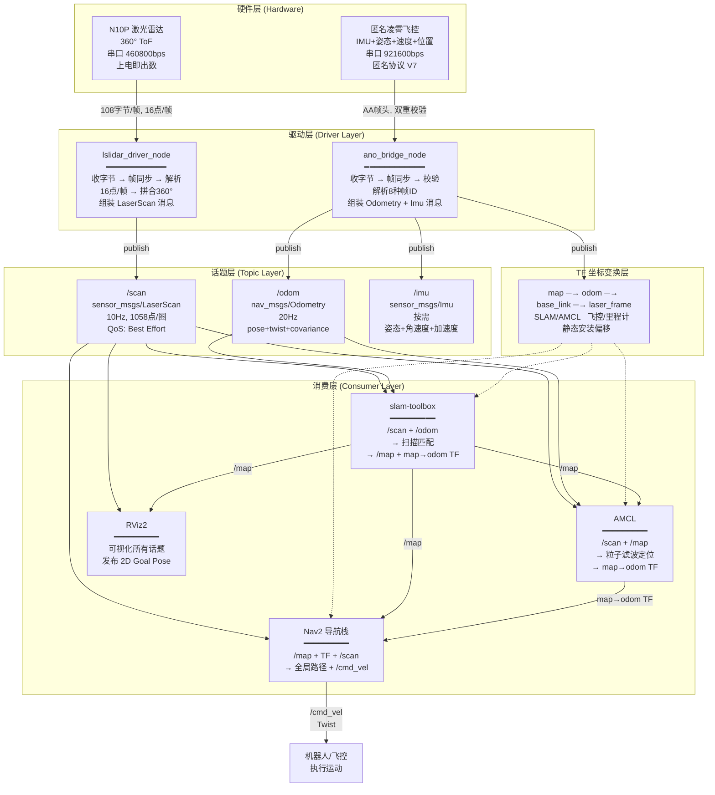

### 0.B.3 阶段零知识体系全景

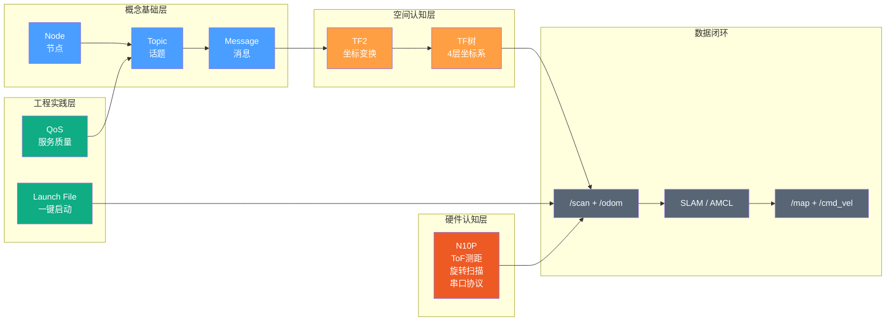

---


# 阶段零补充：lslidar_msgs 自定义消息详解

> 为什么你在 IDE 里只看到 build/ 里的文件？源码在哪？

---

## 0.C.1 源码位置

`lslidar_msgs` 的源码在：

```
n10p_ws/src/Lslidar_ROS2_driver/lslidar_msgs/
├── CMakeLists.txt              ← 构建规则（关键：rosidl_generate_interfaces）
├── package.xml                 ← 包元信息
└── msg/                        ← 消息定义文件（这里是源码！）
    ├── LslidarPacket.msg
    ├── LslidarPoint.msg
    ├── LslidarScan.msg
    ├── LslidarSweep.msg
    └── LslidarDifop.msg
```

而你在 `build/` 和 `install/` 里看到的是**编译产物**——从 .msg 文件自动生成出来的 C++ 头文件（`.hpp`）和 Python 模块。

---

## 0.C.2 .msg 文件如何变成代码

在 [CMakeLists.txt:30-37](n10p_ws/src/Lslidar_ROS2_driver/lslidar_msgs/CMakeLists.txt) 中：

```cmake
rosidl_generate_interfaces(lslidar_msgs
  "msg/LslidarDifop.msg"
  "msg/LslidarPacket.msg"
  "msg/LslidarPoint.msg"
  "msg/LslidarScan.msg"
  "msg/LslidarSweep.msg"
  DEPENDENCIES builtin_interfaces std_msgs
)
```

`rosidl_generate_interfaces` 这个 CMake 宏做了以下事情：

```
源文件 (.msg)                    编译产物
─────────────                    ────────
msg/LslidarPacket.msg  ──→  build/lslidar_msgs/rosidl_generator_cpp/lslidar_msgs/msg/
                            ├── lslidar_packet.hpp        ← C++ 头文件
                            ├── lslidar_packet__struct.hpp ← C++ 结构体定义

msg/LslidarPacket.msg  ──→  install/lslidar_msgs/share/lslidar_msgs/msg/
                            ├── LslidarPacket.msg          ← msg 文件副本
                            └── LslidarPacket.idl          ← IDL 中间表示

msg/LslidarPacket.msg  ──→  Python: import lslidar_msgs.msg 可用
```

**结论**：你在 `build/` 里看到的是自动生成的 C++/Python 代码，不是源码。源码在 `src/Lslidar_ROS2_driver/lslidar_msgs/msg/`。

---

## 0.C.3 5 种自定义消息一览

### LslidarPacket — 原始数据包

```
builtin_interfaces/Time stamp      # 数据包时间戳
uint8[2000] data                   # 原始字节数组（最多 2000 字节）
```

驱动内部封装从串口/UDP 收到的原始数据包。录制 rosbag 回放时用这个消息类型。

### LslidarPoint — 单个激光点

```
float32 time          # 该点被采集的时刻
float64 x             # 笛卡尔坐标 X (m)
float64 y             # 笛卡尔坐标 Y (m)
float64 z             # 笛卡尔坐标 Z (m)
float64 azimuth       # 方位角 (度)
float64 distance      # 原始距离值 (m)
float64 intensity     # 反射强度 (0~255)
```

包含极坐标（azimuth + distance）和笛卡尔坐标（x, y, z）。注意跟 `sensor_msgs/LaserScan` 的区别——LaserScan 是用一个大数组存所有点的距离，这个是单个点的完整表示。

### LslidarScan — 一次扫描

```
float64 altitude         # 所有点的共同高度（单线雷达 ≈ 0）
LslidarPoint[] points    # 所有有效点，按方位角 0→359.99 排序
```

一圈完整 360° 扫描的数据。对于多线雷达（如 16 线），一个 Sweep 包含 16 个 Scan。

### LslidarSweep — 完整扫描周期

```
std_msgs/Header header         # 标准消息头（时间戳 + frame_id）
LslidarScan[16] scans          # 最多 16 次扫描（多线雷达的 16 条线）
```

多线雷达完整数据。N10P（单线）中 `scans[0]` 是唯一有效的扫描。

### LslidarDifop — 设备信息

```
int64 temperature    # 雷达内部温度
int64 rpm            # 当前转速 (RPM)
```

设备诊断信息，驱动通过发送特殊指令帧获取。

---

## 0.C.4 为什么要定义自定义消息？

驱动最终发布给下游的是标准消息 `/scan`（`sensor_msgs/LaserScan`），那为什么还定义了 5 个 lslidar_msgs？

```
┌─────────────────────────────────────────────────────┐
│                  lslidar_driver（驱动内部）           │
│                                                     │
│  串口字节 → LslidarPacket → LslidarPoint           │
│                 (内部数据搬运)   (中间数据结构)        │
│                                                     │
│  最终输出 → sensor_msgs/LaserScan (/scan)           │
│                                                     │
│  诊断信息 → LslidarDifop (设备温度、转速)            │
│  回放数据 → LslidarSweep / LslidarScan (rosbag 用)  │
└─────────────────────────────────────────────────────┘
```

这个驱动支持 8 种镭神雷达（M10/N10/L10 系列），每种数据格式不同。自定义消息在驱动内部**统一了数据结构**，让不同型号共用同一套代码。

---

## 0.C.5 IDE 里怎么找

如果你在 VSCode 中以 `n10p_leishen/` 为工作区根目录：

```
n10p_leishen/
└── n10p_ws/
    └── src/
        └── Lslidar_ROS2_driver/          ← 展开这里
            ├── lslidar_driver/           ← C++ 驱动
            └── lslidar_msgs/             ← 自定义消息源码
                └── msg/                  ← 5 个 .msg 文件在这里
```

> 不要直接把 `n10p_ws/` 作为 VSCode 根目录，否则 `build/` `install/` `src/` 混在一起会很乱。

---

# 阶段一：项目全景地图 — "老板视角"

> 目标：能画出一张"数据从硬件流入，经过哪些包，最终输出什么"的完整图。
> 本阶段不讲代码实现细节，只讲"谁是谁、谁连谁"。

---

## 1.1 一句话说清这个项目

```
N10P 激光雷达 + 匿名凌霄飞控 + ROS2 → 无人机自主 SLAM 建图与导航
```

**最终目标**：一架搭载树莓派 4B 的无人机，通过 N10P 激光雷达感知周围环境，自主建图、自主定位、自主规划路径飞往目标点。

**当前状态**（截至 2026-05-30）：

| Phase | 名称 | 状态 |
|-------|------|------|
| 0 | 环境验证 | ✅ 完成 |
| 1 | N10P 驱动编译与数据验证 | ✅ 完成 |
| 2 | RViz2 可视化联调 | ✅ 完成 |
| 2.5 | 凌霄飞控串口解析 | ✅ 完成 |
| 3 | SLAM 建图 | ✅ 完成 |
| 4 | Nav2 导航 | ✅ 完成 |
| 5 | Gazebo 仿真集成 | ✅ 完成 |
| 5.5 | 桌面测试模式 | ✅ 完成 |
| 6 | **树莓派 4B 移植** | ⬜ 未开始 |
| 7 | **无人机 MAVROS 集成** | ⬜ 未开始 |

当前处于"**地面验证全部完成，等待移植上机**"阶段。

---

## 1.2 硬件全景

### 1.2.1 涉及的所有硬件

```
┌──────────────────────────────────────────────────────────┐
│                      开发机 (现在)                         │
│  Ubuntu 22.04 | RTX 5060 | 16核 CPU | 30GB RAM            │
│                                                          │
│  ┌─────────────┐        ┌──────────────────┐             │
│  │ N10P 激光雷达 │        │ 匿名凌霄飞控       │             │
│  │ USB 串口     │        │ USB 数传          │             │
│  │ CH9102 芯片  │        │ 921600 bps        │             │
│  │ 460800 bps  │        │ 匿名协议 V7       │             │
│  └──────┬──────┘        └────────┬─────────┘             │
│         │ /dev/ttyACM0           │ /dev/ttyACM0           │
│         │ (雷达专用)              │ (数传专用，会冲突!)     │
│         └──────────┬─────────────┘                       │
│                    ▼                                     │
│            ROS2 Humble                                   │
│            331 个 ros-humble 包                           │
└──────────────────────────────────────────────────────────┘

┌──────────────────────────────────────────────────────────┐
│                    目标平台 (未来)                         │
│  树莓派 4B (4GB/8GB RAM) + 无人机机身                     │
│  4 核 Cortex-A72 @1.8GHz | microSD 卡                    │
│  通过 MAVROS 与飞控通信 (Phase 7)                         │
└──────────────────────────────────────────────────────────┘
```

### 1.2.2 两台串口设备的区别（重要！）

| 特性 | N10P 激光雷达 | 匿名凌霄飞控数传 |
|------|-------------|---------------|
| USB 芯片 | CH9102（沁恒微电子） | 不详（可能是 STM32 虚拟串口） |
| 设备路径 | `/dev/ttyACM0` 或 `/dev/serial/by-id/usb-1a86_USB_Single_Serial_...` | `/dev/ttyACM0` 或 `/dev/serial/by-id/usb-ANO_TC_ANO_RadioLink...` |
| 波特率 | **460800** | **921600** |
| 数据方向 | 单向（雷达→上位机） | 双向（飞控↔上位机） |
| 协议 | 镭神私有帧格式 | 匿名协议 V7 |

> ⚠️ **串口冲突警告**：两个设备同时插上时，如果都识别为 `/dev/ttyACM0`，会冲突。解决方案：用 `/dev/serial/by-id/` 路径区分，因为 by-id 包含 USB 芯片的唯一序列号。

---

## 1.3 数据流向总图

### 1.3.1 完整链路（从硬件到最终输出）

```
硬件层          驱动层             话题层             算法层             输出层
───────        ───────           ───────            ───────            ───────

N10P雷达   →   lslidar_driver  →  /scan         →  slam-toolbox  →  /map
(串口)         _node              (LaserScan,       (SLAM 建图)      (栅格地图)
                                 10Hz)             AMCL (定位)     map→odom TF

匿名飞控   →   ano_bridge      →  /odom          →  被 SLAM/AMCL  →  定位修正
(串口)         _node              (Odometry,       消费
                                 20Hz)
                               →  /imu
                                 (Imu, 按需)

                                                                  →  /cmd_vel
Rviz2点击  →  bt_navigator    →  planner_server  →  controller    →  (发给飞控
目标点       (行为树)            (全局规划)         _server          执行运动)
                                 /plan             (局部控制)
```

### 1.3.2 每个环节的输入和输出

| 环节 | 输入 | 输出 | 频率 |
|------|------|------|------|
| **lslidar_driver_node** | N10P 串口原始字节 | `/scan` (LaserScan) | 10Hz |
| **ano_bridge_node** | 飞控串口原始字节 | `/odom` (Odometry), `/imu` (Imu), TF(odom→base_link) | 20Hz / 按需 |
| **slam-toolbox** | `/scan` + TF(odom→base_link) | `/map` (OccupancyGrid), TF(map→odom) | 周期性 |
| **AMCL** | `/scan` + `/map` + TF(odom→base_link) | TF(map→odom) | 按需(粒子更新) |
| **planner_server** | `/map` + TF(map→odom) + 目标位姿 | `/plan` (Path) | 按需(收到目标后) |
| **controller_server** | `/plan` + `/scan` + TF | `/cmd_vel` (Twist) | 20Hz |
| **map_server** | 地图文件 (.pgm+.yaml) | `/map` (OccupancyGrid) | 启动时一次 |

### 1.3.3 TF 坐标树的含义

```
map            ← 世界固定坐标系 (SLAM 建的地图就以这个为原点)
 │              发布者: slam-toolbox 或 AMCL
 │              含义: "机器人在世界的哪个位置"
 │
odom           ← 里程计累积坐标系 (飞控认为的"我从原点走了多远")
 │              发布者: ano_bridge_node (20Hz)
 │              含义: "飞控传感器告诉我走了多远"
 │
base_link      ← 机器人本体坐标系 (机器人的正中心)
 │              发布者: 无 (它就是树的节点，不是消息)
 │              含义: "以机器人中心为原点"
 │
laser_frame    ← 激光雷达坐标系 (雷达的安装位置)
                发布者: static_transform_publisher (静态)
                含义: "雷达装在 robot 的 (0, 0, -0.1) 处"
```

关键认知：
- `map → odom` 是"**修正量**"：飞控的里程计会漂移（越走越不准），SLAM/AMCL 通过激光匹配算出漂移了多少，然后发布一个 TF 修正它
- `odom → base_link` 是"**传感器值**"：飞控直接告诉你的位置变化
- `base_link → laser_frame` 是"**安装位置**"：焊接/螺丝固定的，永远不变

---

## 1.4 六个包的职责（一句话 + 一张表）

### 1.4.1 包清单

| 包名 | 类型 | 语言 | 可执行节点 | 一句话职责 |
|------|------|------|-----------|-----------|
| **lslidar_msgs** | ament_cmake | — | 无 | 定义 5 种镭神自用消息类型 |
| **lslidar_driver** | ament_cmake | C++ | lslidar_driver_node | 把 N10P 串口字节变成 /scan 话题 |
| **n10p_bringup** | ament_python | Python | ano_bridge_node, dummy_odom_node, keyboard_odom_node | 把飞控串口字节变成 /odom+/imu+TF |
| **n10p_slam** | ament_python | Python | 无 | 提供 SLAM 配置和 launch 文件 |
| **n10p_nav** | ament_python | Python | 无 | 提供 Nav2 导航配置和 launch 文件 |
| **n10p_gazebo** | ament_python | Python | scan_relay | 提供仿真环境和 launch 文件 |

> 注意：n10p_slam 和 n10p_nav 是"纯配置包"——它们没有自己的可执行代码，只提供 YAML 参数文件和 launch 启动文件。实际的算法逻辑来自 ros-humble-slam-toolbox 和 ros-humble-navigation2。

### 1.4.2 包依赖关系

```
lslidar_msgs ──→ lslidar_driver    (驱动使用自定义消息)
lslidar_driver ──→ n10p_bringup     (bringup 启动驱动节点)
n10p_bringup ──→ n10p_slam          (SLAM 需要里程计)
n10p_bringup ──→ n10p_nav           (导航需要里程计)
n10p_gazebo 独立                     (仿真替代真实硬件，不依赖 bringup)
```

### 1.4.3 每个包的关键文件

| 包 | 关键文件 |
|----|---------|
| lslidar_msgs | `CMakeLists.txt` (rosidl_generate_interfaces), `msg/*.msg` (5 个消息定义) |
| lslidar_driver | `src/lslidar_driver.cc` (核心驱动 1384 行), `params/lsx10.yaml` (N10P 配置) |
| n10p_bringup | `ano_bridge_node.py` (飞控解析 404 行), `dummy_odom_node.py` (占位里程计), `keyboard_odom_node.py` (键盘控制) |
| n10p_slam | `config/mapper_params_online_async.yaml` (SLAM 参数), `launch/slam_launch.py` (手持建图) |
| n10p_nav | `config/nav2_params_n10p.yaml` (导航参数), `launch/nav_launch.py` (真实导航) |
| n10p_gazebo | `urdf/n10p_drone.urdf` (无人机模型), `worlds/simple_obstacles.world` (仿真世界), `launch/sim_launch.py` |

---

## 1.5 五种运行模式详解

### 1.5.1 模式总览

```
模式                  硬件需求              启动命令                           串口占用
────                  ────────              ────────                           ──────
① 仅雷达              N10P                  ros2 launch lslidar_driver         仅雷达
                                           lslidar_launch.py

② 雷达+飞控           N10P + 飞控           ros2 launch n10p_bringup           雷达+飞控
  (传感器全开)                              n10p_bringup_launch.py

③ SLAM 手持建图       N10P                  ros2 launch n10p_slam              仅雷达
  (不需要飞控)                              slam_launch.py

④ Nav2 导航           N10P + 飞控(或键盘)    ros2 launch n10p_nav               仅雷达
                                           nav_launch.py

⑤ Gazebo 仿真         无                    bash scripts/start_simulation.sh   无
```

### 1.5.2 模式 ①：仅雷达

**启动什么**：[lslidar_launch.py](n10p_ws/src/Lslidar_ROS2_driver/lslidar_driver/launch/lslidar_launch.py)

```
启动的节点：
  - lslidar_driver_node  ← 雷达驱动
  - rviz2                ← 可视化

输出话题：/scan (10Hz)
```

**用途**：快速验证雷达是否正常出数据。在 RViz2 中看激光点的分布。

**注意**：这个模式下里程计不存在，TF 树只有 `base_link → laser_frame`（如果 launch 中有静态 TF），所以不能直接接 SLAM。

### 1.5.3 模式 ②：雷达+飞控（传感器全开）

**启动什么**：[n10p_bringup_launch.py](n10p_ws/src/n10p_bringup/launch/n10p_bringup_launch.py)

```
启动的节点：
  - ano_bridge_node       ← 飞控解析
  - lslidar_driver_node   ← 雷达驱动
  - static_tf_laser       ← 静态 TF (base_link→laser_frame)

输出话题：
  /scan (10Hz), /odom (20Hz), /imu (按需)
  TF: odom→base_link (20Hz), base_link→laser_frame (静态)
```

**用途**：所有传感器数据就绪，为 SLAM 或导航提供完整的输入。

**重要**：此模式占用了**两个串口**（雷达 + 飞控数传），其他 launch 不能再启动驱动，否则串口冲突。

### 1.5.4 模式 ③：SLAM 手持建图

**启动什么**：[slam_launch.py](n10p_ws/src/n10p_slam/launch/slam_launch.py)

```
启动的节点（共 5 个）：
  - dummy_odom_node       ← 占位里程计 (位置全零，姿态来自飞控)
  - lslidar_driver_node   ← 雷达驱动
  - static_tf_laser       ← 静态 TF
  - slam_toolbox          ← SLAM 建图 (3秒后启动)
  - rviz2                 ← 可视化 (6秒后启动)

输出话题：
  /scan (10Hz), /odom (20Hz, 位置全零), /map (按需)
  TF: odom→base_link, map→odom, base_link→laser_frame
```

**为什么用 dummy_odom？** 手持建图时，人拿着雷达在空间里走动，飞控可能不在线。dummy_odom 发布全零位置 + 飞控姿态，让 TF 链完整。SLAM 的扫描匹配（scan matching）可以自动估算出机器人实际移动了多少，弥补里程计的缺失。

**和模式 ② 的关系**：slam_launch.py **自带驱动**，所以不能和 bringup_launch.py 同时跑（串口冲突）。如果已经用 bringup 启动了传感器，想在此基础上加 SLAM，要用 `slam_only_launch.py`：

```
终端1: ros2 launch n10p_bringup n10p_bringup_launch.py   ← 传感器
终端2: ros2 launch n10p_slam slam_only_launch.py          ← 仅 SLAM+Rviz2
```

### 1.5.5 模式 ④：Nav2 导航

**启动什么**：[nav_launch.py](n10p_ws/src/n10p_nav/launch/nav_launch.py)

```
启动的节点（共 11 个），分 4 批启动：

第1批 (立即):    dummy_odom_node, lslidar_driver_node, static_tf_laser
第2批 (2~4秒):   map_server, amcl, lifecycle_manager_localization
第3批 (5~6秒):   planner_server, controller_server, bt_navigator, lifecycle_manager_navigation
第4批 (8秒):     rviz2

输出话题：
  /scan (10Hz), /odom (20Hz), /map (静态地图), /plan (全局路径), /cmd_vel (速度指令)
```

**启动顺序为什么有延迟？**

| 延迟 | 原因 |
|------|------|
| map_server 等 2 秒 | 等 ROS2 网络 (DDS discovery) 就绪 |
| AMCL 等 3 秒 | 等 map_server 把 /map 发布出来 |
| 导航栈等 5 秒 | 等 AMCL 的 TF(map→odom) 发布出来 |
| RViz2 等 8 秒 | 等其他所有节点就绪再开显示 |

**AMCL 是什么？** 自适应蒙特卡洛定位。它把之前的 SLAM 地图加载进来，然后用当前的激光扫描跟地图比对，算出"机器人在地图上的哪个位置"。输出的是 `map→odom` 的 TF 修正。

### 1.5.6 模式 ⑤：Gazebo 仿真

**启动什么**：[sim_launch.py](n10p_ws/src/n10p_gazebo/launch/sim_launch.py) + [start_simulation.sh](scripts/start_simulation.sh)

```
启动的内容（共 9+ 项），分 5 批：

第1批 (0秒):     gzserver + gzclient (Gazebo 模拟器)
第2批 (3~5秒):   spawn_robot (生成无人机) + map_server + robot_state_publisher + static_tf(map→odom)
第3批 (8秒):     planner_server + controller_server + bt_navigator
第4批 (18秒):    lifecycle_manager_navigation
第5批 (19秒):    rviz2
```

**仿真和真机的关键区别**：

| | 真机 | 仿真 |
|---|------|------|
| 时间源 | 系统时钟 (wall time) | Gazebo 模拟时钟 (sim time) |
| 里程计来源 | 飞控 (ano_bridge) | Gazebo 插件 (ground truth) |
| 定位方式 | AMCL (粒子滤波) | 不用 AMCL (里程计就是真值) |
| 地图 | 真实建图结果 | 空白地图 (10m×10m) |
| 障碍物感知 | 真实雷达 → 真实环境 | 模拟雷达 → 4 个虚拟箱子 |
| 规划器 | SmacPlanner2D | NavfnPlanner (更简单) |
| 全局 costmap | static_layer (真实地图) | static_layer (空白地图) |

### 1.5.7 桌面测试模式（模式 ④ 的变体）

**启动什么**：[desktop_test_launch.py](n10p_ws/src/n10p_nav/launch/desktop_test_launch.py)

这是 Phase 5.5 新增的模式：**真雷达 + 键盘虚拟里程计 + Nav2 导航**。

```
终端1: ros2 run n10p_bringup keyboard_odom_node   ← 键盘控制虚拟里程计
终端2: ros2 launch n10p_nav desktop_test_launch.py ← 导航栈

键盘映射：
  W/X: 前进/后退    A/D: 左移/右移
  Q/E: 左转/右转    S: 停止    R: 回原点
```

**为什么需要这种模式？** 树莓派还没到，飞控不在线，但想用真实雷达测试 Nav2 能不能跑通。键盘模拟机器人移动 → AMCL 跟踪定位 → Nav2 规划导航路径。

---

## 1.6 目录结构速查

```
n10p_leishen/                              ← 项目根目录
│
├── CLAUDE.md                              ← 项目最高指令（每次对话自动加载）
├── learn.md                               ← 本学习笔记（你正在看的）
├── user.md                                ← 保姆级使用教程
├── env.md                                 ← 环境配置教程
├── requirements.txt                       ← 依赖清单
│
├── n10p_knowledge_base/                   ← N10P 硬件知识库
│   ├── 01_Hardware_and_Protocol_CheatSheet.md
│   ├── 02_ROS2_Development_Guide.md
│   ├── 03_Visualization_and_Troubleshooting.md
│   └── 04_Official_Documentation_Summary.md
│
├── 凌霄协议/                               ← 匿名飞控 + 凌霄飞控协议文档 (PDF)
│
├── maps/                                  ← SLAM 建图保存的地图文件
│   ├── n10p_map.pgm + n10p_map.yaml       ← 真实建图结果
│   └── blank_map.pgm + blank_map.yaml     ← 仿真用空白地图
│
├── scripts/                               ← 辅助工具脚本
│   ├── start_simulation.sh                ← Gazebo 仿真一键启动
│   └── map_viewer.py                      ← PGM 地图查看器
│
├── n10p_ws/                               ← ROS2 工作空间
│   ├── src/                               ← 源码
│   │   ├── Lslidar_ROS2_driver/           ← 官方驱动（从 GitHub 克隆）
│   │   │   ├── lslidar_msgs/              ←   自定义消息定义
│   │   │   └── lslidar_driver/            ←   C++ 驱动核心
│   │   ├── n10p_bringup/                  ← 飞控桥接 + 里程计节点
│   │   ├── n10p_slam/                     ← SLAM 建图配置
│   │   ├── n10p_nav/                      ← Nav2 导航配置
│   │   └── n10p_gazebo/                   ← Gazebo 仿真
│   ├── build/                             ← 编译中间产物
│   ├── install/                           ← 编译安装产物
│   └── log/                               ← 编译日志
│
└── .claude/                               ← Claude Code 配置（不关心）
```

**找东西的口诀**：
- 找雷达驱动 → `n10p_ws/src/Lslidar_ROS2_driver/lslidar_driver/`
- 找飞控解析 → `n10p_ws/src/n10p_bringup/n10p_bringup/ano_bridge_node.py`
- 找启动方式 → 各包的 `launch/` 目录
- 找参数配置 → 各包的 `params/` 或 `config/` 目录下的 `.yaml` 文件
- 找地图文件 → `maps/`
- 找硬件资料 → `n10p_knowledge_base/`

---

## 1.7 Git 提交历史（了解项目演进）

```
490b19a  三、一些bug修修补补，也没解决        ← 最新 (bug修复)
e1a5d50  二、gazebo仿真                       ← 仿真集成
3d06897  一、n10p雷达驱动+ros2建图slam+导航nav2  ← 核心功能
```

3 个 commit，从下往上依次完成了：驱动+SLAM+Nav2 → 仿真 → Bug 修复。

---


## 阶段一 知识图谱

### 1.A.1 项目全景架构图

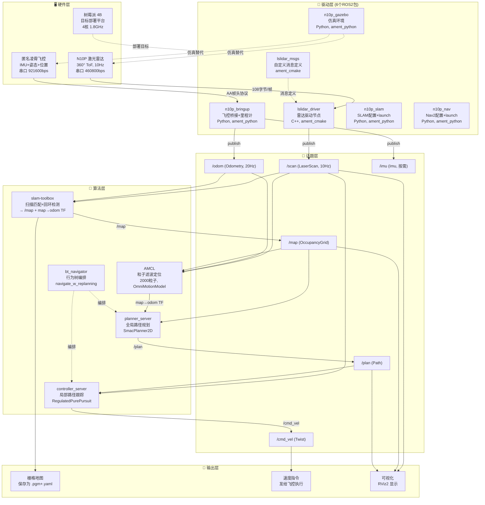

### 1.A.2 五种运行模式决策树

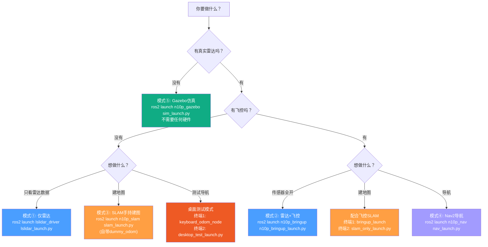

### 1.A.3 包依赖关系图

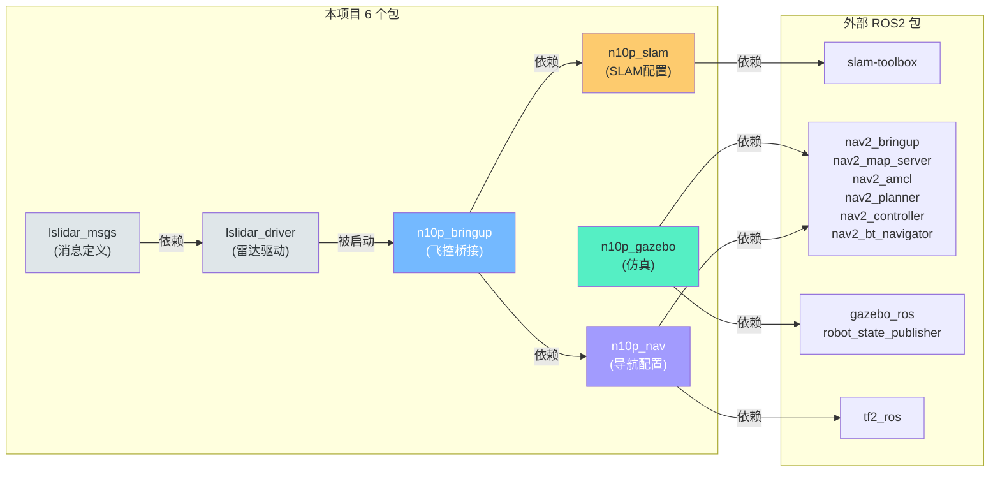

---

# 阶段一补充：TF 坐标变换实战详解

> 用一次完整的无人机飞行流程，讲清楚 map、odom、base_link 到底是怎么协同工作的。

---

## 1.B.1 首先回答你的两个问题

### 问题 1：地图的原点在哪里？

**地图原点 = 你启动 SLAM 建图那一瞬间，机器人所在的位置。**

SLAM 配置文件 `mapper_params_online_async.yaml:19` 明确写了：

```yaml
map_start_pose: [0.0, 0.0, 0.0]   # 地图原点
```

当你第一次启动 SLAM（`slam_launch.py`），slam-toolbox 创建一个空的"世界"，把机器人的当前位置标记为 `(0, 0, 0)`。之后slam-toolbox 通过激光扫描匹配，推算出机器人相对于这个原点走了多远，同时在地图上画出障碍物。

打个比方：你搬进一个空房间，在门口放了一枚硬币标记为"原点"。然后你闭着眼睛（只用里程计）走一圈，每次睁眼看一眼前方（激光扫描），把看到的墙壁位置记录下来。最终你得到一张以"门口的硬币"为原点的地图。

**地图原点没有物理意义**——它不是房间的某个固定角落，也不是 GPS 坐标。它纯粹是"开始建图时机器人恰好在哪里"。

### 问题 2：odom 怎么知道离世界坐标系的相对位移？

**odom 不知道。odom 从零开始自己算，是 SLAM/AMCL 后来告诉它"你偏了，需要修正"。**

这是最关键的理解。下面用完整流程讲清楚。

---

## 1.B.2 一个完整的无人机工作流程

**场景设定**：一个 10m × 10m 的仓库，里面有货架。我们有一架搭载 N10P 雷达和飞控的无人机。

```
        y=10
         ┌──────────────────────────┐
         │                          │
         │    货架A      货架B       │
         │                          │
         │                          │
         │    货架C      货架D       │
         │                          │
         │               无人机起飞点│
         └──────────────────────────┘
      (0,0)                      x=10
```

---

### 第一阶段：建图（某一天）

**步骤 1：放置无人机，开机**

操作：把无人机放在仓库门口附近（不是任何特殊位置），上电。

飞控启动后，**在飞控自己的世界里**，它认为当前位置是 `(0, 0, 0)`，朝向 0°。飞控创建一个叫 `odom` 的坐标系，机器人此时在 odom 坐标系的原点。

```
飞控内心世界：
    odom 坐标系
       │
       └── base_link 在 (0, 0, 0)，朝向 0°
```

**步骤 2：启动 SLAM 手持建图**

执行：`ros2 launch n10p_slam slam_launch.py`

slam-toolbox 启动时，创建了一个叫 `map` 的坐标系。**此时机器人在 map 坐标系的原点**。

```
slam-toolbox 的内心世界：
    map 坐标系
       │
       └── 机器人在 (0, 0, 0)，朝向 0°（因为刚启动，map 和 odom 重合）
```

**关键**：此时 `map` 和 `odom` 重合，都是 `(0, 0, 0)`。因为机器人还没动，谁也不知道"真实世界"在哪。`map→odom` 的 TF = 零（无修正）。

**步骤 3：拿着无人机在仓库里走一圈**

你拿起无人机，先在 X 方向走了 5 米，绕过一个货架，又走了回来。

此时发生了两件事：

**① 飞控（odom）在持续更新：**

飞控的 IMU + 速度积分告诉你：
```
t=0s:   我在 odom 原点 (0, 0, 0)，朝 X 方向
t=10s:  我在 odom 的 (2.0, 0.02, 0)  ← 朝 X 走了约 2m
t=20s:  我在 odom 的 (4.0, 0.05, 0)  ← 又走了 2m
t=30s:  我在 odom 的 (5.0, 0.10, 0)  ← 到了货架附近
t=40s:  我在 odom 的 (2.0, 0.10, 0)  ← 往回走了
t=50s:  我在 odom 的 (0.5, 0.15, 0)  ← 快回到原点了
```

注意 Y 坐标从 0 慢慢漂到了 0.15——这是里程计的**累积漂移**，飞控自己察觉不到。

飞控一直在发布 `odom→base_link` 的 TF：每 20ms 一次，告诉下游"我相对于 odom 原点走了多少"。

**② SLAM 在做扫描匹配（scan matching）：**

SLAM 每收到一帧激光扫描，就跟上一帧对比：
```
第 1 帧扫描：看到前方 1.8m 有堵墙（仓库墙壁）
第 2 帧扫描：同一堵墙现在在 1.2m 处 → 我朝墙走了 0.6m
第 3 帧扫描：墙在 0.6m 处 → 又走了 0.6m
...
```

SLAM 还能检测**回环**（loop closure）——当你走回之前来过的地方时：
```
第 50 帧扫描：这个 L 形角落的图案... 我见过！这是第 1 帧看到的那个角落！
             但 odom 说我现在在 (0.5, 0.15)，而实际我应该在 (0, 0) 附近
             → odom 漂了 0.15m！需要修正！
```

SLAM 修正的方式：发布一个新的 `map→odom` TF。本来是零 TF（因为最开始重合），现在变成 `(0, -0.15, 0)`，意思是"要得到正确的 map 坐标，把 odom 的 Y 坐标减去 0.15"。

```
修正前：
  odom 说 base_link 在 (0.5, 0.15)
  map→odom TF = (0, 0, 0)  ← 零修正
  → map 中 base_link 在 (0.5, 0.15) ← 错了！应该是 (0.5, 0)

修正后：
  odom 说 base_link 在 (0.5, 0.15)
  map→odom TF = (0, -0.15, 0) ← SLAM 发布的新修正
  → map 中 base_link 在 (0.5, 0.15) + (0, -0.15, 0) = (0.5, 0) ← 对了！
```

**步骤 4：保存地图**

SLAM 完成后，调用 SaveMap 服务。slam-toolbox 把当前的栅格地图保存为 `n10p_map.pgm` + `n10p_map.yaml`。

这张地图的原点是 `(0, 0, 0)`——也就是你**启动 SLAM 时机器人站的位置**。

---

### 第二阶段：使用地图导航（另一天）

**步骤 1：把无人机重新放到仓库里**

**重点**：这次你放的位置可能跟上次建图时不一样——比如往右偏了 1 米。但没关系！

上电后，飞控跟上次一样，从零开始：
```
飞控内心世界：
    odom 坐标系
       │
       └── base_link 在 (0, 0, 0)  ← 又是零！
```

odom 坐标系**总是从零开始**。它不知道上次建图的事，不知道地图原点在哪，不知道自己在仓库什么位置。它只会说："从我开机以来，我走了多远"。

**步骤 2：启动导航**

执行：`ros2 launch n10p_nav nav_launch.py`

这次启动了 map_server，把之前保存的地图加载进来，发布到 `/map` 话题。同时启动了 AMCL（定位模块）。

**启动瞬间**：AMCL 不知道机器人在哪。它在地图上**随机撒了 2000 个粒子**——每个粒子代表"机器人可能在这个位置"。

```
AMCL 初始状态：
    地图上散布着 2000 个红色粒子
    每个粒子 (x, y, θ) 都是随机猜测
    AMCL 还没有发布 map→odom TF
```

**步骤 3：给 AMCL 一个初始位姿**

在 RViz2 里用"2D Pose Estimate"工具，在地图上点一下无人机的大概位置 + 朝向。

这一步之后：AMCL 把所有粒子集中到你点的位置附近，不再随机散布。

**步骤 4：AMCL 自动收敛到精确位置**

激光雷达一直在发 `/scan`。AMCL 对每个粒子问："如果机器人真的在这里，它看到的激光扫描应该长什么样？"然后跟真实的 `/scan` 对比。

```
粒子 A(位置正确): 预期扫描 ≈ 实际扫描 → 得分高 ✓ 保留！
粒子 B(偏了 30cm): 预期扫描 ≠ 实际扫描 → 得分低 ✗ 淘汰！
粒子 C(方向错了): 预期扫描 ≠ 实际扫描 → 得分低 ✗ 淘汰！
```

经过几轮淘汰和重采样后，2000 个粒子密集聚集在真实位置附近。AMCL 取这些粒子的加权平均 = **机器人在 map 中的精确位姿**。

现在 AMCL 知道了：**机器人实际上在 map 的 (3.5, 2.1)，朝向 45°**。

但 odom 还在说"我在 (0, 0)，朝向 0°"！这就出现了矛盾：
- odom 说 base_link 在 odom 的 (0, 0, 0)
- AMCL 说 base_link 应该在 map 的 (3.5, 2.1, 45°)

**AMCL 解决这个矛盾的方式：发布 `map→odom` TF！**

```
AMCL 发布的 map→odom TF：
  平移 = (3.5, 2.1, 0)
  旋转 = 45°

TF 系统自动计算：
  map 中的 base_link = map→odom × odom→base_link
                     = (3.5, 2.1, 45°) × (0, 0, 0)
                     = (3.5, 2.1, 45°)  ← 正确！
```

**步骤 5：给出导航目标**

现在 TF 链完整了——AMCL 知道机器人在 map 的哪里，持续发布 `map→odom` TF。一切就绪。

你在 RViz2 中点击"2D Goal Pose"，在 map 坐标中指定目标 `(8.0, 4.0)`。

planner_server 收到请求：从 map 的 `(3.5, 2.1)` 规划一条路径到 `(8.0, 4.0)`。路径 `/plan` 上的所有点都在 map 坐标系中。

controller_server 把路径上的点转换到 base_link 坐标系中，算出 `/cmd_vel`。

无人机开始移动：
```
t=0s:    odom→base_link = (0, 0, 0)           map→odom = (3.5, 2.1, 45°)
t=5s:    odom→base_link = (0.5, 0.01, 0)      AMCL 重新计算 map→odom
t=10s:   odom→base_link = (1.0, 0.02, 0)      AMCL 重新计算 map→odom
t=20s:   odom→base_link = (2.0, 0.01, 0)      AMCL 重新计算 map→odom
...
         → map 中 base_link = 始终是激光匹配出的真实位置
```

**AMCL 持续在后台修正** `map→odom` TF：每收到一帧 `/scan`，就跟地图比对一次，更新粒子权重。如果 odom 漂了，`map→odom` 会相应调整，保证 `map 中的 base_link` 始终正确。

---

## 1.B.3 用"GPS 类比"一言以蔽之

| | GPS 系统 | ROS2 TF 系统 |
|---|---------|------------|
| 世界固定坐标系 | 地球经纬度 | `map` 坐标系 |
| 本机推算 | 手机 GPS 芯片的航迹推算 | 飞控里程计 → `odom` |
| 纠偏方式 | 接收卫星信号校准 | 激光扫描匹配地图 → AMCL 修正 |
| 纠偏输出 | 手机上显示"你在地球上的位置" | `map→odom` TF |

- GPS 不需要你"站在固定位置开机"——卫星告诉你绝对位置
- 里程计不需要你"站在地图原点开机"——AMCL 用激光扫描告诉你绝对位置

**AMCL = 室内版 GPS**。GPS 用卫星信号定位，AMCL 用激光扫描匹配地图定位。

---

## 1.B.4 一张图讲清全过程

```
时间线：建图（Day 1）→ 导航（Day 2）
```

```
Day 1: 建图
══════════════════════════════════════════════════════════════

[启动 SLAM]                     [建图完成]
     │                               │
     ▼                               ▼
 map 原点诞生                   map 被保存
 在机器人脚下                   原点 = 曾经的脚下
 (0, 0, 0)
     │                               │
     └──── 机器人移动, SLAM追踪 ──────┘


Day 2: 导航 (机器人在不同位置重新开机)
══════════════════════════════════════════════════════════════

上电         启动 AMCL       给初始位姿        AMCL 收敛          开始导航
 │               │               │                │                  │
 ▼               ▼               ▼                ▼                  ▼
odom 从        2000 粒子      粒子聚焦到      粒子收敛到         map→odom TF
(0,0,0)       随机散布       用户指定位姿     精确位置           持续更新
开始          在地图上        附近             map→odom TF       /cmd_vel 发出
                                               被设定
                                               (3.5, 2.1, 45°)

飞控一直说:       AMCL不知道         有了近似位姿        激光匹配          地图中定位
"我在(0,0)"       自己在哪里         开始激光匹配        确认精确位姿        持续稳定
```

---

## 1.B.5 总结：TF 三段式的本质

```
map → odom → base_link → laser_frame
 ↑       ↑        ↑            ↑
 │       │        │            └── 雷达装在哪 (固定偏移, 永远不会变)
 │       │        └── 飞控说"我走了多远" (一直在变, 高频, 但会漂移)
 │       └── SLAM/AMCL 的"纠偏量" (间断修正, 低频, 但精确)
 └── 世界的原点 (建图时确定, 永远不变)
```

**odom 不需要"知道"世界坐标系**。它只管自己的事。
- odom: "从我开机以来，我往前走了 3.5 米"
- AMCL: "但你现在实际在地图的 (3.5, 2.1)，你往右多漂了 2.1 米"
- AMCL 发布 map→odom: 平移 (3.5, 2.1) — 翻译了 odom 的话
- TF 系统自动算: 实际位置 = 3.5 - 3.5 = 0? 不对...
  
  实际算法: map 中 base_link 坐标 = map→odom 变换 × odom→base_link 变换
  = (3.5, 2.1, 45°) 变换 × (3.5, 0, 0) 变换
  ≠ 简单加减，是完整的 2D 刚体变换

最终：**不管无人机在哪开机，AMCL 都能通过激光匹配地图把它定位到 map 坐标系的正确位置，然后发布 map→odom TF 来"对齐"两个坐标系。**

---


# 阶段二：硬件驱动层 — N10P 雷达驱动详解

> 目标：理解 N10P 驱动从串口字节到 /scan 话题的每一步发生了什么。
> 本阶段深入 C++ 源码，但只关注关键逻辑，不逐行解释。

---

## 2.1 驱动包总览

`lslidar_driver` 是一个 C++ ROS2 包，是整个项目中最底层的模块。它位于：

```
n10p_ws/src/Lslidar_ROS2_driver/lslidar_driver/
```

### 2.1.1 文件地图

```
lslidar_driver/
├── CMakeLists.txt              ← 编译规则：编译 lslidar_driver_node 可执行文件
├── package.xml                 ← 包元信息：依赖 rclcpp, lslidar_msgs, PCL, pcap 等
│
├── include/lslidar_driver/     ← 头文件
│   ├── lslidar_driver.h        ←   核心类 LslidarDriver 声明（继承自 rclcpp::Node）
│   ├── input.h                 ←   UDP/PCAP 网络输入类
│   └── lsiosr.h                ←   串口 I/O 抽象类（LSIOSR 单例）
│
├── src/                        ← 源码
│   ├── lslidar_driver_node.cc  ←   入口 main()：创建节点 → 轮询循环
│   ├── lslidar_driver.cc       ←   核心驱动逻辑（~1384 行，整个项目的核心）
│   ├── input.cc                ←   网络输入实现（UDP socket / PCAP 文件回放）
│   └── lsiosr.cpp              ←   串口实现（termios 配置, 460800bps, 8N1）
│
├── params/
│   └── lsx10.yaml              ←   N10P 出厂配置
│
├── launch/
│   ├── lslidar_launch.py       ←   单雷达启动
│   └── lslidar_double_launch.py←   双雷达启动
│
└── rviz/
    └── lslidar.rviz            ←   预配置的 RViz2 显示文件
```

### 2.1.2 驱动支持的所有雷达型号

从 `lslidar_driver.cc:140-226` 的参数选择逻辑可以看到，一个驱动支持 8 种镭神雷达：

| 型号 | 每帧字节 | 每帧点数 | 波特率 | 总点数 | 本项目使用 |
|------|---------|---------|--------|--------|-----------|
| M10 | 92 | 42 | 460800 | 1008 | |
| M10_P | 160 | 70 | 500000 | 2000 | |
| M10_PLUS | 104 | 41 | 921600 | 5000 | |
| M10_GPS | 102 | 42 | 460800 | 1008 | |
| N10 | 58 | 16 | 230400 | 2000 | |
| **N10_P** | **108** | **16** | **460800** | **2000** | ✅ |
| M10_DOUBLE | 300 | 70 | 921600 | 3000 | |
| L10 | 58 | 16 | 230400 | 2000 | |

**关键认知**：N10_P 的 `points_size_ = 2000` 是前/后半圈各 1000 点。文件顶部 `scan_points_.resize(6000)` 预分配了 6000 个元素的数组（3000×2=6000，留有余量）。

---

## 2.2 N10P 的帧格式（字节级）

### 2.2.1 完整帧结构

N10_P 每帧 **108 字节**，结构如下：

```
偏移  字节数  内容               解析方式
────  ──────  ────────────────  ────────────────────────────
0     2       帧头               固定值 0xA5 0x5A
2     2       转速参数            rpm = 2,500,000 / value
4     1       (未使用/保留)       —
5     2       起始角度            大端序 uint16, 单位 0.01°
7     n×2     距离数据区起点      每个点 2 字节, 小端序 uint16, 单位 mm
              共 16 个点          值 0xFFFF = 无效点
              (16×2 = 32 字节从偏移7开始)
               57-104: 其他数据       —
105   2       结束角度            大端序 uint16, 单位 0.01°
107   1       CRC8 校验           所有前 107 字节的累加和 & 0xFF
```

### 2.2.2 N10P 的特殊之处

跟其他型号不同，N10_P 的帧包含 **结束角度字段**（偏移 105-106）。

这意味着驱动不是靠假设"每帧 15°"，而是用 `(end_angle - start_angle) / 15` 来**精确计算**本帧内的角度步长。如果电机转速不稳导致帧长变化，这个机制能自适应。

代码证据（`lslidar_driver.cc:666-678`）：

```cpp
if (lidar_name == "N10" || lidar_name == "L10") {
    // 读取结束角度
    end_degree = (s_e * 256 + z_e) / 100.f;
    // 计算本帧的精确角度步长
    if (degree > end_degree)
        degree_interval = end_degree + 360 - degree;
    else
        degree_interval = end_degree - degree;
}
```

> 注意：代码中条件判断用的是 `N10` 和 `L10`，但实际上 N10_P 也进入这个分支（因为 `end_degree_bits_start = 105` 在 N10_P 配置中也被设置了）。

### 2.2.3 CRC8 校验

N10_P 使用简单的 **累加和校验**（`lslidar_driver.cc:625-636`）：

```cpp
uint8_t LslidarDriver::N10_CalCRC8(unsigned char *p, int len) {
    uint8_t crc = 0;
    int sum = 0;
    for (int i = 0; i < len; i++) {
        sum += uint8_t(p[i]);
    }
    crc = sum & 0xff;  // 取低 8 位
    return crc;
}
```

把前 107 个字节全部加起来，取低 8 位，跟第 108 字节对比。如果不一致 → 帧损坏 → 丢弃。

---

## 2.3 驱动数据流 — 函数调用链

从 `main()` 到 `/scan` 发布，经过以下调用链：

```
main()                                    [lslidar_driver_node.cc:24]
 │
 └─→ node = new LslidarDriver()          构造函数:
     │                                      - 声明参数 (declare_parameter)
     │                                      - 读取参数 (get_parameter)
     │                                      - 根据 lidar_name 选择型号参数
     │                                      - 创建发布者: /scan + /lslidar_point_cloud
     │                                      - 创建订阅者: /lslidar_order
     │                                      - 初始化串口 (LSIOSR::init)
     │                                      - 启动发布线程 (pubScanThread)
     │
     └─→ while(polling())                 [lslidar_driver.cc:1266]
          │
          ├─→ interface == "serial" 时:
          │   接收一个完整帧
          │   receive_data(packet_bytes)   [lslidar_driver.cc:554]
          │     ├─ 读第 1 字节 → 检查 0xA5
          │     ├─ 读第 2 字节 → 检查 0x5A
          │     ├─ N10_P: len = 108
          │     ├─ 读剩余 106 字节
          │     ├─ CRC8 校验
          │     └─ return 108 (帧长度)
          │
          ├─→ N10_P 走双回波处理:
          │   data_processing_2(packet_bytes, len)
          │     ├─ 解析起始角度 + 结束角度 → 算角度步长
          │     ├─ 循环 16 个点:
          │     │   读取 2 字节距离值 (小端序)
          │     │   转换: dist = (s*256+z) / 1000.0 (mm→m)
          │     │   检查 0xFFFF → 无效标记
          │     │   角度裁剪 (angle_disable_min/max)
          │     │   存储: scan_points_[i] = 前半圈点
          │     │          scan_points_[i+3000] = 后半圈点
          │     └─ 圈检测: 角度回绕 → 通知发布线程
          │
          └─→ interface == "net" 时:
              类似，但走 UDP socket 而非串口

rclcpp::spin_some(node)                  处理 ROS2 回调
  └─ /lslidar_order 订阅回调

[独立线程]

pubScanThread()                           [lslidar_driver.cc:955]
 │  阻塞等待 pubscan_cond_ 条件变量
 │  被唤醒后:
 ├─→ 分配 LaserScan 消息
 ├─→ 设置 header.frame_id = "laser_frame"
 ├─→ 设置 angle_min=0, angle_max=2π, angle_increment=2π/scan_num
 ├─→ 设置 range_min=0.02, range_max=12.0
 ├─→ 遍历 scan_points_:
 │     前半圈: ranges[idx] = points[i].range
 │     后半圈: ranges[idx+count_num] = points[i+3000].range
 │     无效点: ranges[idx] = inf
 └─→ scan_pub->publish(scan)  ← 发布到 /scan 话题
```

---

## 2.4 关键参数文件 lsx10.yaml

```yaml
/lslidar_driver_node:           # 节点名，参数挂在这个命名空间下
  ros__parameters:
    frame_id: laser_frame       # 雷达坐标系名
    lidar_name: N10_P           # 型号：触发 N10_P 专用参数(108字节/帧)
    angle_disable_min: 0.0      # 角度过滤起点 (0=不过滤)
    angle_disable_max: 0.0      # 角度过滤终点 (0=不过滤)
    min_range: 0.02             # 最小有效距离(m)
    max_range: 12.0             # 最大有效距离(m)
    use_gps_ts: false           # 不用 GPS 时间戳
    interface_selection: serial # 串口模式
    serial_port_: /dev/serial/by-id/usb-1a86_USB_Single_Serial_58EB011256-if00
                                # CH9102 USB 串口的唯一路径
    compensation: false         # 角度补偿 (N10P 不需要)
    pubScan: true               # 发布 /scan 话题
    pubPointCloud2: false       # 不发布点云 (省带宽)
    pointcloud_topic: /lslidar_point_cloud
```

**每个参数的含义**：

| 参数 | 如果改了会怎样 |
|------|--------------|
| `lidar_name` | 改成 M10 → 驱动按 92 字节/帧解析 → 全乱套 |
| `serial_port_` | 改成错误的设备 → 串口打不开 → 驱动报错退出 |
| `min_range / max_range` | 只影响 LaserScan 的过滤，不影响原始解析。改大了可能把有效近处障碍物滤掉 |
| `angle_disable_min/max` | 屏蔽某个角度范围，比如雷达后方被机身挡住可以设为 150°~210° |
| `pubScan: false` | 不发布 /scan → 下游 SLAM 无数据 → 什么都做不了 |
| `pubPointCloud2: true` | 额外发布点云 → 多耗 CPU，一般不需要 |

---

## 2.5 驱动验证方法

### 2.5.1 确认驱动正常运行

```bash
# 激活环境
ros2env
source n10p_ws/install/setup.bash

# 启动驱动
ros2 launch lslidar_driver lslidar_launch.py
```

### 2.5.2 三步验证法

| 步骤 | 命令 | 预期结果 | 如果不正常 |
|------|------|---------|-----------|
| ① 话题存在 | `ros2 topic list \| grep scan` | 能看到 `/scan` | 驱动没启动或 crash |
| ② 数据有内容 | `ros2 topic echo /scan --once` | `ranges` 数组有值（不全为 inf） | 雷达没转/遮挡/串口错 |
| ③ 频率正确 | `ros2 topic hz /scan` | 平均 ~10Hz | 串口丢数/CPU 太慢 |

### 2.5.3 常见故障排查

```
ros2 topic list | grep scan  →  无输出
    ↓ 原因
    驱动 crash (double free 退出)
    → 查 dmesg | tail, 看是否有 segfault
    → 或者检查串口是否被占用 (lsof /dev/ttyACM0)

ros2 topic echo /scan --once  →  ranges 全是 inf
    ↓ 原因
    雷达转了吗？(听声音/看指示灯)
    串口路径对吗？(ls -la /dev/serial/by-id/)
    波特率对吗？(N10P 是 460800)

ros2 topic hz /scan  →  3Hz 而非 10Hz
    ↓ 原因
    CPU 被挤占 (top 看 driver 的 CPU 占用)
    或者串口速率不对
```

---

## 2.6 驱动已知坑点与修复

### KI-005: Double Free 崩溃 ★★★

**现象**：驱动启动后立刻退出，错误码 -6 (`double free or corruption`)。

**根因**（`lslidar_driver.cc:1271 + data_processing/data_processing_2`）：
```cpp
// polling() 中分配内存:
unsigned char *packet_bytes = new unsigned char[500];

// data_processing/data_processing_2 中:
delete packet_bytes;  // ❌ BUG 1: 应该用 delete[] (数组)
// 返回 polling() 后:
delete packet_bytes;  // ❌ BUG 2: 指针被释两次 (double free)
```

**修复**：
1. 删除 `data_processing()` 和 `data_processing_2()` 内部的 `delete` 语句（内存所有权归 `polling()`）
2. 把 `polling()` 中的 `delete` 改为 `delete[]`

### KI-002: angle_increment 错误 ★★★

**现象**：slam-toolbox 报 "1058 range readings, expected 529"，所有扫描被丢弃。

**根因**（`lslidar_driver.cc:990`）：
```cpp
// 错误版本:
scan->angle_increment = 2 * M_PI / count_num;  // count_num=529
// → angle_increment = 360/529 ≈ 0.68°

// 但 ranges[] 数组有 scan_num = 2*count_num = 1058 个元素
// → 角度增量算大了 2 倍
// → ranges[528] 应该是 180°, 但增量说 ranges[528] 是 360°
// → slam-toolbox 检测到矛盾 → 丢弃整帧
```

**修复**：
```cpp
scan->angle_increment = 2 * M_PI / scan_num;  // scan_num = 1058
// → angle_increment = 360/1058 ≈ 0.34°  ✓
```

### KI-006: Linux 设备路径不稳定

**现象**：昨天 `ros2 launch` 还能用，今天插上雷达找不到设备。

**根因**：Linux 分配 `/dev/ttyACM0`、`/dev/ttyACM1` 是按插入顺序的。先插飞控 → 飞控占 ACM0 → 雷达变 ACM1。

**修复**：用 `/dev/serial/by-id/` 路径，因为 `by-id` 包含 USB 芯片的唯一序列号，不受插入顺序影响。

```bash
# 不稳定:
serial_port_: /dev/ttyACM0

# 稳定:
serial_port_: /dev/serial/by-id/usb-1a86_USB_Single_Serial_58EB011256-if00
```

---

## 2.7 串口 I/O 层：LSIOSR

`lsiosr.cpp` 是一个约 400 行的串口抽象层（单例模式），封装了 POSIX termios：

```
LSIOSR::instance()
  ├── init(port, baud)       → open() + tcgetattr + 配置 8N1 + tcsetattr
  ├── read(buf, len)         → select() 超时等待 + read()
  ├── write(buf, len)        → write()
  └── close()                → close(fd)
```

配置的串口参数：
- 8 个数据位、无校验、1 个停止位（8N1）
- 支持波特率：230400, 460800, 500000, 921600
- 读取超时：使用 `select()` 非阻塞等待

---


## 阶段二 知识图谱

### 2.A.1 驱动函数调用链

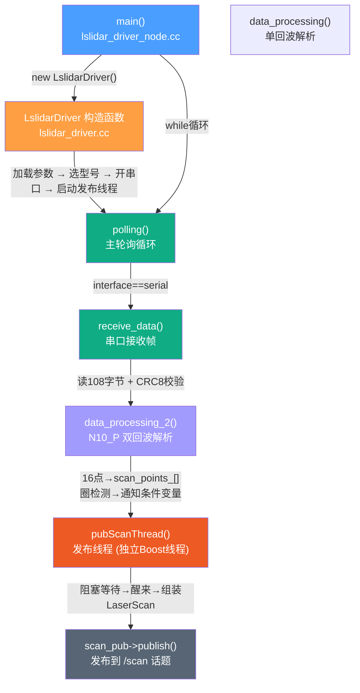

### 2.A.2 帧解析流程图（N10_P）

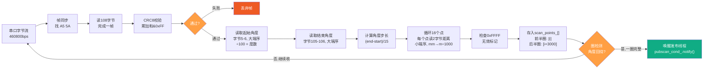

### 2.A.3 双回波(N10_P)数据存储模型

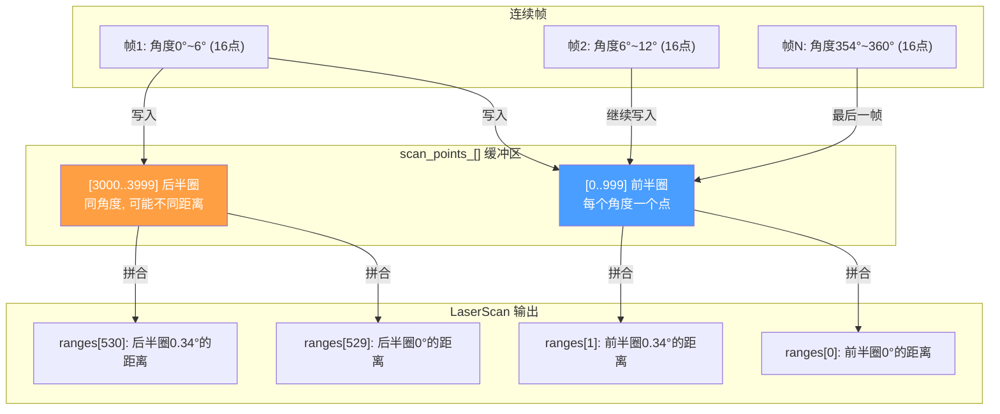

---


# 阶段三：飞控桥接层 — 里程计与姿态

> 目标：理解飞控数据怎么变成 /odom 和 /imu，以及"里程计"到底是什么。
> 本阶段深入 [ano_bridge_node.py](n10p_ws/src/n10p_bringup/n10p_bringup/ano_bridge_node.py)（404 行），完整解析匿名协议 V7。

---

## 3.1 什么是"匿名凌霄飞控"

飞控（Flight Controller）= 无人机的大脑。它是一个独立的单片机（STM32），负责：

- 读取 IMU 传感器（加速度计 + 陀螺仪 + 磁力计）
- 通过融合算法（如卡尔曼滤波）算出飞行姿态（四元数/欧拉角）
- 估算飞行速度和位置（通过积分 IMU 数据）
- 接收遥控器指令、控制电机转速

飞控通过**串口数传**跟机载计算机（本项目目前是开发机，最终是树莓派）通信，协议叫"匿名协议 V7"。

```
无人机硬件栈:
┌─────────────────────────────────┐
│  机载计算机 (树莓派/开发机)       │ ← 跑 ROS2, SLAM, Nav2
│  USB 口 ← 插数传接收器           │
└──────────┬──────────────────────┘
           │ 串口 921600bps
           │ 匿名协议 V7 帧
┌──────────┴──────────────────────┐
│  匿名凌霄飞控 (STM32)            │ ← 跑姿态解算, 电机控制
│  - IMU (加速度计+陀螺仪+磁力计)   │
│  - 气压计 (高度)                 │
│  - GPS (可选)                    │
└─────────────────────────────────┘
```

---

## 3.2 匿名协议 V7 详解

### 3.2.1 帧格式

```
┌──────┬──────┬──────┬──────┬──────────┬──────┬──────┐
│ HEAD │ ADDR │  ID  │ LEN  │  DATA    │  SC  │  AC  │
│ 1B   │ 1B   │ 1B   │ 1B   │   n B    │ 1B   │ 1B   │
└──────┴──────┴──────┴──────┴──────────┴──────┴──────┘
 0xAA   0xFF   帧ID  数据长   实际数据   累加和  累积和
```

| 字段 | 字节 | 含义 |
|------|------|------|
| `HEAD` | 1 | 帧头，固定 `0xAA` |
| `ADDR` | 1 | 目标地址。`0xFF` = 广播, `0xAF` = 主机 |
| `ID` | 1 | 帧类型 ID，决定 DATA 区如何解析 |
| `LEN` | 1 | DATA 区的字节数 |
| `DATA` | n | 实际数据，n = LEN |
| `SC` | 1 | 累加和校验：`sum(HEAD..DATA_end) & 0xFF` |
| `AC` | 1 | 累积和校验：`cumulative_sum(各步SC) & 0xFF` |

### 3.2.2 双重校验和（SC + AC）

这是匿名协议的核心特点——用两步累积校验保证可靠性。

```
假设帧数据序列: [AA, FF, 04, 09, v0, v1, v2, v3, sta, ...]

SC 计算 (累加和):
  SC₁ = (AA)                      & 0xFF
  SC₂ = (AA + FF)                 & 0xFF
  SC₃ = (AA + FF + 04)            & 0xFF
  ...
  SC_final = (all bytes sum)      & 0xFF  → 这就是 SC

AC 计算 (SC 值的累积和):
  AC₁ = SC₁                        & 0xFF
  AC₂ = (AC₁ + SC₂)               & 0xFF
  AC₃ = (AC₂ + SC₃)               & 0xFF
  ...
  AC_final                         & 0xFF  → 这就是 AC
```

如果传输中一个比特翻转了，SC 可能碰巧蒙混过关，但 AC 几乎不可能同时蒙混。双重校验大大提高了误码检测率。

代码实现（`ano_bridge_node.py:167-175`）：
```python
def verify_checksum(self, frame):
    sc = 0
    ac = 0
    data_end = 4 + frame[3]  # HEAD 到 DATA 结束
    for i in range(data_end):
        sc = (sc + frame[i]) & 0xFF
        ac = (ac + sc) & 0xFF
    return sc == frame[-2] and ac == frame[-1]
```

### 3.2.3 本项目解析的 8 种帧 ID

| ID | 名称 | DATA 字段 | 长度 | 发布到什么 |
|----|------|----------|------|-----------|
| `0x01` | IMU_RAW | ACC_X/Y/Z (int16×3) + GYR_X/Y/Z (int16×3) | 13B | `/imu` (角速度+加速度) |
| `0x02` | MAG_BARO | MAG_X/Y/Z (int16×3) + ALT_BAR (int32 cm) | 14B | 缓存 (高度) |
| `0x03` | EULER | ROL/PIT/YAW ×100 (int16×3) | 7B | 缓存 (欧拉角, 备用) |
| `0x04` | QUAT | V0/V1/V2/V3 ×10000 (int16×4) | 9B | `/odom` + `/imu` (姿态四元数) |
| `0x05` | ALTITUDE | ALT_FU (int32 cm) + ALT_ADD (int32 cm) | 9B | `/odom` (Z 位置) |
| `0x07` | SPEED | SPEED_X/Y/Z (int16×3 cm/s) | 6B | `/odom` (线速度) |
| `0x08` | POSITION | POS_X/Y (int32×2 cm) | 8B | `/odom` (X,Y 位置) |
| `0x0E` | MODULE_STA | 4 个 uint8 状态字节 | 4B | 缓存 (模块状态) |

**注意**：飞控**不会**同时发送所有 8 种帧。它按固定顺序循环发送（如 0x01 → 0x04 → 0x07 → 0x08 → 0x01 → ...），每帧间隔约几毫秒。ano_bridge_node 的 1kHz 串口轮询足以捕获所有帧。

---

## 3.3 ano_bridge_node 架构

### 3.3.1 两大工作流程

```
流程 A: 串口读取 (1kHz)                    流程 B: 定时发布 (20Hz)
─────────────────────                      ─────────────────────

read_serial() [每 1ms]                    publish_odometry() [每 50ms]
    │                                         │
    ├→ ser.read() 读串口缓冲区                  ├→ 组装 Odometry 消息
    │                                         │   ├─ header.frame_id = "odom"
    ├→ 追加到 self.buf                         │   ├─ child_frame_id = "base_link"
    │                                         │   ├─ pose.position = (pos_x,pos_y,pos_z)
    ├→ parse_buffer()                          │   ├─ pose.orientation = (q0,q1,q2,q3)
    │   ├─ 找帧头 0xAA                         │   ├─ twist.linear = (vel_x,vel_y,vel_z)
    │   ├─ 读 LEN → 完整帧                     │   └─ twist.angular = (gyr_x,gyr_y,gyr_z)
    │   ├─ verify_checksum() → 校验            │
    │   └─ dispatch_frame() → 分发解析          ├→ odom_pub.publish(msg)
    │       ├─ ID=0x01 → parse_imu_raw()       │
    │       │   更新 self.acc, self.gyr        ├→ 如果 publish_tf:
    │       │   调用 publish_imu()              │   发布 TransformStamped
    │       ├─ ID=0x04 → parse_quat()           │   (odom → base_link)
    │       │   更新 self.q0~q3                 │
    │       ├─ ID=0x05 → parse_altitude()       └→ 完成
    │       │   更新 self.pos_z
    │       ├─ ID=0x07 → parse_speed()
    │       │   更新 self.vel_x,vel_y,vel_z
    │       └─ ID=0x08 → parse_position()
    │           更新 self.pos_x,pos_y
    └→ 完成
```

**关键设计**：串口读取（1kHz）和消息发布（20Hz）是两个独立的流程。飞控数据随时来，解析后更新缓存变量（`self.pos_x`, `self.vel_x`, `self.q0~q3` 等）。发布流程每 50ms 从缓存变量中读最新值，组装成 Odometry 消息发出去。

### 3.3.2 数据换算说明

飞控发来的都是**整数**，需要乘以 scale 因子换算成标准单位。

| 数据 | 飞控原始值 | 换算 | 最终值 | 说明 |
|------|----------|------|--------|------|
| 姿态四元数 | int16 ×10000 | ÷10000 | float (w,x,y,z) | 飞控融合后的姿态 |
| 位置 X/Y | int32 cm | ×0.01 | float m | 飞控积分的位置 |
| 高度 | int32 cm | ×0.01 | float m | 气压计/超声波 |
| 速度 X/Y/Z | int16 cm/s | ×0.01 | float m/s | 飞控估计的速度 |
| 角速度 | int16 LSB | ×0.001065 | float rad/s | ±2000dps 陀螺仪 |
| 加速度 | int16 LSB | ×0.004788 | float m/s² | ±16g 加速度计 |

---

## 3.4 /odom 消息的每一行怎么来的

以 `publish_odometry()` 函数（`ano_bridge_node.py:282-332`）为例：

```python
msg = Odometry()
msg.header.frame_id = "odom"         # 父坐标系 = 里程计
msg.child_frame_id = "base_link"      # 子坐标系 = 机器人本体

# 位置 — 来自飞控 ID 0x08 帧 (POSITION), cm→m
msg.pose.pose.position.x = self.pos_x   # 飞控累积的 X 位置
msg.pose.pose.position.y = self.pos_y   # 飞控累积的 Y 位置
msg.pose.pose.position.z = self.pos_z   # 来自 ID 0x05 (ALTITUDE)

# 姿态四元数 — 来自飞控 ID 0x04 帧 (QUAT), ×10000→归一化
msg.pose.pose.orientation.w = self.q0
msg.pose.pose.orientation.x = self.q1
msg.pose.pose.orientation.y = self.q2
msg.pose.pose.orientation.z = self.q3

# 线速度 — 来自飞控 ID 0x07 帧 (SPEED), cm/s→m/s
msg.twist.twist.linear.x = self.vel_x
msg.twist.twist.linear.y = self.vel_y
msg.twist.twist.linear.z = self.vel_z

# 角速度 — 来自飞控 ID 0x01 帧 (IMU) 的陀螺仪数据
msg.twist.twist.angular.x = self.gyr[0]
msg.twist.twist.angular.y = self.gyr[1]
msg.twist.twist.angular.z = self.gyr[2]

# 协方差 — 硬编码的合理默认值（非实时估算）
msg.pose.covariance = [0.01, ...]    # 位置: 0.01m², 姿态: 0.001rad²
msg.twist.covariance = [0.01, ...]   # 速度: 0.01 (m/s)²
```

**为什么协方差是硬编码的？**
飞控不输出协方差矩阵（这需要卡尔曼滤波器额外输出）。所以节点用了合理的经验值：认为位置精度约 10cm，姿态精度约 3°，速度精度约 10cm/s。这些值足够 SLAM/AMCL 使用了——因为 AMCL 主要信任激光匹配，不依赖里程计的协方差。

---

## 3.5 /imu 消息的每一行怎么来的

`publish_imu()` 函数（`ano_bridge_node.py:349-387`）：

```python
msg = Imu()
msg.header.frame_id = "base_link"   # IMU 装在机身上

# 姿态 — 跟 /odom 同一个来源 (飞控融合四元数)
msg.orientation = (q0, q1, q2, q3)

# 角速度 — 来自飞控陀螺仪原始数据 (ID 0x01)
msg.angular_velocity.x = gyr_x      # 绕 X 轴旋转速度 (rad/s)
msg.angular_velocity.y = gyr_y      # 绕 Y 轴
msg.angular_velocity.z = gyr_z      # 绕 Z 轴 (偏航)

# 线加速度 — 来自飞控加速度计原始数据 (ID 0x01)
msg.linear_acceleration.x = acc_x   # X 方向加速度 (m/s²)
msg.linear_acceleration.y = acc_y   # Y 方向
msg.linear_acceleration.z = acc_z   # Z 方向 (重力方向)
```

**IMU 和 Odometry 中姿态的区别**：
- `/imu` 发布的是**原始传感器数据**（角速度 + 加速度）加上融合后的姿态
- `/odom` 发布的是**里程计推断**（位置 + 速度 + 姿态）
- 两者姿态来源相同（飞控四元数），但 IMU 额外包含原始陀螺仪和加速度计读数

**关于 ACC scale 的已知问题**：飞控静止时，Z 轴加速度应该约 9.8 m/s²（重力），但实测约 6.4。说明 `acc_scale = 0.004788` 这个值需要校准。不过目前不影响使用——SLAM 不需要加速度数据，只用四元数姿态。

---

## 3.6 三个里程计节点对比

n10p_bringup 包含 3 种里程计节点，适用于不同场景：

| | ano_bridge_node | dummy_odom_node | keyboard_odom_node |
|---|----------------|-----------------|-------------------|
| **位置来源** | 飞控积分 (ID 0x08) | 全零 (0,0,0) | 键盘积分 (20Hz) |
| **姿态来源** | 飞控融合四元数 (ID 0x04) | 飞控四元数 (仅 ID 0x04) | 偏航角积分 (无 roll/pitch) |
| **速度来源** | 飞控估计 (ID 0x07) | 无 (零) | 键盘设置值 |
| **角速度来源** | 飞控陀螺仪 (ID 0x01) | 无 | 键盘设置值 |
| **需要飞控** | 是 | 可选 (有则用姿态) | 否 |
| **使用场景** | 真实飞行 / 完整测试 | 手持 SLAM 建图 | 桌面测试 Nav2 |
| **代码行数** | 404 | 156 | 175 |

### 3.6.1 dummy_odom_node — 为什么位置全零但 SLAM 能用？

这是项目中最精妙的设计决策之一。回顾手持 SLAM 场景：

- 你拿着雷达在室内走，**没有飞控提供位置**
- dummy_odom 把位置固定为 (0,0,0)，只从飞控取四元数姿态
- slam-toolbox 配置了 `minimum_travel_distance: 0.0`（不依赖里程计触发）
- SLAM 的扫描匹配（scan matching）自己算出了机器人的真实位移
- SLAM 发布 `map→odom` TF 来修正里程计的"零位移"偏差
- 最终 `/map` 仍然正确生成

**dummy_odom 唯一必须提供的是姿态**（四元数），因为如果姿态全是零（意味着雷达水平朝前），而你拿着雷达倾斜了 30°，那激光平面就歪了，SLAM 扫描匹配会崩溃。

### 3.6.2 keyboard_odom_node — 纯键盘模拟全向运动

这个节点**不读飞控**，不需要任何串口。用 Python stdlib 的 `termios + tty + select` 实现非阻塞键盘读取。

运动模型（全向）体现在 `update_odom()` 函数（`keyboard_odom_node.py:128-130`）：

```python
# 体坐标系速度 → 世界坐标系积分（全向模型）
self.x += (self.vx * cos(self.yaw) - self.vy * sin(self.yaw)) * dt
self.y += (self.vx * sin(self.yaw) + self.vy * cos(self.yaw)) * dt
self.yaw += self.vth * dt
```

这个公式允许机器人朝任意方向平移（不受偏航角约束），你按 A 键就是纯左移（不改变朝向），按 D 就是纯右移。

---

## 3.7 TF 坐标树 — 谁发布哪一段

```
map            ← 世界固定原点 (建图时确定)
 │              发布者: slam-toolbox (建图) 或 AMCL (导航)
 │              频率: 按需 (回环检测/粒子更新后)
 │
odom           ← 里程计累积原点 (每次开机从零开始)
 │              发布者: ano_bridge_node / dummy_odom / keyboard_odom
 │              频率: 20Hz (定时发布)
 │              内容: odom → base_link 的平移 + 旋转
 │
base_link      ← 机器人本体中心
 │              发布时间: 不直接发布 (它是 odom 的子帧)
 │
laser_frame    ← 雷达安装位置
                发布者: static_transform_publisher
                频率: 静态 (启动时一次)
                内容: base_link → laser_frame 的固定偏移 (0, 0, -0.1)
```

**为什么真机和仿真 TF 方向相反？**

| | 真机 | 仿真 |
|---|------|------|
| `base_link → laser_frame` 平移 | `(0, 0, -0.1)` | `(0, 0, 0.1)` |
| 原因 | 雷达吊在无人机**下方** 10cm | URDF 中雷达在机身**上方** 10cm |

这不是 bug。仿真中雷达装在顶部是为了方便（不用考虑起落架遮挡），真机中雷达吊在底部是实际安装位置。只要 TF 发布正确，SLAM 不在乎雷达实际装在哪。

---


## 阶段三 知识图谱

### 3.A.1 飞控数据流全景

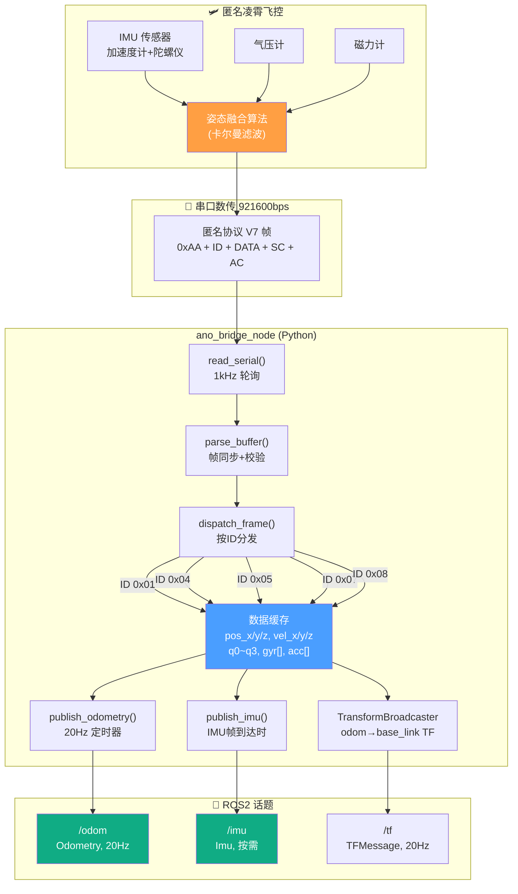

### 3.A.2 三种里程计节点对比

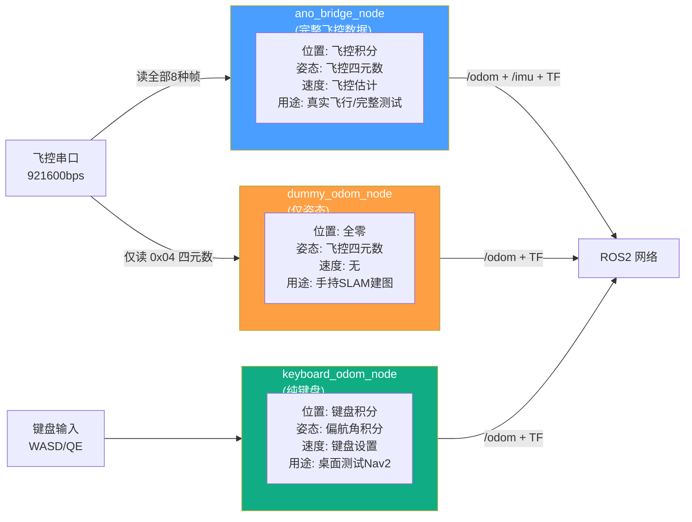

### 3.A.3 匿名协议帧格式

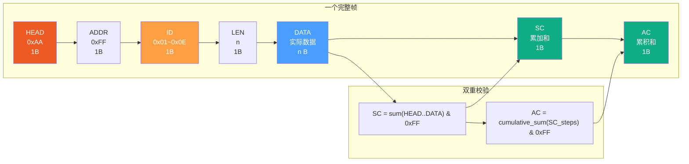

---


# 阶段四：SLAM 建图 — 怎么把激光扫描变成地图

> 目标：理解 slam-toolbox 如何把 /scan + /odom 变成 /map，以及地图如何保存给导航使用。
> 本阶段深入 [mapper_params_online_async.yaml](n10p_ws/src/n10p_slam/config/mapper_params_online_async.yaml) 的每个参数含义。

---

## 4.1 SLAM 基本概念

### 4.1.1 问题定义

SLAM = **S**imultaneous **L**ocalization **A**nd **M**apping（同时定位与建图）

机器人被放在一个未知环境中，手里只有激光雷达和里程计。它要同时回答两个问题：

1. **定位（Localization）**：我在哪？
2. **建图（Mapping）**：周围环境长什么样？

这两个问题是**互相依赖**的——要知道环境长什么样，首先需要知道自己在哪；要知道自己在哪，又需要知道环境长什么样。这是一个"鸡生蛋蛋生鸡"的问题，SLAM 的核心就是同时求解这两个东西。

### 4.1.2 输入输出

```
输入:                           输出:
─────                           ─────

/scan (LaserScan, 10Hz)  ──┐
                            ├──→  slam-toolbox  ──→  /map (OccupancyGrid, 栅格地图)
TF(odom→base_link)  ───────┘                         TF(map→odom, 修正里程计漂移)
```

### 4.1.3 核心思想：扫描匹配（Scan Matching）

SLAM 的核心操作叫"扫描匹配"：把当前收到的激光扫描跟之前累积的地图对齐。

```
第 1 帧扫描: ████░░░░░░░░░░  ← 前方 4m 有墙

第 2 帧扫描: ██░░░░░░░░░░░░  ← 墙在 2m 处了！说明我朝墙走了 2m
             墙更近了

第 3 帧扫描: ░░████░░░░░░░░  ← 墙在左边了！说明我转弯了
             墙在左边
```

每次收到新的扫描，SLAM 都会问："如果把这帧扫描放在地图的哪个位置，它跟已有地图的匹配度最高？"找到最优位置后，就把机器人的位姿更新到那里，然后把新扫描数据融入地图。

### 4.1.4 回环检测（Loop Closure）

当你走了一圈回到起点时，里程计说你在 (100, 5)，但激光扫描看到的环境跟你起始位置看到的一样。SLAM 识别出这是一个"回环"——"我来过这里！"，然后自动修正累积的漂移。

```
回环前:                           回环后:
  实际路径: ┌──────┐               实际路径: ┌──────┐
            │      │                         │      │
            └──────┘                         └──────┘
  里程计说: ┌──────┐╱╲  漂了           地图修正后: 完美闭合
```

---

## 4.2 slam-toolbox 简介

### 4.2.1 为什么选 slam-toolbox（ADR-001）

| 候选 | 优 | 劣 | 结论 |
|------|----|-----|------|
| **slam-toolbox** | 已安装在 ros-humble 中，社区活跃，支持异步建图+离线优化 | 参数较多需要调 | ✅ 选用 |
| Hector SLAM | 不需要里程计 | 建图质量一般，对雷达精度要求高 | 备选 |
| Cartographer | Google 出品，精度最高 | 计算量大，树莓派跑不动 | 放弃 |
| Gmapping | ROS1 经典 | ROS2 版本成熟度一般 | 放弃 |

### 4.2.2 Online Async 模式

slam-toolbox 有几种工作模式。我们用的是 **online async（在线异步）**：

- **online**：实时接收 /scan，边跑边建图
- **async**：建图优化在后台异步进行，不阻塞新数据的接收。这样即使某一次优化花的时间长了，也不会丢扫描数据。

---

## 4.3 本项目 SLAM 配置逐参数详解

配置文件：`n10p_slam/config/mapper_params_online_async.yaml`（56 行）

### 4.3.1 模式与坐标系

```yaml
mode: mapping                # 建图模式。导航时改用 localization
map_frame: map              # 地图坐标系名
odom_frame: odom            # 里程计坐标系名
base_frame: base_link       # 机器人本体坐标系名
scan_topic: /scan           # 订阅哪个话题的激光数据
```

**mapping vs localization 模式**：
- `mapping`：同时建图+定位。地图在持续更新，用于首次探索环境
- `localization`：只用已有地图定位，不修改地图。用于导航时的精确定位

### 4.3.2 地图参数

```yaml
map_resolution: 0.05        # 每格 5cm × 5cm
map_start_pose: [0.0, 0.0, 0.0]  # 地图原点 = 机器人初始位置
map_update_interval: 3.0    # 每 3 秒更新一次地图发布
max_laser_range: 12.0       # 最远用多远的激光数据（匹配 N10P 量程）
minimum_laser_range: 0.02   # 最近用多近的激光数据
```

| 参数 | 如果改大了 | 如果改小了 |
|------|-----------|-----------|
| `map_resolution` | 地图粗糙，内存小，树莓派友好 | 地图精细，内存大，计算慢 |
| `map_update_interval` | 地图更新慢，省 CPU | 更新快，CPU 开销大 |
| `max_laser_range` | 远距离噪声被纳入地图 | 远距离障碍物看不到 |

### 4.3.3 扫描匹配参数

```yaml
minimum_travel_distance: 0.0    # 平移多少米才处理新扫描 (0=每帧都处理)
minimum_travel_heading: 0.0     # 旋转多少弧度才处理新扫描 (0=不依赖里程计)
```

**这两个参数是本项目的关键设置。** 标准配置是 `minimum_travel_distance: 0.5`（移动半米才处理一次），但我们设为 0，因为：

- 手持建图时用的 `dummy_odom` 位置始终是零，如果设 0.5m，SLAM 会认为"机器人从未移动过"→ 永远不会处理新扫描 → 永远不建图
- 设 0 意味着每一帧 /scan 都处理，完全依赖 scan matching 来推断运动

### 4.3.4 回环检测参数

```yaml
do_loop_closing: true                   # 启用回环检测
loop_search_maximum_distance: 5.0       # 在当前位置 5m 范围内搜索回环候选
loop_match_min_chain_size: 10           # 至少 10 帧连续匹配才认定回环
loop_match_min_response_coarse: 0.35    # 粗匹配得分阈值
loop_match_min_response_fine: 0.45      # 精细匹配得分阈值
```

回环检测的工作方式：
1. 每收到一帧扫描，在当前位姿 5m 范围内搜索"历史上有没有类似的扫描"
2. 如果找到相似的 → 做精细匹配 → 得分 > 0.45 → 确认回环
3. 回环确认后，位姿图优化器修正整条轨迹

### 4.3.5 求解器参数

```yaml
solver_plugin: solver_plugins::CeresSolver      # 用 Google Ceres 做非线性优化
ceres_linear_solver: SPARSE_NORMAL_CHOLESKY      # 稀疏矩阵求解器
ceres_preconditioner: SCHUR_JACOBI               # SCHUR 预处理器（加速收敛）
ceres_trust_strategy: LEVENBERG_MARQUARDT        # LM 信赖域策略
ceres_num_threads: 4                             # 4 线程并行
```

这些是 Ceres Solver 的底层配置，一般不需要改。唯一可能需要调整的是 `ceres_num_threads`——树莓派 4B 只有 4 核，建议降为 2。

### 4.3.6 地图保存

```yaml
map_file_name: /home/ubuntu22/ROS2/n10p_leishen/maps/n10p_map
map_save_mode: 0    # 0=完整保存, 1=仅保存变更
```

保存地图的方式：在终端中调用 slam-toolbox 的 SaveMap 服务。

---

## 4.4 两种启动模式

### 4.4.1 模式 A：手持建图（slam_launch.py）

```
ros2 launch n10p_slam slam_launch.py
```

启动的节点：
```
dummy_odom_node        ← 占位里程计 (位置全零 + 飞控姿态)
lslidar_driver_node    ← N10P 雷达驱动 (自带驱动!)
static_tf_laser        ← 静态 TF
slam_toolbox           ← SLAM 建图 (3秒延迟)
rviz2                  ← 可视化 (6秒延迟)
```

**适用场景**：第一次建图，没有已有地图，不需要飞控。**自给自足，一个 launch 搞定一切。**

**不能跟 bringup_launch.py 同时跑**：两个 launch 都启动了雷达驱动 → 两个进程抢同一个串口 → 驱动崩溃。

### 4.4.2 模式 B：配合飞控建图（slam_only_launch.py）

```
终端1: ros2 launch n10p_bringup n10p_bringup_launch.py   ← 传感器
终端2: ros2 launch n10p_slam slam_only_launch.py          ← 仅 SLAM
```

启动的节点（仅 slam_only_launch.py）：
```
slam_toolbox           ← SLAM 建图 (1秒延迟)
rviz2                  ← 可视化 (4秒延迟)
```

**适用场景**：飞控在线，想用真实里程计（而非 dummy_odom）做 SLAM。

**对比 slam_launch.py**：
- 不启动驱动（假设 bringup 已启动）
- 不启动 dummy_odom（用 bringup 中的 ano_bridge_node）
- 延迟更短（1 秒 vs 3 秒），因为无需等驱动初始化

---

## 4.5 从建图到导航 — 地图如何交接

SLAM 建完图后，地图文件被保存。导航时，map_server 加载地图。

### 4.5.1 保存地图

```bash
# 终端执行，调用 slam-toolbox 的 SaveMap 服务
ros2 service call /slam_toolbox/save_map slam_toolbox/srv/SaveMap
```

或者用 ROS2 命令行：
```bash
ros2 run nav2_map_server map_saver_cli -f ~/ROS2/n10p_leishen/maps/n10p_map
```

### 4.5.2 地图文件的含义

保存后会得到两个文件：

**n10p_map.yaml**（元数据）：
```yaml
image: n10p_map.pgm        # 对应的图像文件
mode: trinary              # 三值: -1未知, 0空闲, 100占用
resolution: 0.05           # 每个像素 = 5cm
origin: [-5.59, -7.76, 0]  # 地图左下角像素在 map 坐标系的位置
occupied_thresh: 0.65      # 像素值 >0.65 → 视为占用
free_thresh: 0.25          # 像素值 <0.25 → 视为空闲
```

**n10p_map.pgm**（图像）：
一个灰度图像，每个像素代表 5cm×5cm 的格子。白色=空闲，黑色=占用，灰色=未知。

### 4.5.3 导航时加载地图

`nav_launch.py` 中的 map_server 节点加载这个 yaml 文件：

```python
map_server_node = Node(
    package='nav2_map_server',
    executable='map_server',
    parameters=[params_file, {'yaml_filename': map_yaml}],
)
```

map_server 加载后发布 `/map` 话题（跟 SLAM 的 /map 是同一种消息类型），AMCL 订阅这个地图做定位。

**关键**：导航时 map_server 发布的是**静态地图**（从文件读取，不再更新），而 SLAM 发布的是**动态地图**（持续更新）。导航不需要更新地图——导航是"用已知地图找路"。

---

## 4.6 SLAM 验证方法

### 4.6.1 确认 SLAM 正常工作

| 步骤 | 命令 | 预期 |
|------|------|------|
| ① 话题存在 | `ros2 topic list \| grep map` | `/map` 存在 |
| ② 地图有内容 | `ros2 topic echo /map --once` | `data[]` 不全为 -1 |
| ③ TF 完整 | `ros2 run tf2_tools view_frames` | 能看到 map→odom→base_link 的完整树 |

### 4.6.2 判断建图质量

| 现象 | 原因 | 对策 |
|------|------|------|
| 地图模糊、重影 | 里程计漂移太大 | 走慢一点，多走回环 |
| 地图不闭合 | 回环检测未触发 | 增加回环候选距离，或减少阈值 |
| 地图上出现"自己的轮廓" | 手持时身体遮挡雷达后方 | 把雷达举高，或屏蔽后方角度 |
| 地图大面积空白 | 扫描被丢弃 | 检查 TF 链是否完整，QoS 是否匹配 |

### 4.6.3 查看保存的地图

```bash
# 用项目自带的查看工具
python3 scripts/map_viewer.py maps/n10p_map.yaml
```

---


## 阶段四 知识图谱

### 4.A.1 SLAM 工作流程全景

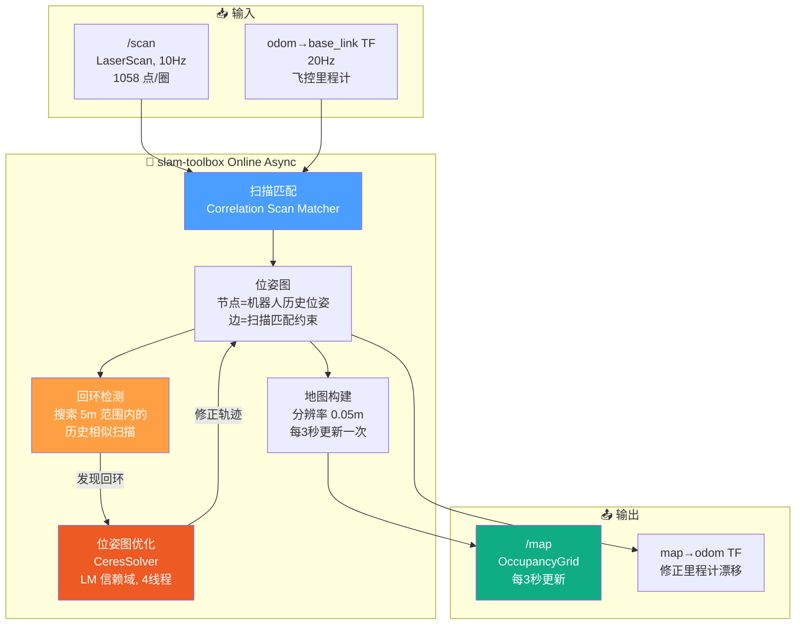

### 4.A.2 扫描匹配原理示意

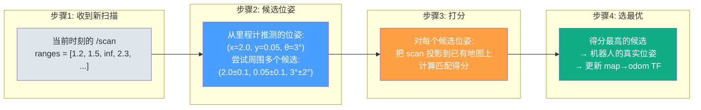

### 4.A.3 建图到导航的地图交接

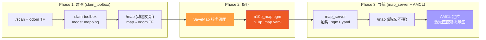

### 4.A.4 两种 SLAM 启动模式对比

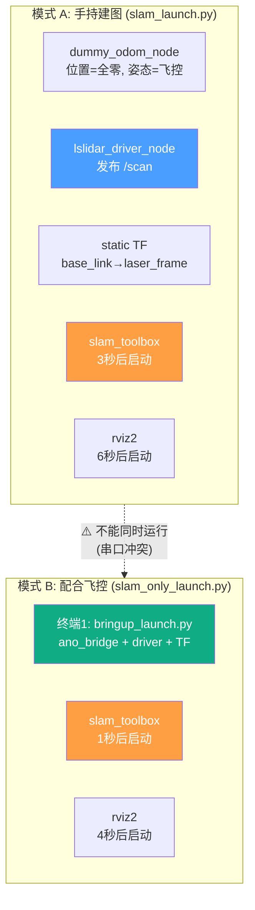

---

