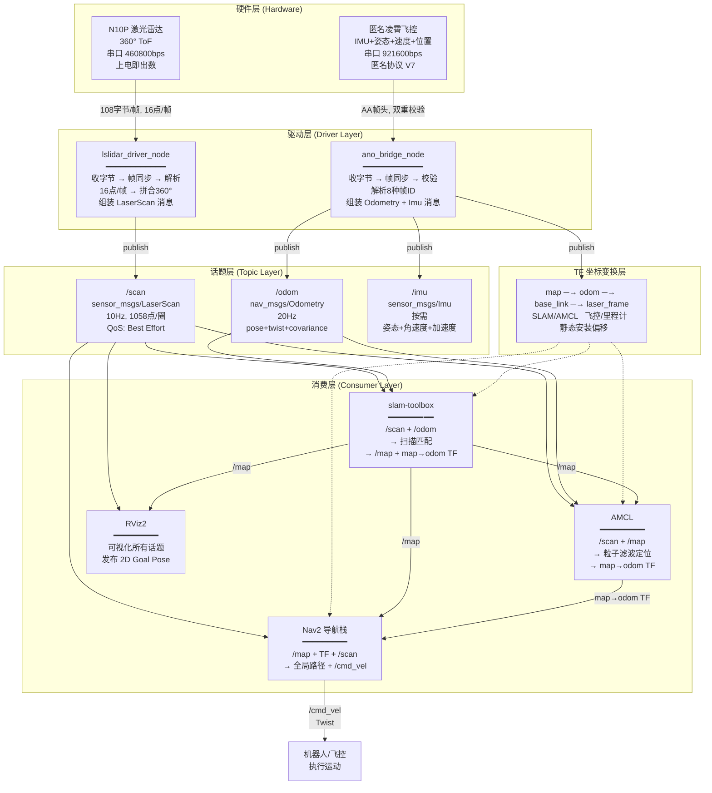
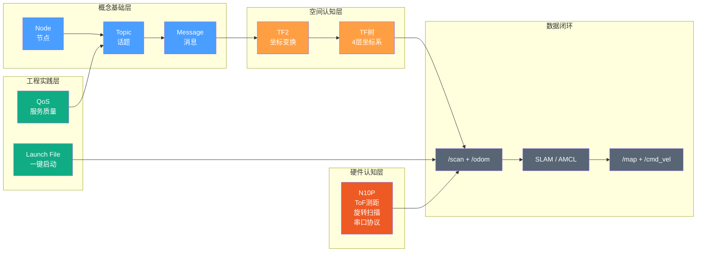
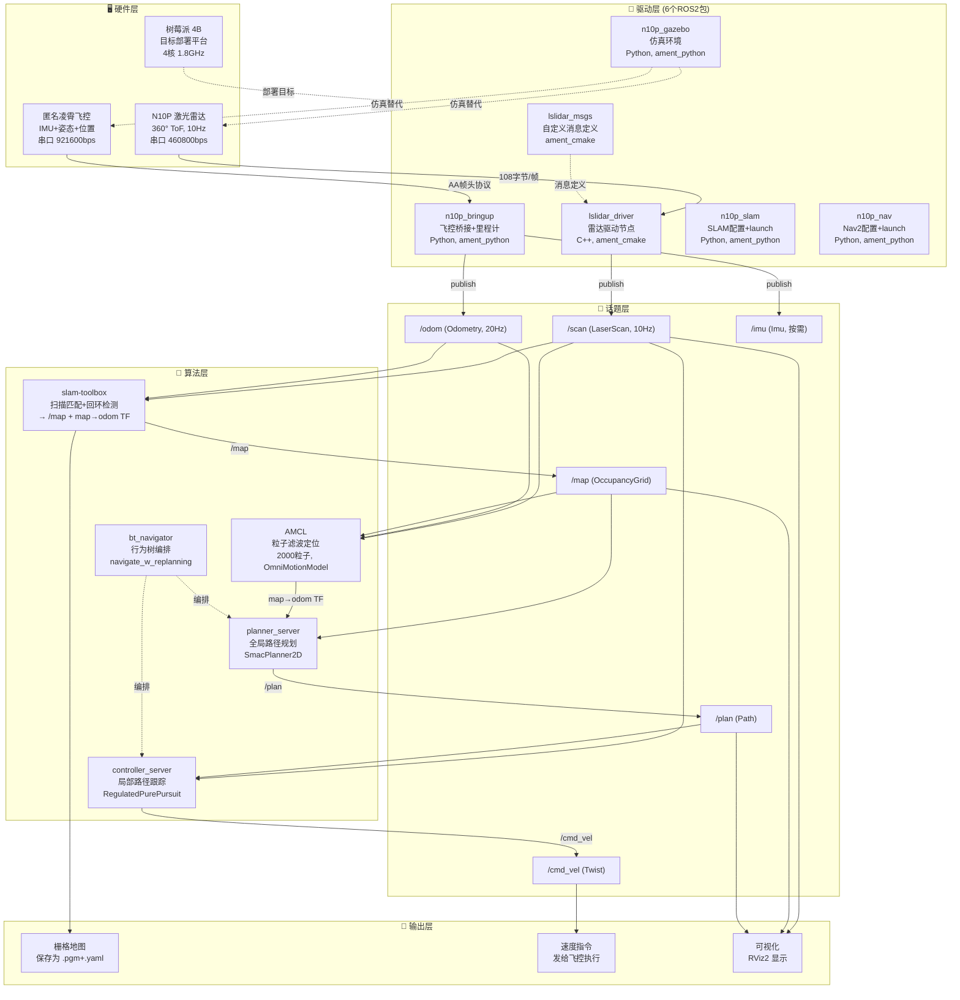
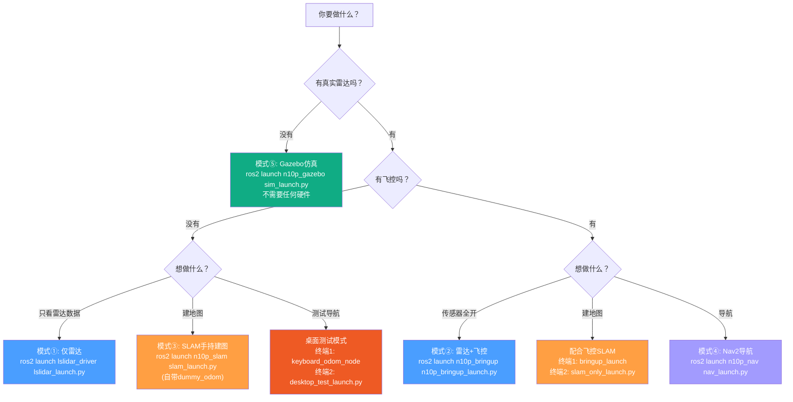
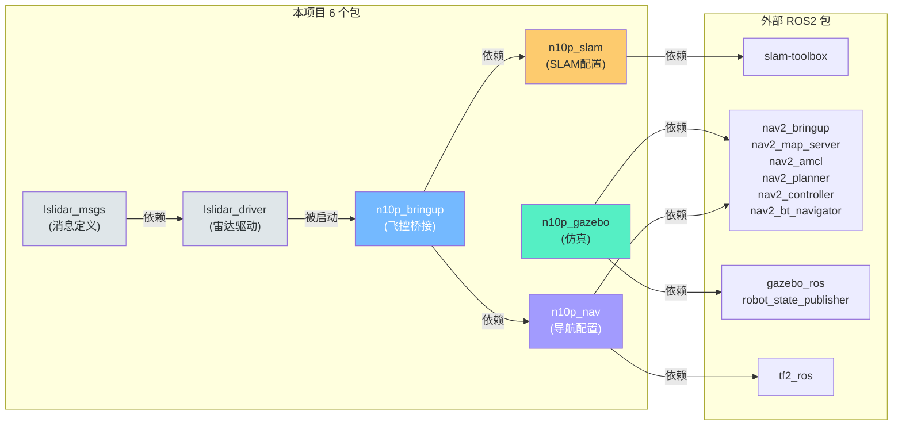

# N10P 项目学习笔记

> 创建: 2026-05-30 | 逐步追加，不覆盖已有内容
> 每阶段讲解内容按时间顺序追加在下方

---

# 阶段零：ROS2 核心概念速成

> 本阶段目标：建立 ROS2 的基本词汇表。之后讲项目的任何内容，你都不会因为"不知道这个词是什么意思"而卡住。

---

## 0.1 节点（Node）与话题（Topic）

### 概念

**节点（Node）** = 一个独立的可执行程序。ROS2 把整个机器人软件拆成很多小节点，每个节点只做一件事。

打个比方：一个公司里有前台、会计、工程师、保洁——每个人是一个"节点"，各干各的。他们不直接喊话，而是通过"邮件系统"（话题）来传递信息。

**话题（Topic）** = 一条有名字的数据管道。节点 A 往管道里发数据（发布），节点 B 从管道里读数据（订阅）。A 和 B 互不知道对方的存在，只管往管道里收发。

```
[节点A] --发布-->  /some_topic  --订阅--> [节点B]
(发布者/Publisher)                         (订阅者/Subscriber)
```

关键特性：
- **多对多**：一个话题可以被多个节点订阅，也可以被多个节点发布（虽然通常只有一个发布者）
- **异步**：发布者不等待订阅者处理完，发了就继续干自己的事
- **类型安全**：每个话题有固定的消息类型，类型不匹配就接不上

### 本项目实例

打开 [lslidar_driver_node.cc](n10p_ws/src/Lslidar_ROS2_driver/lslidar_driver/src/lslidar_driver_node.cc)，看到第 26-31 行：

```cpp
auto node = std::make_shared<lslidar_driver::LslidarDriver>();
while (rclcpp::ok() && node->polling()) {
    rclcpp::spin_some(node);
}
```

这里创建了一个叫 `lslidar_driver_node` 的节点。它在第 230 行创建了一个发布者：

```cpp
scan_pub = this->create_publisher<sensor_msgs::msg::LaserScan>(scan_topic, 10);
```

意思是：这个节点要向话题 `/scan`（默认值）发布类型为 `sensor_msgs::msg::LaserScan` 的消息，队列深度为 10。

同时它也在第 233 行创建了一个订阅者：

```cpp
difop_switch = this->create_subscription<std_msgs::msg::Int8>("lslidar_order", 1, ...);
```

意思是：这个节点订阅了话题 `/lslidar_order`，当有人发 `std_msgs::msg::Int8` 消息过来时，执行回调函数 `lidar_order`。

### 本项目话题总表

| 话题 | 消息类型 | 发布者 | 订阅者 | 频率 |
|------|----------|--------|--------|------|
| `/scan` | `sensor_msgs/LaserScan` | lslidar_driver_node | slam_toolbox, AMCL, local_costmap, RViz2 | ~10Hz |
| `/odom` | `nav_msgs/Odometry` | ano_bridge_node | slam_toolbox, AMCL, RViz2 | 20Hz |
| `/imu` | `sensor_msgs/Imu` | ano_bridge_node | （可选） | 按需 |
| `/map` | `nav_msgs/OccupancyGrid` | slam_toolbox 或 map_server | AMCL, global_costmap, RViz2 | 周期性 |
| `/cmd_vel` | `geometry_msgs/Twist` | controller_server | 飞控(真机)/planar_move(仿真) | 按需 |
| `/plan` | `nav_msgs/Path` | planner_server | controller_server, RViz2 | 按需 |
| `/lslidar_order` | `std_msgs/Int8` | 外部(用户) | lslidar_driver_node | 按需 |
| `/n10p_lidar_plugin/out` | `sensor_msgs/LaserScan` | Gazebo ray 插件 | scan_relay | ~10Hz |
| `/tf` | `tf2_msgs/TFMessage` | 多个节点 | 所有需要坐标变换的节点 | 变化时 |
| `/robot_description` | `std_msgs/String` | robot_state_publisher | RViz2 | 启动时 |

---

## 0.2 消息类型（Message）

### 概念

ROS2 通信是强类型的。发布者和订阅者必须约定好消息的"数据结构"——就像两个人通信必须用同一种语言。消息类型用 `.msg` 文件定义，位于包的 `msg/` 目录下。

本项目有两类消息：
1. **ROS2 标准消息**：ROS2 官方定义的通用消息，如 `sensor_msgs/LaserScan`
2. **自定义消息**：本项目 `lslidar_msgs` 包定义的镭神专用消息

### 本项目最关键的 4 种标准消息

#### sensor_msgs/LaserScan（激光扫描数据）

从 [lslidar_driver.cc:972-996](n10p_ws/src/Lslidar_ROS2_driver/lslidar_driver/src/lslidar_driver.cc) 可以看到驱动的构造方式：

```
LaserScan 消息结构：
├── header
│   ├── stamp          # 时间戳（什么时候采的）
│   └── frame_id       # 坐标系名（本项目 = "laser_frame"）
├── angle_min          # 扫描起始角度（本项目 = 0 弧度 = 0°）
├── angle_max          # 扫描结束角度（本项目 = 2π 弧度 = 360°）
├── angle_increment    # 相邻两个采样点之间的角度间隔
├── range_min          # 最小有效距离（本项目 = 0.02m）
├── range_max          # 最大有效距离（本项目 = 12.0m）
├── ranges[]           # 距离数组，每个元素是对应角度上的障碍物距离(m)
│                      #   值 = inf 表示该方向没检测到东西或太远/太近
└── intensities[]      # 强度数组，每个元素是对应角度的反射强度(0-255)
```

**直观理解**：雷达转一圈，在 360° 上均匀采样 ~1058 个点（N10P），每个点有一个距离值和一个强度值。`ranges[0]` 是 0° 方向的距离，`ranges[529]` 是 180° 方向的距离，以此类推。

本项目 N10P：`angle_increment = 2*PI/1058 ≈ 0.00594 弧度 ≈ 0.34°`，即每 0.34° 一个采样点。

#### nav_msgs/Odometry（里程计）

从 [ano_bridge_node.py:86](n10p_ws/src/n10p_bringup/n10p_bringup/ano_bridge_node.py) 可以看到发布者定义。

```
Odometry 消息结构：
├── header
│   ├── stamp          # 时间戳
│   └── frame_id       # 父坐标系（本项目 = "odom"）
├── child_frame_id     # 子坐标系（本项目 = "base_link"）
├── pose               # 位姿（位置 + 姿态）
│   ├── pose
│   │   ├── position   # (x, y, z) 位置，单位 m
│   │   └── orientation # 姿态四元数 (w, x, y, z)
│   └── covariance     # 6×6 协方差矩阵（表达不确定性）
└── twist              # 速度
    ├── twist
    │   ├── linear     # 线速度 (x, y, z)，单位 m/s
    │   └── angular    # 角速度 (x, y, z)，单位 rad/s
    └── covariance     # 6×6 协方差矩阵
```

**重要**：`/odom` 消息本身**不直接给出"机器人在哪"**。它给出的是 `odom` 坐标系和 `base_link` 坐标系之间的**相对变换**。要得到机器人在 map 中的位姿，需要结合 `map→odom` 的 TF。

#### nav_msgs/OccupancyGrid（占据栅格地图）

这是 SLAM 的输出和导航的输入——一张"格子地图"。

```
OccupancyGrid 消息结构：
├── header
│   └── frame_id       # 坐标系名（本项目 = "map"）
├── info
│   ├── resolution     # 每个格子的边长(m)，本项目 = 0.05
│   ├── width          # 地图宽度（格子数）
│   ├── height         # 地图高度（格子数）
│   └── origin         # 地图左下角在 map 坐标系中的位姿
└── data[]             # 一维数组，长度 = width × height
                       #   每个元素值: -1=未知, 0=空闲, 100=占用
```

**直观理解**：地图就像一个围棋棋盘，每个格子告诉你"这里有没有障碍物"。resolution=0.05 意思是每个格子代表现实中 5cm×5cm 的区域。

#### geometry_msgs/Twist（速度指令）

导航最终输出的东西——告诉机器人应该往哪开。

```
Twist 消息结构：
├── linear
│   ├── x    # 前进方向线速度(m/s)，本项目目标 = 0.3
│   ├── y    # 横向线速度(m/s)，全向机器人可以横着走
│   └── z    # 垂直线速度(m/s)，地面机器人永远是 0
└── angular
    ├── x    # 绕 x 轴角速度，地面机器人永远是 0
    ├── y    # 绕 y 轴角速度，地面机器人永远是 0
    └── z    # 绕 z 轴(偏航)角速度(rad/s)，本项目最大 = 1.0
```

### 本项目自定义消息：lslidar_msgs

在 [lslidar_msgs/msg/](n10p_ws/src/Lslidar_ROS2_driver/lslidar_msgs/msg/) 下定义了 5 种消息：

| 消息 | 用途 | 关键字段 |
|------|------|----------|
| `LslidarPacket` | 原始数据包 | `uint8[2000] data` |
| `LslidarPoint` | 单个激光点 | x, y, z, azimuth(方位角), distance, intensity |
| `LslidarScan` | 一次扫描 | `LslidarPoint[] points` |
| `LslidarSweep` | 完整周期(16次扫描) | `LslidarScan[16] scans` |
| `LslidarDifop` | 设备信息 | temperature, rpm |

> 注意：本项目实际使用标准 `sensor_msgs/LaserScan` 发布扫描数据，自定义消息主要存在于驱动内部。下游 SLAM/Nav2 消费的是标准消息。

---

## 0.3 TF2 坐标变换

### 为什么需要 TF

机器人上装了很多传感器，每个传感器有自己的"视角"：

```
激光雷达说："我正前方 2 米有堵墙"
IMU 说："我在以 0.1 rad/s 的速度左转"
里程计说："我从原点向前移动了 3.5 米"
```

问题：这三个数据来自**不同的参考系**，怎么把它们统一起来？

答案：TF（Transform，坐标变换）。TF 系统维护一棵"坐标系树"，任何两个坐标系之间都能互相换算。

### 坐标系树（TF Tree）

本项目的 TF 树：

```
map (世界固定坐标系)
 │
 │  ← 由 SLAM/AMCL 动态发布（不断修正）
 │
odom (里程计累积坐标系)
 │
 │  ← 由飞控 ano_bridge_node 动态发布（20Hz）
 │
base_link (机器人本体坐标系)
 │
 │  ← 由静态 TF 发布（不变，因为雷达固定在机身上）
 │
laser_frame (激光雷达坐标系)
```

各层的含义：

| 变换 | 发布者 | 含义 |
|------|--------|------|
| `map → odom` | slam_toolbox(建图时) 或 AMCL(导航时) | 修正里程计的累积漂移。里程计会越走越偏，SLAM/AMCL 用激光匹配来纠正它 |
| `odom → base_link` | ano_bridge_node(飞控) 或 dummy_odom 或 keyboard_odom | 机器人本体相对于里程计原点的位姿，从飞控的 IMU + 速度积分得出 |
| `base_link → laser_frame` | static_transform_publisher（静态 TF） | 雷达在机器人上的安装位置。本项目 = (0, 0, -0.1)，表示雷达在机体正下方 10cm |

### 静态 vs 动态 TF

**静态 TF**：雷达装在机器人上的位置是固定的，不会变。所以在 launch 文件里一次性发布就好了。

在 [n10p_bringup_launch.py:42-47](n10p_ws/src/n10p_bringup/launch/n10p_bringup_launch.py)：

```python
Node(
    package='tf2_ros',
    executable='static_transform_publisher',
    arguments=['0', '0', '-0.1', '0', '0', '0', 'base_link', 'laser_frame'],
)
```

参数含义：(平移 x, y, z, 旋转 roll, pitch, yaw, 父坐标系, 子坐标系)

**动态 TF**：机器人一直在动，`odom → base_link` 一直在变。所以 ano_bridge_node 在 [ano_bridge_node.py:90](n10p_ws/src/n10p_bringup/n10p_bringup/ano_bridge_node.py) 创建了 `TransformBroadcaster`，以 20Hz 持续广播最新的变换。

### TF 怎么使用

当 slam_toolbox 收到一条 `/scan` 消息时：
1. `/scan` 的 `frame_id = "laser_frame"`，表示这些距离值是在雷达坐标系下的
2. tf2 库自动查 TF 树：`laser_frame → base_link → odom → map`
3. 把每条激光射线的坐标从 `laser_frame` 换算到 `map` 坐标系
4. 这样就能在 map 中更新栅格地图了

**整个链条的关键**：如果任何一段 TF 断了（比如 `odom → base_link` 没发布），SLAM 就不知道雷达数据对应地图上的哪个位置，/scan 数据会被全部丢弃。

---

## 0.4 Launch 文件

### 概念

Launch 文件 = 一个"启动脚本"，一键启动多个节点并加载参数。类比 docker-compose.yml。

没有 launch 文件时，你需要手动开多个终端：
```bash
# 终端1
ros2 run n10p_bringup ano_bridge_node --ros-args --params-file params/ano_bridge.yaml

# 终端2
ros2 run lslidar_driver lslidar_driver_node --ros-args --params-file params/lsx10.yaml

# 终端3
ros2 run tf2_ros static_transform_publisher 0 0 -0.1 0 0 0 base_link laser_frame
```

有了 launch 文件，一行搞定：
```bash
ros2 launch n10p_bringup n10p_bringup_launch.py
```

### Python Launch 文件结构

以最简单的 [lslidar_launch.py](n10p_ws/src/Lslidar_ROS2_driver/lslidar_driver/launch/lslidar_launch.py) 为例：

```python
def generate_launch_description():
    # 1. 加载参数文件
    driver_dir = os.path.join(
        get_package_share_directory('lslidar_driver'), 'params', 'lsx10.yaml')

    # 2. 定义节点
    driver_node = LifecycleNode(
        package='lslidar_driver',          # 包名
        executable='lslidar_driver_node',  # 可执行文件名
        name='lslidar_driver_node',        # 节点实例名（可自定义）
        parameters=[driver_dir],           # 加载的参数文件
    )

    # 3. 定义第二个节点
    rviz_node = Node(
        package='rviz2',
        executable='rviz2',
        arguments=['-d', rviz_dir],        # 命令行参数
    )

    # 4. 返回所有节点，ros2 launch 会一起启动
    return LaunchDescription([driver_node, rviz_node])
```

关键要素：
- `generate_launch_description()` 是入口函数，每个 Python launch 必须有
- `Node()` 或 `LifecycleNode()` 描述一个要启动的节点
- 可以同时启动多个节点
- 可以用 `TimerAction` 控制启动延迟（见 nav_launch.py 的复杂用法）

### 本项目 7 个 Launch 文件

| 文件 | 所属包 | 启动内容 |
|------|--------|----------|
| `lslidar_launch.py` | lslidar_driver | 雷达驱动 + RViz2 |
| `lslidar_double_launch.py` | lslidar_driver | 双雷达驱动 |
| `n10p_bringup_launch.py` | n10p_bringup | 飞控桥接 + 雷达驱动 + 静态TF |
| `slam_launch.py` | n10p_slam | dummy_odom + 雷达驱动 + slam-toolbox + RViz2 |
| `slam_only_launch.py` | n10p_slam | 仅 slam-toolbox + RViz2（配合 bringup 使用） |
| `nav_launch.py` | n10p_nav | map_server + AMCL + Nav2全家桶 + RViz2 |
| `desktop_test_launch.py` | n10p_nav | 桌面测试版（配合 keyboard_odom 使用） |
| `sim_launch.py` | n10p_gazebo | Gazebo + spawn机器人 + Nav2 + RViz2 |

**重要规则**：
- `slam_launch.py` 和 `n10p_bringup_launch.py` **不能同时运行**，因为它们都启动了雷达驱动——两个驱动抢同一个串口 → 崩溃
- 如果已经用 bringup 启动了驱动，想加 SLAM → 用 `slam_only_launch.py`

---

## 0.5 QoS 策略（Quality of Service）

### 概念

QoS（Quality of Service）= 服务质量的配置，控制消息传递的"可靠程度"。ROS2 从 DDS（Data Distribution Service）继承了这套机制。

### 三个核心参数

| 策略 | 选项 | 含义 |
|------|------|------|
| **Reliability**（可靠性） | `RELIABLE` | 保证送达。丢包会重传。适合配置参数、命令。 |
| | `BEST_EFFORT` | 尽力而为。丢了就丢了，不重传。适合高频传感器数据。 |
| **Durability**（持久性） | `VOLATILE` | 不存历史。新订阅者收不到之前发的消息。 |
| | `TRANSIENT_LOCAL` | 存最近的值。新订阅者能收到最后一次发布的数据。适合 /map。 |
| **History**（历史） | `KEEP_LAST` + depth=N | 只保留最近 N 条消息，旧的丢弃。 |
| | `KEEP_ALL` | 保留所有消息。 |

### 本项目为什么 /scan 用 Best Effort

在 [lslidar_driver.cc:230](n10p_ws/src/Lslidar_ROS2_driver/lslidar_driver/src/lslidar_driver.cc) 和 [ano_bridge_node.py:78-83](n10p_ws/src/n10p_bringup/n10p_bringup/ano_bridge_node.py) 中：

```
驱动发布 /scan:   depth=10（队列只保留 10 条）
飞控发布 /odom:   RELIABILITY=BEST_EFFORT, DEPTH=10
```

原因：
- 雷达每秒 10 帧，如果某一帧丢了，10ms 后就有新的——根本不需要重传
- 如果用 RELIABLE（保证送达），接收方处理慢 → 队列堆积 → 延迟越来越大 → 收到的数据是"过时的"
- Best Effort 保证收到的永远是**最新的**数据

### KI-002：QoS 不匹配导致 RViz2 无显示（已修复）

**现象**：驱动正常发布 /scan，`ros2 topic echo /scan` 能看到数据，但 RViz2 一片空白。

**根因**：驱动发布用 Best Effort，但 RViz2 默认用 Reliable 订阅。两边的 QoS 对不上 → DDS 认为"不匹配" → 消息传递失败。

**修复**：RViz2 的 LaserScan 插件属性中，Reliability Policy 改为 Best Effort。

> 经验法则：**发布者和订阅者的 Reliability 必须一致，否则收不到数据。**

---

## 阶段零小结

至此你应该能回答以下问题：

1. **节点是什么？话题是什么？** — 节点 = 独立程序，话题 = 数据管道。节点通过话题异步通信。
2. **LaserScan 消息里有什么？** — header(stamp+frame_id), angle_min/max/increment, range_min/max, ranges[], intensities[]
3. **Odometry 消息里有什么？** — header(frame_id=odom), child_frame_id=base_link, pose(位置+姿态), twist(线速度+角速度), covariance
4. **TF 树解决什么问题？** — 不同坐标系的数据统一换算。本项目：map → odom → base_link → laser_frame。
5. **Launch 文件做什么？** — 一键启动多个节点并加载参数。本项目的核心入口。
6. **为什么 /scan 用 Best Effort？** — 高频传感器，丢一帧无所谓，用最新数据最重要。Reliable 会造成延迟堆积。

---

# 阶段零补充：N10P 激光雷达工作原理

> 在进入阶段一之前，先深入理解"激光雷达到底是怎么出数据的"。

---

## 0.A.1 测距原理：脉冲飞行时间法（ToF）

N10P 的测距原理不复杂：**发射一束激光 → 碰到物体 → 反射回来 → 记录来回时间 → 算距离**。

```
计时开始                    计时结束
   |                           |
   v                           v
   ═══════════════════════════════╗
   激光发射器 ──────► 物体表面     ║
   ═══════════════════════════════╝
   |<────────── 距离 d ──────────>|

   光速 c = 3×10⁸ m/s
   来回时间 = t
   距离 d = (c × t) / 2    ← 除以2是因为光走了"来回"
```

具体过程：
1. 红外激光二极管发一个极短的光脉冲（波长 905nm，人眼不可见，Class I 安全等级）
2. 光脉冲碰到障碍物后，部分光被反射回来
3. 雷达的接收器（光电二极管）检测到反射光
4. 精确计时电路记录从发射到接收的时间差 t
5. 计算距离：`d = c × t / 2`

**关键数据**：
- 测距范围：0.02m ~ 12m。超过 12m 或反射太弱 → 返回无效值（在 LaserScan 中用 `inf` 表示）
- 测距精度：近距离 ±3cm（0~6m），远距离 ±4.5cm（6~12m）。受物体颜色/材质反射率影响

---

## 0.A.2 360° 扫描是怎么实现的

N10P 不是像相机那样"拍一张全景照片"。它是**逐点测量，靠旋转拼接出 360°全景**。

```
        激光收发模组（固定不动）
            │
            ▼
    ┌──────────────────┐
    │  旋转反射镜/棱镜   │ ← 高速旋转（~600 rpm = 10 圈/秒）
    └──────────────────┘
          ╱    ╲
         ╱      ╲        ← 激光被反射到不同方向
        ╱        ╲
     墙壁       桌子
```

**原理**：雷达内部有一面 45° 倾斜的反射镜，由无刷电机驱动高速旋转。激光发射器和接收器的位置是固定的——但光打到旋转的镜子上，反射方向就随着镜子的角度不断变化，从而扫出 360°。

**打个比方**：你站在一个房间里，手里拿着一个手电筒，每转 0.3° 开一下手电筒照一下前方，测一次距离。转完一圈，你就知道了周围所有方向上障碍物的距离。

**关键参数**：
- 扫描频率：**10Hz**（镜子每秒转 10 圈，即 600 rpm）
- 每圈采样点数：**约 1058 个**（N10P 实际值，由前后半圈拼接得出）
- 角度分辨率：**360° / 1058 ≈ 0.34°**（相邻两个采样点之间差 0.34°）

---

## 0.A.3 从物理世界到 ROS2 数据的完整链路

下面追踪数据从串口字节流到 `/scan` 话题的每一步。

### 第一层：串口字节流

雷达上电后，电机开始转，激光开始发射。串口以 **460800 bps** 的速率**单向**向上位机吐数据。上位机无需发任何指令——"上电即出数"。

### 第二层：帧的结构

字节流是连续的。每一"帧"是 108 字节的固定长度（N10_P 型号），结构如下：

```
┌────────┬────────┬──────────┬──────────┬────────────────┬──────────┬──────┐
│ 帧头   │ 转速   │ 起始角度 │ 数据区   │ 16个距离值     │ 结束角度 │ CRC  │
│ A5 5A  │ 2B     │ 2B       │ 从字节7  │ 每个2B,小端序  │ 2B       │ 1B   │
│ 2B     │        │          │ 开始     │ 单位:毫米      │ 字节105  │      │
└────────┴────────┴──────────┴──────────┴────────────────┴──────────┴──────┘
总长度：108 字节/帧
```

以上参数来自驱动源码 `lslidar_driver.cc:203-213`：

```cpp
else if (lidar_name == "N10_P") {
    PACKET_SIZE = 108;            // 每帧 108 字节
    package_points = 16;          // 每帧 16 个测距点
    data_bits_start = 7;          // 距离数据从第 7 字节开始
    degree_bits_start = 5;        // 起始角度在字节 5-6
    end_degree_bits_start = 105;  // 结束角度在字节 105-106
    baud_rate_ = 460800;          // 波特率 460800
    points_size_ = 2000;          // count_num=2000, scan_num=4000
}
```

### 第三层：帧同步与校验

驱动从连续字节流中找帧头 `A5 5A`，然后读 108 字节，做 CRC8 校验。校验通过才进入解析。

### 第四层：逐帧解析

每帧提取两样东西：

**起始角度**（字节 5-6，大端序 uint16，单位 0.01°）：
```
start_angle = 0x201E → 8222 → 82.22°
```

**结束角度**（字节 105-106，用于计算本帧内的角度步长）：
```
angle_step = (end_angle - start_angle) / (package_points - 1)
```

**16 个距离值**（从字节 7 开始，每个 2 字节小端序）：
```
第 0 点：角度 = 82.22°, 距离 = 346mm → 0.346m（存入 scan_points_[0]）
第 1 点：角度 = 82.56°, 距离 = 302mm → 0.302m（存入 scan_points_[1]）
...
第15点：角度 = 87.32°, 距离 = 0xFFFF → 无效，标记为 inf（存入 scan_points_[15]）
```

距离值 `0xFFFF` 表示该方向无有效回波（超出量程、物体吸光太强、阳光干扰等）。

### 第五层：拼合成完整一圈

一帧只有 16 个点（约覆盖 6° 扇形），要凑满一圈需要约 **2000/16 = 125 帧**（半圈就有 1000 点）。

驱动维护一个 `scan_points_[]` 数组（大小 6000 = 3000×2），不停往里填新点。关键逻辑：N10P 使用**前后半圈拼接**方式。

```
scan_points_[0]        ← 前半圈某个角度的距离
scan_points_[0 + 3000] ← 后半圈同角度的距离（可能打到不同物体）
```

当角度从高跳回低（"角度回绕"），说明一圈完成。驱动发信号通知发布线程。

### 第六层：组装 LaserScan 消息

发布线程醒来后，从 `scan_points_[]` 中取出所有有效点，按角度均匀分布到 `ranges[]` 数组。关键代码在 `lslidar_driver.cc:988-1032`：

```cpp
scan->angle_min = 0;                              // 0°
scan->angle_max = 2 * M_PI;                       // 360°
scan->angle_increment = 2 * M_PI / scan_num;      // 360° / 1058 ≈ 0.34°
scan->range_min = 0.02;                           // N10P 最近 0.02m
scan->range_max = 12.0;                           // N10P 最远 12m

// ranges[0]   = 0° 方向的距离
// ranges[264] = 90° 方向的距离
// ranges[529] = 180° 方向的距离
for (int i = 0; i < count_num; i++) {
    int idx = round((360 - points[i].degree) * count_num / 360);
    scan->ranges[idx] = points[i].range;
    scan->ranges[idx + count_num] = points[i + 3000].range;
}
```

### 第七层：发布

`scan_pub->publish(std::move(scan));` — 消息发布到 `/scan` 话题，频率约 **10Hz**。

---

## 0.A.4 直观看待"圈"和"帧"的关系

```
一本书（一圈扫描） = 约 125 帧纸
每页纸上 16 行字（16 个测距点）
全书共约 2000 行字（前半圈 1000，后半圈 1000）

雷达的工作：不停地翻页（每秒约 1250 帧），一面写前半圈，一面写后半圈。
翻完 125 页，全书完成 → 发布 /scan → 开始下一本书。
```

---

## 0.A.5 N10P 关键参数速查

| 参数 | 数值 | 来源 |
|------|------|------|
| 测距原理 | 脉冲 ToF (905nm) | 官方规格 |
| 扫描方式 | 旋转反射镜，360° | 硬件设计 |
| 扫描频率 | 10Hz（每秒 10 圈） | 官方规格 |
| 每圈点数 | ~1058 | 驱动实际值 (2×count_num) |
| 角度分辨率 | 360°/1058 ≈ 0.34° | 驱动 angle_increment |
| 每帧大小 | 108 字节 | 驱动 PACKET_SIZE |
| 每帧点数 | 16 | 驱动 package_points |
| 串口波特率 | 460800 bps | 驱动 baud_rate_ |
| 量程 | 0.02m ~ 12m | 官方/驱动 min_range/max_range |
| 精度 | ±3cm(近) / ±4.5cm(远) | 官方规格 |
| 数据方向 | 单向（上电即出数） | 协议特性 |
| 无效标记 | `0xFFFF` / LaserScan 中用 `inf` | 协议 + 驱动 |

---

## 0.A.6 常见误区

| 误区 | 真相 |
|------|------|
| "雷达转一圈发一帧数据" | 错。一圈约 125 帧，每帧只有 16 个点 |
| "雷达每秒发 10 帧" | 错。每秒约 1250 帧。10Hz 是**圈频率**，不是帧频率 |
| "上位机需要发指令雷达才转" | 错。上电即出数，驱动的 `/lslidar_order` 是可选的控制功能 |
| "ranges[] = 0 表示没障碍物" | 错。`inf`（无穷大）才表示无回波。0 表示距离接近 0 |
| "N10P 的 4500 pts/s 是真实值" | 存疑。驱动实测约 1058 点/圈 × 10Hz = 10580 pts/s |

---

## 阶段零 知识图谱

### 0.B.1 ROS2 核心概念思维导图

```mermaid
mindmap
  root((阶段零: ROS2 核心概念))
    节点 Node
      独立可执行程序
      本项目: lslidar_driver_node / ano_bridge_node
      创建发布者/订阅者
      通过 create_publisher / create_subscription
    话题 Topic
      命名的数据管道
      本项目核心话题
        /scan: LaserScan, 10Hz, 雷达驱动发布
        /odom: Odometry, 20Hz, 飞控桥接发布
        /imu: Imu, 按需, 飞控桥接发布
        /map: OccupancyGrid, 按需, SLAM或map_server发布
        /cmd_vel: Twist, 按需, 控制器发布
        /plan: Path, 按需, 规划器发布
      发布-订阅模型
        多对多, 异步, 类型安全
    消息 Message
      sensor_msgs/LaserScan
        header(stamp+frame_id)
        angle_min / max / increment
        range_min / max
        ranges[] 距离数组
        intensities[] 强度数组
      nav_msgs/Odometry
        frame_id="odom"
        child_frame_id="base_link"
        pose(位置+姿态四元数)
        twist(线速度+角速度)
        covariance(协方差矩阵)
      nav_msgs/OccupancyGrid
        resolution(0.05m/格)
        width x height
        data[](-1未知/0空闲/100占用)
      geometry_msgs/Twist
        linear(x/y/z 线速度 m/s)
        angular(z 偏航角速度 rad/s)
      lslidar_msgs 自定义消息
        LslidarPacket / Point / Scan / Sweep / Difop
    TF2 坐标变换
      问题: 不同传感器参考系不统一
      坐标树: map -> odom -> base_link -> laser_frame
      发布者
        odom->base_link: ano_bridge_node, 20Hz动态
        base_link->laser_frame: static_transform_publisher, 静态
        map->odom: SLAM(建图)或AMCL(导航), 动态
      作用: 把laser_frame下的数据换算到map坐标系
    Launch 文件
      一键启动多个节点+加载参数
      generate_launch_description() 入口
      本项目7个文件
        lslidar_launch.py: 仅雷达+RViz2
        n10p_bringup_launch.py: 雷达+飞控+TF
        slam_launch.py: 手持建图(含驱动)
        slam_only_launch.py: 仅SLAM(配合bringup)
        nav_launch.py: 真实导航
        desktop_test_launch.py: 桌面测试
        sim_launch.py: Gazebo仿真
    QoS 服务质量
      Reliability
        RELIABLE: 保证送达, 有重传
        BEST_EFFORT: 尽力而为, 丢了拉倒
      Durability
        VOLATILE: 新订阅者收不到旧数据
        TRANSIENT_LOCAL: 保留最新值
      History
        KEEP_LAST+depth: 只保留最近N条
      KI-002: QoS不匹配导致RViz2无显示
```

### 0.B.2 数据流向全景图



### 0.B.3 阶段零知识体系全景



---


# 阶段零补充：lslidar_msgs 自定义消息详解

> 为什么你在 IDE 里只看到 build/ 里的文件？源码在哪？

---

## 0.C.1 源码位置

`lslidar_msgs` 的源码在：

```
n10p_ws/src/Lslidar_ROS2_driver/lslidar_msgs/
├── CMakeLists.txt              ← 构建规则（关键：rosidl_generate_interfaces）
├── package.xml                 ← 包元信息
└── msg/                        ← 消息定义文件（这里是源码！）
    ├── LslidarPacket.msg
    ├── LslidarPoint.msg
    ├── LslidarScan.msg
    ├── LslidarSweep.msg
    └── LslidarDifop.msg
```

而你在 `build/` 和 `install/` 里看到的是**编译产物**——从 .msg 文件自动生成出来的 C++ 头文件（`.hpp`）和 Python 模块。

---

## 0.C.2 .msg 文件如何变成代码

在 [CMakeLists.txt:30-37](n10p_ws/src/Lslidar_ROS2_driver/lslidar_msgs/CMakeLists.txt) 中：

```cmake
rosidl_generate_interfaces(lslidar_msgs
  "msg/LslidarDifop.msg"
  "msg/LslidarPacket.msg"
  "msg/LslidarPoint.msg"
  "msg/LslidarScan.msg"
  "msg/LslidarSweep.msg"
  DEPENDENCIES builtin_interfaces std_msgs
)
```

`rosidl_generate_interfaces` 这个 CMake 宏做了以下事情：

```
源文件 (.msg)                    编译产物
─────────────                    ────────
msg/LslidarPacket.msg  ──→  build/lslidar_msgs/rosidl_generator_cpp/lslidar_msgs/msg/
                            ├── lslidar_packet.hpp        ← C++ 头文件
                            ├── lslidar_packet__struct.hpp ← C++ 结构体定义

msg/LslidarPacket.msg  ──→  install/lslidar_msgs/share/lslidar_msgs/msg/
                            ├── LslidarPacket.msg          ← msg 文件副本
                            └── LslidarPacket.idl          ← IDL 中间表示

msg/LslidarPacket.msg  ──→  Python: import lslidar_msgs.msg 可用
```

**结论**：你在 `build/` 里看到的是自动生成的 C++/Python 代码，不是源码。源码在 `src/Lslidar_ROS2_driver/lslidar_msgs/msg/`。

---

## 0.C.3 5 种自定义消息一览

### LslidarPacket — 原始数据包

```
builtin_interfaces/Time stamp      # 数据包时间戳
uint8[2000] data                   # 原始字节数组（最多 2000 字节）
```

驱动内部封装从串口/UDP 收到的原始数据包。录制 rosbag 回放时用这个消息类型。

### LslidarPoint — 单个激光点

```
float32 time          # 该点被采集的时刻
float64 x             # 笛卡尔坐标 X (m)
float64 y             # 笛卡尔坐标 Y (m)
float64 z             # 笛卡尔坐标 Z (m)
float64 azimuth       # 方位角 (度)
float64 distance      # 原始距离值 (m)
float64 intensity     # 反射强度 (0~255)
```

包含极坐标（azimuth + distance）和笛卡尔坐标（x, y, z）。注意跟 `sensor_msgs/LaserScan` 的区别——LaserScan 是用一个大数组存所有点的距离，这个是单个点的完整表示。

### LslidarScan — 一次扫描

```
float64 altitude         # 所有点的共同高度（单线雷达 ≈ 0）
LslidarPoint[] points    # 所有有效点，按方位角 0→359.99 排序
```

一圈完整 360° 扫描的数据。对于多线雷达（如 16 线），一个 Sweep 包含 16 个 Scan。

### LslidarSweep — 完整扫描周期

```
std_msgs/Header header         # 标准消息头（时间戳 + frame_id）
LslidarScan[16] scans          # 最多 16 次扫描（多线雷达的 16 条线）
```

多线雷达完整数据。N10P（单线）中 `scans[0]` 是唯一有效的扫描。

### LslidarDifop — 设备信息

```
int64 temperature    # 雷达内部温度
int64 rpm            # 当前转速 (RPM)
```

设备诊断信息，驱动通过发送特殊指令帧获取。

---

## 0.C.4 为什么要定义自定义消息？

驱动最终发布给下游的是标准消息 `/scan`（`sensor_msgs/LaserScan`），那为什么还定义了 5 个 lslidar_msgs？

```
┌─────────────────────────────────────────────────────┐
│                  lslidar_driver（驱动内部）           │
│                                                     │
│  串口字节 → LslidarPacket → LslidarPoint           │
│                 (内部数据搬运)   (中间数据结构)        │
│                                                     │
│  最终输出 → sensor_msgs/LaserScan (/scan)           │
│                                                     │
│  诊断信息 → LslidarDifop (设备温度、转速)            │
│  回放数据 → LslidarSweep / LslidarScan (rosbag 用)  │
└─────────────────────────────────────────────────────┘
```

这个驱动支持 8 种镭神雷达（M10/N10/L10 系列），每种数据格式不同。自定义消息在驱动内部**统一了数据结构**，让不同型号共用同一套代码。

---

## 0.C.5 IDE 里怎么找

如果你在 VSCode 中以 `n10p_leishen/` 为工作区根目录：

```
n10p_leishen/
└── n10p_ws/
    └── src/
        └── Lslidar_ROS2_driver/          ← 展开这里
            ├── lslidar_driver/           ← C++ 驱动
            └── lslidar_msgs/             ← 自定义消息源码
                └── msg/                  ← 5 个 .msg 文件在这里
```

> 不要直接把 `n10p_ws/` 作为 VSCode 根目录，否则 `build/` `install/` `src/` 混在一起会很乱。

---

# 阶段一：项目全景地图 — "老板视角"

> 目标：能画出一张"数据从硬件流入，经过哪些包，最终输出什么"的完整图。
> 本阶段不讲代码实现细节，只讲"谁是谁、谁连谁"。

---

## 1.1 一句话说清这个项目

```
N10P 激光雷达 + 匿名凌霄飞控 + ROS2 → 无人机自主 SLAM 建图与导航
```

**最终目标**：一架搭载树莓派 4B 的无人机，通过 N10P 激光雷达感知周围环境，自主建图、自主定位、自主规划路径飞往目标点。

**当前状态**（截至 2026-05-30）：

| Phase | 名称 | 状态 |
|-------|------|------|
| 0 | 环境验证 | ✅ 完成 |
| 1 | N10P 驱动编译与数据验证 | ✅ 完成 |
| 2 | RViz2 可视化联调 | ✅ 完成 |
| 2.5 | 凌霄飞控串口解析 | ✅ 完成 |
| 3 | SLAM 建图 | ✅ 完成 |
| 4 | Nav2 导航 | ✅ 完成 |
| 5 | Gazebo 仿真集成 | ✅ 完成 |
| 5.5 | 桌面测试模式 | ✅ 完成 |
| 6 | **树莓派 4B 移植** | ⬜ 未开始 |
| 7 | **无人机 MAVROS 集成** | ⬜ 未开始 |

当前处于"**地面验证全部完成，等待移植上机**"阶段。

---

## 1.2 硬件全景

### 1.2.1 涉及的所有硬件

```
┌──────────────────────────────────────────────────────────┐
│                      开发机 (现在)                         │
│  Ubuntu 22.04 | RTX 5060 | 16核 CPU | 30GB RAM            │
│                                                          │
│  ┌─────────────┐        ┌──────────────────┐             │
│  │ N10P 激光雷达 │        │ 匿名凌霄飞控       │             │
│  │ USB 串口     │        │ USB 数传          │             │
│  │ CH9102 芯片  │        │ 921600 bps        │             │
│  │ 460800 bps  │        │ 匿名协议 V7       │             │
│  └──────┬──────┘        └────────┬─────────┘             │
│         │ /dev/ttyACM0           │ /dev/ttyACM0           │
│         │ (雷达专用)              │ (数传专用，会冲突!)     │
│         └──────────┬─────────────┘                       │
│                    ▼                                     │
│            ROS2 Humble                                   │
│            331 个 ros-humble 包                           │
└──────────────────────────────────────────────────────────┘

┌──────────────────────────────────────────────────────────┐
│                    目标平台 (未来)                         │
│  树莓派 4B (4GB/8GB RAM) + 无人机机身                     │
│  4 核 Cortex-A72 @1.8GHz | microSD 卡                    │
│  通过 MAVROS 与飞控通信 (Phase 7)                         │
└──────────────────────────────────────────────────────────┘
```

### 1.2.2 两台串口设备的区别（重要！）

| 特性 | N10P 激光雷达 | 匿名凌霄飞控数传 |
|------|-------------|---------------|
| USB 芯片 | CH9102（沁恒微电子） | 不详（可能是 STM32 虚拟串口） |
| 设备路径 | `/dev/ttyACM0` 或 `/dev/serial/by-id/usb-1a86_USB_Single_Serial_...` | `/dev/ttyACM0` 或 `/dev/serial/by-id/usb-ANO_TC_ANO_RadioLink...` |
| 波特率 | **460800** | **921600** |
| 数据方向 | 单向（雷达→上位机） | 双向（飞控↔上位机） |
| 协议 | 镭神私有帧格式 | 匿名协议 V7 |

> ⚠️ **串口冲突警告**：两个设备同时插上时，如果都识别为 `/dev/ttyACM0`，会冲突。解决方案：用 `/dev/serial/by-id/` 路径区分，因为 by-id 包含 USB 芯片的唯一序列号。

---

## 1.3 数据流向总图

### 1.3.1 完整链路（从硬件到最终输出）

```
硬件层          驱动层             话题层             算法层             输出层
───────        ───────           ───────            ───────            ───────

N10P雷达   →   lslidar_driver  →  /scan         →  slam-toolbox  →  /map
(串口)         _node              (LaserScan,       (SLAM 建图)      (栅格地图)
                                 10Hz)             AMCL (定位)     map→odom TF

匿名飞控   →   ano_bridge      →  /odom          →  被 SLAM/AMCL  →  定位修正
(串口)         _node              (Odometry,       消费
                                 20Hz)
                               →  /imu
                                 (Imu, 按需)

                                                                  →  /cmd_vel
Rviz2点击  →  bt_navigator    →  planner_server  →  controller    →  (发给飞控
目标点       (行为树)            (全局规划)         _server          执行运动)
                                 /plan             (局部控制)
```

### 1.3.2 每个环节的输入和输出

| 环节 | 输入 | 输出 | 频率 |
|------|------|------|------|
| **lslidar_driver_node** | N10P 串口原始字节 | `/scan` (LaserScan) | 10Hz |
| **ano_bridge_node** | 飞控串口原始字节 | `/odom` (Odometry), `/imu` (Imu), TF(odom→base_link) | 20Hz / 按需 |
| **slam-toolbox** | `/scan` + TF(odom→base_link) | `/map` (OccupancyGrid), TF(map→odom) | 周期性 |
| **AMCL** | `/scan` + `/map` + TF(odom→base_link) | TF(map→odom) | 按需(粒子更新) |
| **planner_server** | `/map` + TF(map→odom) + 目标位姿 | `/plan` (Path) | 按需(收到目标后) |
| **controller_server** | `/plan` + `/scan` + TF | `/cmd_vel` (Twist) | 20Hz |
| **map_server** | 地图文件 (.pgm+.yaml) | `/map` (OccupancyGrid) | 启动时一次 |

### 1.3.3 TF 坐标树的含义

```
map            ← 世界固定坐标系 (SLAM 建的地图就以这个为原点)
 │              发布者: slam-toolbox 或 AMCL
 │              含义: "机器人在世界的哪个位置"
 │
odom           ← 里程计累积坐标系 (飞控认为的"我从原点走了多远")
 │              发布者: ano_bridge_node (20Hz)
 │              含义: "飞控传感器告诉我走了多远"
 │
base_link      ← 机器人本体坐标系 (机器人的正中心)
 │              发布者: 无 (它就是树的节点，不是消息)
 │              含义: "以机器人中心为原点"
 │
laser_frame    ← 激光雷达坐标系 (雷达的安装位置)
                发布者: static_transform_publisher (静态)
                含义: "雷达装在 robot 的 (0, 0, -0.1) 处"
```

关键认知：
- `map → odom` 是"**修正量**"：飞控的里程计会漂移（越走越不准），SLAM/AMCL 通过激光匹配算出漂移了多少，然后发布一个 TF 修正它
- `odom → base_link` 是"**传感器值**"：飞控直接告诉你的位置变化
- `base_link → laser_frame` 是"**安装位置**"：焊接/螺丝固定的，永远不变

---

## 1.4 六个包的职责（一句话 + 一张表）

### 1.4.1 包清单

| 包名 | 类型 | 语言 | 可执行节点 | 一句话职责 |
|------|------|------|-----------|-----------|
| **lslidar_msgs** | ament_cmake | — | 无 | 定义 5 种镭神自用消息类型 |
| **lslidar_driver** | ament_cmake | C++ | lslidar_driver_node | 把 N10P 串口字节变成 /scan 话题 |
| **n10p_bringup** | ament_python | Python | ano_bridge_node, dummy_odom_node, keyboard_odom_node | 把飞控串口字节变成 /odom+/imu+TF |
| **n10p_slam** | ament_python | Python | 无 | 提供 SLAM 配置和 launch 文件 |
| **n10p_nav** | ament_python | Python | 无 | 提供 Nav2 导航配置和 launch 文件 |
| **n10p_gazebo** | ament_python | Python | scan_relay | 提供仿真环境和 launch 文件 |

> 注意：n10p_slam 和 n10p_nav 是"纯配置包"——它们没有自己的可执行代码，只提供 YAML 参数文件和 launch 启动文件。实际的算法逻辑来自 ros-humble-slam-toolbox 和 ros-humble-navigation2。

### 1.4.2 包依赖关系

```
lslidar_msgs ──→ lslidar_driver    (驱动使用自定义消息)
lslidar_driver ──→ n10p_bringup     (bringup 启动驱动节点)
n10p_bringup ──→ n10p_slam          (SLAM 需要里程计)
n10p_bringup ──→ n10p_nav           (导航需要里程计)
n10p_gazebo 独立                     (仿真替代真实硬件，不依赖 bringup)
```

### 1.4.3 每个包的关键文件

| 包 | 关键文件 |
|----|---------|
| lslidar_msgs | `CMakeLists.txt` (rosidl_generate_interfaces), `msg/*.msg` (5 个消息定义) |
| lslidar_driver | `src/lslidar_driver.cc` (核心驱动 1384 行), `params/lsx10.yaml` (N10P 配置) |
| n10p_bringup | `ano_bridge_node.py` (飞控解析 404 行), `dummy_odom_node.py` (占位里程计), `keyboard_odom_node.py` (键盘控制) |
| n10p_slam | `config/mapper_params_online_async.yaml` (SLAM 参数), `launch/slam_launch.py` (手持建图) |
| n10p_nav | `config/nav2_params_n10p.yaml` (导航参数), `launch/nav_launch.py` (真实导航) |
| n10p_gazebo | `urdf/n10p_drone.urdf` (无人机模型), `worlds/simple_obstacles.world` (仿真世界), `launch/sim_launch.py` |

---

## 1.5 五种运行模式详解

### 1.5.1 模式总览

```
模式                  硬件需求              启动命令                           串口占用
────                  ────────              ────────                           ──────
① 仅雷达              N10P                  ros2 launch lslidar_driver         仅雷达
                                           lslidar_launch.py

② 雷达+飞控           N10P + 飞控           ros2 launch n10p_bringup           雷达+飞控
  (传感器全开)                              n10p_bringup_launch.py

③ SLAM 手持建图       N10P                  ros2 launch n10p_slam              仅雷达
  (不需要飞控)                              slam_launch.py

④ Nav2 导航           N10P + 飞控(或键盘)    ros2 launch n10p_nav               仅雷达
                                           nav_launch.py

⑤ Gazebo 仿真         无                    bash scripts/start_simulation.sh   无
```

### 1.5.2 模式 ①：仅雷达

**启动什么**：[lslidar_launch.py](n10p_ws/src/Lslidar_ROS2_driver/lslidar_driver/launch/lslidar_launch.py)

```
启动的节点：
  - lslidar_driver_node  ← 雷达驱动
  - rviz2                ← 可视化

输出话题：/scan (10Hz)
```

**用途**：快速验证雷达是否正常出数据。在 RViz2 中看激光点的分布。

**注意**：这个模式下里程计不存在，TF 树只有 `base_link → laser_frame`（如果 launch 中有静态 TF），所以不能直接接 SLAM。

### 1.5.3 模式 ②：雷达+飞控（传感器全开）

**启动什么**：[n10p_bringup_launch.py](n10p_ws/src/n10p_bringup/launch/n10p_bringup_launch.py)

```
启动的节点：
  - ano_bridge_node       ← 飞控解析
  - lslidar_driver_node   ← 雷达驱动
  - static_tf_laser       ← 静态 TF (base_link→laser_frame)

输出话题：
  /scan (10Hz), /odom (20Hz), /imu (按需)
  TF: odom→base_link (20Hz), base_link→laser_frame (静态)
```

**用途**：所有传感器数据就绪，为 SLAM 或导航提供完整的输入。

**重要**：此模式占用了**两个串口**（雷达 + 飞控数传），其他 launch 不能再启动驱动，否则串口冲突。

### 1.5.4 模式 ③：SLAM 手持建图

**启动什么**：[slam_launch.py](n10p_ws/src/n10p_slam/launch/slam_launch.py)

```
启动的节点（共 5 个）：
  - dummy_odom_node       ← 占位里程计 (位置全零，姿态来自飞控)
  - lslidar_driver_node   ← 雷达驱动
  - static_tf_laser       ← 静态 TF
  - slam_toolbox          ← SLAM 建图 (3秒后启动)
  - rviz2                 ← 可视化 (6秒后启动)

输出话题：
  /scan (10Hz), /odom (20Hz, 位置全零), /map (按需)
  TF: odom→base_link, map→odom, base_link→laser_frame
```

**为什么用 dummy_odom？** 手持建图时，人拿着雷达在空间里走动，飞控可能不在线。dummy_odom 发布全零位置 + 飞控姿态，让 TF 链完整。SLAM 的扫描匹配（scan matching）可以自动估算出机器人实际移动了多少，弥补里程计的缺失。

**和模式 ② 的关系**：slam_launch.py **自带驱动**，所以不能和 bringup_launch.py 同时跑（串口冲突）。如果已经用 bringup 启动了传感器，想在此基础上加 SLAM，要用 `slam_only_launch.py`：

```
终端1: ros2 launch n10p_bringup n10p_bringup_launch.py   ← 传感器
终端2: ros2 launch n10p_slam slam_only_launch.py          ← 仅 SLAM+Rviz2
```

### 1.5.5 模式 ④：Nav2 导航

**启动什么**：[nav_launch.py](n10p_ws/src/n10p_nav/launch/nav_launch.py)

```
启动的节点（共 11 个），分 4 批启动：

第1批 (立即):    dummy_odom_node, lslidar_driver_node, static_tf_laser
第2批 (2~4秒):   map_server, amcl, lifecycle_manager_localization
第3批 (5~6秒):   planner_server, controller_server, bt_navigator, lifecycle_manager_navigation
第4批 (8秒):     rviz2

输出话题：
  /scan (10Hz), /odom (20Hz), /map (静态地图), /plan (全局路径), /cmd_vel (速度指令)
```

**启动顺序为什么有延迟？**

| 延迟 | 原因 |
|------|------|
| map_server 等 2 秒 | 等 ROS2 网络 (DDS discovery) 就绪 |
| AMCL 等 3 秒 | 等 map_server 把 /map 发布出来 |
| 导航栈等 5 秒 | 等 AMCL 的 TF(map→odom) 发布出来 |
| RViz2 等 8 秒 | 等其他所有节点就绪再开显示 |

**AMCL 是什么？** 自适应蒙特卡洛定位。它把之前的 SLAM 地图加载进来，然后用当前的激光扫描跟地图比对，算出"机器人在地图上的哪个位置"。输出的是 `map→odom` 的 TF 修正。

### 1.5.6 模式 ⑤：Gazebo 仿真

**启动什么**：[sim_launch.py](n10p_ws/src/n10p_gazebo/launch/sim_launch.py) + [start_simulation.sh](scripts/start_simulation.sh)

```
启动的内容（共 9+ 项），分 5 批：

第1批 (0秒):     gzserver + gzclient (Gazebo 模拟器)
第2批 (3~5秒):   spawn_robot (生成无人机) + map_server + robot_state_publisher + static_tf(map→odom)
第3批 (8秒):     planner_server + controller_server + bt_navigator
第4批 (18秒):    lifecycle_manager_navigation
第5批 (19秒):    rviz2
```

**仿真和真机的关键区别**：

| | 真机 | 仿真 |
|---|------|------|
| 时间源 | 系统时钟 (wall time) | Gazebo 模拟时钟 (sim time) |
| 里程计来源 | 飞控 (ano_bridge) | Gazebo 插件 (ground truth) |
| 定位方式 | AMCL (粒子滤波) | 不用 AMCL (里程计就是真值) |
| 地图 | 真实建图结果 | 空白地图 (10m×10m) |
| 障碍物感知 | 真实雷达 → 真实环境 | 模拟雷达 → 4 个虚拟箱子 |
| 规划器 | SmacPlanner2D | NavfnPlanner (更简单) |
| 全局 costmap | static_layer (真实地图) | static_layer (空白地图) |

### 1.5.7 桌面测试模式（模式 ④ 的变体）

**启动什么**：[desktop_test_launch.py](n10p_ws/src/n10p_nav/launch/desktop_test_launch.py)

这是 Phase 5.5 新增的模式：**真雷达 + 键盘虚拟里程计 + Nav2 导航**。

```
终端1: ros2 run n10p_bringup keyboard_odom_node   ← 键盘控制虚拟里程计
终端2: ros2 launch n10p_nav desktop_test_launch.py ← 导航栈

键盘映射：
  W/X: 前进/后退    A/D: 左移/右移
  Q/E: 左转/右转    S: 停止    R: 回原点
```

**为什么需要这种模式？** 树莓派还没到，飞控不在线，但想用真实雷达测试 Nav2 能不能跑通。键盘模拟机器人移动 → AMCL 跟踪定位 → Nav2 规划导航路径。

---

## 1.6 目录结构速查

```
n10p_leishen/                              ← 项目根目录
│
├── CLAUDE.md                              ← 项目最高指令（每次对话自动加载）
├── learn.md                               ← 本学习笔记（你正在看的）
├── user.md                                ← 保姆级使用教程
├── env.md                                 ← 环境配置教程
├── requirements.txt                       ← 依赖清单
│
├── n10p_knowledge_base/                   ← N10P 硬件知识库
│   ├── 01_Hardware_and_Protocol_CheatSheet.md
│   ├── 02_ROS2_Development_Guide.md
│   ├── 03_Visualization_and_Troubleshooting.md
│   └── 04_Official_Documentation_Summary.md
│
├── 凌霄协议/                               ← 匿名飞控 + 凌霄飞控协议文档 (PDF)
│
├── maps/                                  ← SLAM 建图保存的地图文件
│   ├── n10p_map.pgm + n10p_map.yaml       ← 真实建图结果
│   └── blank_map.pgm + blank_map.yaml     ← 仿真用空白地图
│
├── scripts/                               ← 辅助工具脚本
│   ├── start_simulation.sh                ← Gazebo 仿真一键启动
│   └── map_viewer.py                      ← PGM 地图查看器
│
├── n10p_ws/                               ← ROS2 工作空间
│   ├── src/                               ← 源码
│   │   ├── Lslidar_ROS2_driver/           ← 官方驱动（从 GitHub 克隆）
│   │   │   ├── lslidar_msgs/              ←   自定义消息定义
│   │   │   └── lslidar_driver/            ←   C++ 驱动核心
│   │   ├── n10p_bringup/                  ← 飞控桥接 + 里程计节点
│   │   ├── n10p_slam/                     ← SLAM 建图配置
│   │   ├── n10p_nav/                      ← Nav2 导航配置
│   │   └── n10p_gazebo/                   ← Gazebo 仿真
│   ├── build/                             ← 编译中间产物
│   ├── install/                           ← 编译安装产物
│   └── log/                               ← 编译日志
│
└── .claude/                               ← Claude Code 配置（不关心）
```

**找东西的口诀**：
- 找雷达驱动 → `n10p_ws/src/Lslidar_ROS2_driver/lslidar_driver/`
- 找飞控解析 → `n10p_ws/src/n10p_bringup/n10p_bringup/ano_bridge_node.py`
- 找启动方式 → 各包的 `launch/` 目录
- 找参数配置 → 各包的 `params/` 或 `config/` 目录下的 `.yaml` 文件
- 找地图文件 → `maps/`
- 找硬件资料 → `n10p_knowledge_base/`

---

## 1.7 Git 提交历史（了解项目演进）

```
490b19a  三、一些bug修修补补，也没解决        ← 最新 (bug修复)
e1a5d50  二、gazebo仿真                       ← 仿真集成
3d06897  一、n10p雷达驱动+ros2建图slam+导航nav2  ← 核心功能
```

3 个 commit，从下往上依次完成了：驱动+SLAM+Nav2 → 仿真 → Bug 修复。

---


## 阶段一 知识图谱

### 1.A.1 项目全景架构图



### 1.A.2 五种运行模式决策树



### 1.A.3 包依赖关系图



---
