# N10P ROS2 SLAM 项目 — 学习笔记

> 创建: 2026-07-12 | 逐步追加，不覆盖已有内容

---

# 第一阶段：项目全景地图 — "老板视角"

> 目标：对项目的目标、硬件、数据流、包结构、运行模式有完全的全局认知。
> 能画出"数据从硬件流入，经过哪些包，最终输出什么"的完整图。

---

## 1.1 一句话说清这个项目

> **一架搭载树莓派4B的无人机，通过N10P激光雷达感知周围环境 → 自主建图 → 自主定位 → 自主规划路径飞往目标点。**

拆开来有三件事：

| 阶段 | 做什么 | 核心硬件 |
|------|--------|----------|
| **建图** | 人拿着飞机在房间里走一圈，雷达扫描周围，生成栅格地图 | N10P雷达 |
| **导航** | 加载地图 → 知道"我在哪" → 给定目标 → 算出路径 → 发速度指令 | N10P + 飞控 |
| **飞控对接** | 树莓派把计算结果通过串口发给STM32飞控 → 飞控控制电机 | 树莓派 + STM32 |

**当前状态**（2026-07-12）：建图和导航已跑通。正在做飞控对接——树莓派通过串口给飞控发送0xF5位置帧。

---

## 1.2 硬件全家福

```
┌─────────────────────────────────────────────────────────┐
│                   树莓派 4B (机载大脑)                    │
│  ARM64 四核 1.8GHz · 8GB内存 · Ubuntu 22.04 Server      │
│  跑 ROS2 + SLAM + Nav2 + 飞控通信                        │
│                                                         │
│  接了三样东西：                                           │
│  ┌────────────┐  ┌──────────────┐  ┌────────────────┐  │
│  │ N10P 雷达   │  │ 凌霄飞控(STM32)│  │ K230视觉(未来)  │  │
│  │ 360°单线    │  │ IMU+姿态+控制  │  │ 目标检测        │  │
│  │ USB串口     │  │ GPIO串口       │  │ (待接入)        │  │
│  └────────────┘  └──────────────┘  └────────────────┘  │
│                                                         │
│  无线选项：                                              │
│  ┌──────────────────────────────────────────┐           │
│  │ ESP32-S3: N10P数据→WiFi TCP→树莓派        │           │
│  │ (雷达可无线移动，不被USB线束缚)             │           │
│  └──────────────────────────────────────────┘           │
└─────────────────────────────────────────────────────────┘
```

**关键认知**：树莓派是"大脑"（跑算法做决策），飞控是"小脑"（执行PID控制电机）。分工明确。

| 硬件 | 接口 | 波特率 | 产出的数据 |
|------|------|--------|-----------|
| N10P 雷达 | USB串口 (CH9102) | 460800 | 360°激光距离值，10圈/秒 |
| 凌霄飞控 | GPIO串口 (树莓派→STM32 PD6) | 500000 | 姿态四元数+位置+速度+IMU |
| ESP32-S3 | WiFi TCP 192.168.0.184:8888 | — | 透传N10P原始字节帧 |

---

## 1.3 数据流向总图 — 从硬件字节到最终输出

```
硬件层              驱动层              话题层              算法层              输出层
──────             ──────             ──────             ──────             ──────

N10P雷达  ──→ lslidar_driver  ──→ /scan          ──→ slam-toolbox  ──→ /map (栅格地图)
(串口)        (C++节点)          (LaserScan,         (SLAM建图)         map→odom TF
                                  10Hz, 1058点/圈)
                                                                   ──→ AMCL ──→ 定位修正
                                                                      (粒子滤波)

凌霄飞控 ──→  ano_bridge    ──→  /odom           ──→ 被SLAM/AMCL消费
(串口)        (Python节点)       (Odometry,
                                  20Hz)
                              ──→  /imu
                                   (Imu, 按需)

                                                               planner_server  ──→ /plan (全局路径)
                                                               controller_server ──→ /cmd_vel (速度指令)
                                                                                  ──→ 飞控执行
```

**每一层干什么**：

| 层 | 职责 | 类比 |
|----|------|------|
| 硬件层 | 物理设备产生原始字节流 | 原材料 |
| 驱动层 | 把原始字节解析成标准ROS2消息 | 加工成标准零件 |
| 话题层 | 命名的数据管道，谁都能订阅 | 传送带 |
| 算法层 | 消费数据，做计算，产出结果 | 加工站 |
| 输出层 | 最终产物：地图文件 或 速度指令 | 成品 |

**每个环节的输入和输出**：

| 环节 | 输入 | 输出 | 频率 |
|------|------|------|------|
| lslidar_driver_node | N10P串口原始字节(108字节/帧) | `/scan` (LaserScan) | ~10Hz |
| ano_bridge_node | 飞控串口原始字节(AA帧) | `/odom` + `/imu` + TF(odom→base_link) | 20Hz / 按需 |
| slam-toolbox | `/scan` + TF | `/map` + TF(map→odom) | 地图每3秒更新 |
| AMCL | `/scan` + `/map` + TF | TF(map→odom) | 粒子持续更新 |
| planner_server | `/map` + TF + 目标位姿 | `/plan` (Path) | 收到目标后 |
| controller_server | `/plan` + `/scan` + TF | `/cmd_vel` (Twist) | ~10Hz |
| map_server | .pgm+.yaml文件 | `/map` (静态) | 启动时一次 |

---

## 1.4 六个ROS2包的职责

```
n10p_ws/src/
├── Lslidar_ROS2_driver/    ← 从GitHub克隆的镭神官方驱动
│   ├── lslidar_msgs/       ← 包①：5种镭神专用消息定义 (C++, 无节点)
│   └── lslidar_driver/     ← 包②：雷达驱动 (C++, 1个节点)
│
├── n10p_bringup/           ← 包③：飞控桥接+里程计+WiFi桥接 (Python, 4个节点)
├── n10p_slam/              ← 包④：SLAM配置+启动文件 (纯配置, 无自有代码)
├── n10p_nav/               ← 包⑤：Nav2导航配置+启动文件 (纯配置, 无自有代码)
└── n10p_gazebo/            ← 包⑥：Gazebo仿真 (树莓派不编译)
```

| 包 | 谁写的 | 有代码吗 | 一句话职责 | 关键文件 |
|----|--------|---------|-----------|----------|
| ① lslidar_msgs | 官方 | 仅5个.msg文件 | 定义镭神数据格式 | `msg/*.msg` |
| ② lslidar_driver | 官方(我们修了5个bug) | ✅ C++ 1384行 | 串口字节→/scan话题 | `lslidar_driver.cc` |
| ③ n10p_bringup | **我们写的** | ✅ 4个Python节点 | 飞控解析+里程计+WiFi桥接 | `ano_bridge_node.py` |
| ④ n10p_slam | **我们写的** | ❌ 纯YAML+launch | 告诉slam-toolbox参数 | `mapper_params_online_async.yaml` |
| ⑤ n10p_nav | **我们写的** | ❌ 纯YAML+launch | 告诉Nav2参数 | `nav2_params_n10p.yaml` |
| ⑥ n10p_gazebo | **我们写的** | ❌ 仅开发机 | 虚拟环境替代真实硬件 | `sim_launch.py` |

**关键认知**：③④⑤是我们自己写的。①②是官方的。④⑤是"纯配置包"——没有自己的可执行代码，只提供YAML参数和launch启动文件。真正干活的是slam-toolbox和Nav2这些外部包。

**n10p_bringup包的4个节点**：

| 节点 | 文件 | 干什么 | 什么时候用 |
|------|------|--------|-----------|
| ano_bridge_node | `ano_bridge_node.py` (404行) | 解析飞控串口→/odom+/imu+TF | 飞控在线时 |
| dummy_odom_node | `dummy_odom_node.py` (156行) | 发布全零位置+飞控姿态 | 手持建图(没飞控) |
| keyboard_odom_node | `keyboard_odom_node.py` (175行) | WASD键盘模拟全向移动 | 桌面测试Nav2 |
| n10p_wifi_bridge_node | `n10p_wifi_bridge.py` | TCP接收ESP32数据→/scan | 无线雷达模式 |

---

## 1.5 TF坐标树 — 整个系统的空间参考系

```
map            ← 世界固定原点 (启动SLAM那一瞬间，机器人站的位置)
 │              发布者: slam-toolbox(建图) 或 AMCL(导航)
 │              含义: 机器人在真实世界的哪个位置
 │
odom           ← 里程计累积原点 (每次开机从零开始)
 │              发布者: ano_bridge_node (20Hz)
 │              含义: 飞控告诉我，从我开机以来走了多远
 │
base_link      ← 机器人本体中心
 │              发布者: 无 (它是树的"节点")
 │
laser_frame    ← 雷达的安装位置
                发布者: static_transform_publisher (静态)
                含义: 雷达在机器人正下方10cm处
```

**为什么需要TF？** 不同传感器有不同"视角"——雷达看到的数据在`laser_frame`坐标系下，但SLAM需要知道这些数据在`map`世界坐标系下的位置。TF系统自动完成坐标转换。

**三层TF各自的含义（用"GPS类比"理解）**：

| TF段 | 类比 | 特点 |
|------|------|------|
| `odom→base_link` | 手机的"航迹推算" | 一直在变，高频(20Hz)，但会漂移 |
| `map→odom` | GPS卫星校准信号 | 间断修正，低频，但精确 |
| `base_link→laser_frame` | 手机壳上贴了个外接镜头 | 永远不变，一次发布 |

**核心公式**：`map中机器人位置 = map→odom(AMCL修正量) × odom→base_link(飞控原始值)`

**地图原点在哪？** 你启动SLAM那一瞬间，机器人站的位置。不是房间的某个角落，不是GPS坐标——纯粹是"建图开始时机器人在哪，哪就是(0,0,0)"。

**odom怎么知道相对世界坐标系的位移？** odom不知道。odom只从零开始自己算。是SLAM/AMCL后来通过激光匹配发现"你偏了"，然后用`map→odom` TF来修正。

---

## 1.6 五种运行模式

| 模式 | 命令 | 需要的硬件 | 启动了什么 |
|------|------|-----------|-----------|
| ① 仅看雷达 | `ros2 launch lslidar_driver lslidar_launch.py` | 仅N10P | 驱动 + RViz2 |
| ② 传感器全开 | `ros2 launch n10p_bringup n10p_bringup_launch.py` | N10P + 飞控 | 驱动 + 飞控解析 + TF |
| ③ 手持建图 | `ros2 launch n10p_slam slam_launch.py` | 仅N10P | 驱动 + dummy里程计 + SLAM + RViz2 |
| ④ Nav2导航 | `ros2 launch n10p_nav nav_launch.py` | N10P + 里程计 | 驱动 + 地图 + AMCL + Nav2全家桶 |
| ⑤ 仿真 | `bash scripts/start_simulation.sh` | **无** | Gazebo虚拟世界 |

**模式选择决策树**：

```
有雷达吗？
  ├─ 没有 → 模式⑤仿真
  └─ 有 → 想干什么？
           ├─ 就看数据 → 模式①
           ├─ 建地图 → 有飞控吗？
           │            ├─ 有 → 终端1: 模式② + 终端2: slam_only_launch.py
           │            └─ 无 → 模式③
           └─ 导航 → 模式④ (或用桌面测试变体: keyboard_odom + desktop_test_launch.py)
```

**重要的冲突规则**：
- `slam_launch.py` 和 `n10p_bringup_launch.py` **不能同时跑**（两个都启动了雷达驱动→抢同一串口→崩溃）
- `dummy_odom` 和 `keyboard_odom` **不能同时跑**（两个节点都发布odom→base_link TF→冲突）
- 如果有线+无线同时启动→ `/scan`有两个发布者→数据混乱

---

## 1.7 项目目录速查

```
n10p_leishen/                        ← 项目根目录
├── CLAUDE.md                        ← 最高指令文件（每次对话自动加载）
├── learn.md                         ← 本学习笔记
├── user.md                          ← 使用教程
├── env.md                           ← 环境配置教程
│
├── n10p_knowledge_base/             ← N10P硬件/协议资料
├── n10p_reference_doc/              ← 参考文档（01~13号，开发全记录）
├── maps/                            ← 保存的地图文件(.pgm+.yaml)
├── scripts/                         ← 辅助脚本
│
├── n10p_ws/                         ← ROS2工作空间
│   ├── src/
│   │   ├── Lslidar_ROS2_driver/     ← 官方驱动
│   │   │   ├── lslidar_msgs/        ←   ①消息定义
│   │   │   └── lslidar_driver/      ←   ②驱动核心
│   │   ├── n10p_bringup/            ← ③飞控桥接+里程计
│   │   ├── n10p_slam/               ← ④SLAM配置
│   │   ├── n10p_nav/                ← ⑤Nav2配置
│   │   └── n10p_gazebo/             ← ⑥仿真
│   ├── build/ install/ log/         ← 编译产物
│
└── esp32_n10p_bridge/               ← ESP32固件工程
```

**找东西口诀**：
- 找雷达驱动 → `n10p_ws/src/Lslidar_ROS2_driver/lslidar_driver/`
- 找飞控解析 → `n10p_ws/src/n10p_bringup/n10p_bringup/ano_bridge_node.py`
- 找启动方式 → 各包的 `launch/` 目录
- 找参数配置 → 各包的 `params/` 或 `config/` 目录下的 `.yaml` 文件
- 找地图文件 → `maps/`
- 找硬件资料 → `n10p_knowledge_base/`

---

## 1.8 关键术语词汇表

| 术语 | 含义 | 本项目例子 |
|------|------|-----------|
| **Node 节点** | 一个独立运行的程序 | `lslidar_driver_node`, `ano_bridge_node` |
| **Topic 话题** | 命名的数据管道，发布-订阅模型 | `/scan`, `/odom`, `/map`, `/cmd_vel` |
| **Message 消息** | 话题上传输的数据结构 | `sensor_msgs/LaserScan` |
| **Publisher** | 往话题发数据的节点 | 驱动向`/scan`发数据 |
| **Subscriber** | 从话题读数据的节点 | SLAM从`/scan`读数据 |
| **TF** | 坐标系之间的位置变换关系 | `base_link→laser_frame` |
| **Launch文件** | 一键启动多个节点的脚本 | `slam_launch.py`一次启动5个节点 |
| **QoS** | 消息传递的可靠性/持久性等配置 | `/scan`用Best Effort（丢帧无所谓，要最新） |
| **SLAM** | Simultaneous Localization And Mapping | 同时定位与建图 |
| **AMCL** | Adaptive Monte Carlo Localization | 粒子滤波定位 |
| **Costmap** | 标记可通行/不可通行的栅格地图 | 全局costmap(固定)+局部costmap(4m滚窗) |
| **里程计** | 通过传感器推算机器人位移 | 飞控IMU积分→/odom |

---

## 1.9 "老板"要记住的三条核心线

**1. 建图线**：雷达 → 驱动 → `/scan` → slam-toolbox → `/map`（保存为.pgm+.yaml）

**2. 导航线**：加载地图 → AMCL定位 → planner规划路径 → controller生成速度指令 → `/cmd_vel`

**3. TF线**：`map → odom → base_link → laser_frame`（任何一段断了，整个系统瘫痪）

**出了问题时排查的顺序**：
1. TF链完整吗？(`ros2 run tf2_tools view_frames`)
2. `/scan` 有数据吗？(`ros2 topic hz /scan`)
3. `/odom` 有数据吗？(`ros2 topic hz /odom`)
4. QoS匹配吗？(RViz的Reliability设置为Best Effort)
5. 串口权限对吗？(`ls /dev/serial/by-id/`)

---

> **第一阶段理解确认**：你能闭着眼睛画出"数据从N10P雷达和飞控流入，经过哪些话题，到最终/cmd_vel输出"的完整图吗？能回答"如果要改里程计来源，应该改哪个包的哪个文件"吗？
>
> 如果完全理解了，说"理解了，进第二阶段"。如果还有模糊的，指出具体哪里不清楚。

---

# 第一阶段附录：可视化参考图

> 以下三张图覆盖了节点关系、TF坐标树、每种启动模式的节点/话题清单。
> 在你脑海中构建画面时，随时回来看这些图。

---

## 附录A：全系统节点关系图

> 这是一张"rqt_graph风格的节点-话题连线图"。方框=节点，圆角框=话题。

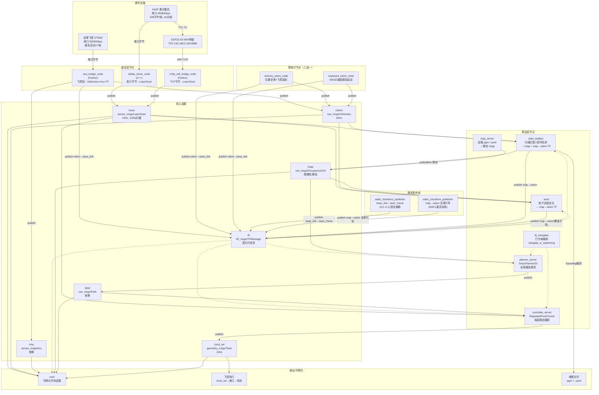

**要点解读**：

- `/scan` 有两个来源（有线驱动 / WiFi桥接），**二选一**，不同时发布
- `/odom` 有三个来源（飞控 / dummy / 键盘），**三选一**，不同时发布
- `slam_toolbox` 和 `AMCL` 都会发布 `map→odom` TF，但不会同时——**建图时SLAM发，导航时AMCL发**
- `map→odom` 引导TF（全零）先发布，AMCL激活后用自己的值覆盖
- 虚线箭头 `-.->` 表示"读取但不订阅话题数据"，而是通过TF库查坐标变换

---

## 附录B：TF坐标树详解

### B.1 TF树层级图

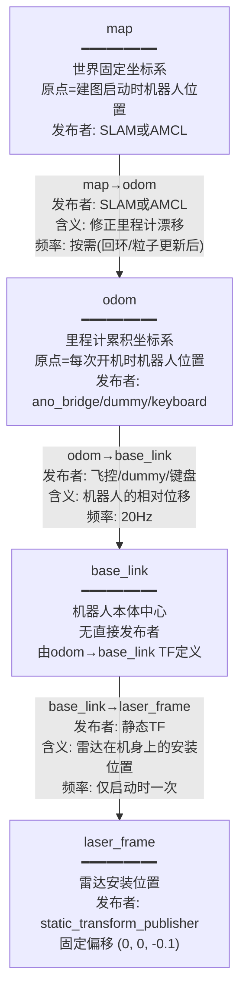

### B.2 TF树时间线

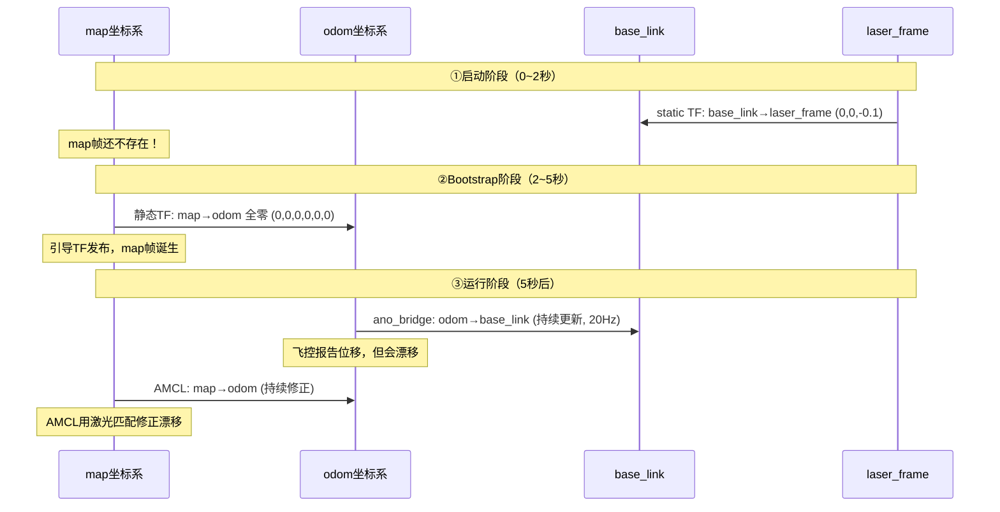

### B.3 建图时 vs 导航时 TF树对比

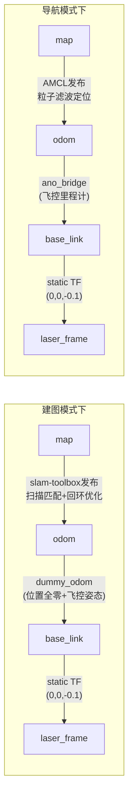

**关键区别**：
- 建图时：`map→odom` 由 **slam-toolbox** 发布（一边建图一边修正）
- 导航时：`map→odom` 由 **AMCL** 发布（用已有地图定位后修正）
- 建图时里程计可以用 `dummy_odom`（全零也可以，因为SLAM靠扫描匹配自估运动）
- 导航时里程计必须是真实数据（飞控或键盘），AMCL需要里程计来做运动预测

---

## 附录C：每种启动模式的节点与话题清单

### C.1 模式①：仅雷达 — `lslidar_launch.py`

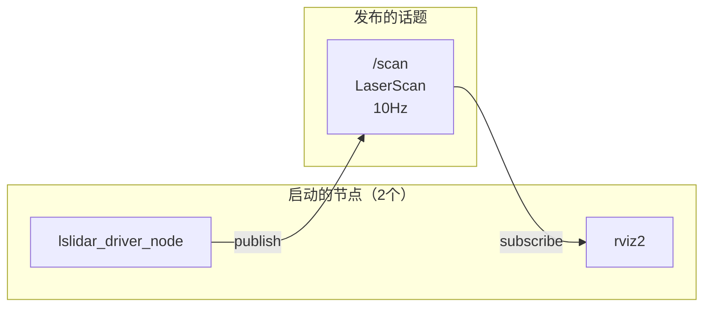

| 节点 | 包 | 发布 | 订阅 |
|------|----|------|------|
| lslidar_driver_node | lslidar_driver | `/scan` (10Hz) | `/lslidar_order` |
| rviz2 | rviz2 | `/goal_pose`, `/initialpose` | `/scan` |

**不存在的TF**：此模式下没有里程计，`odom→base_link` TF不存在，`map`帧不存在。

---

### C.2 模式②：雷达+飞控全开 — `n10p_bringup_launch.py`

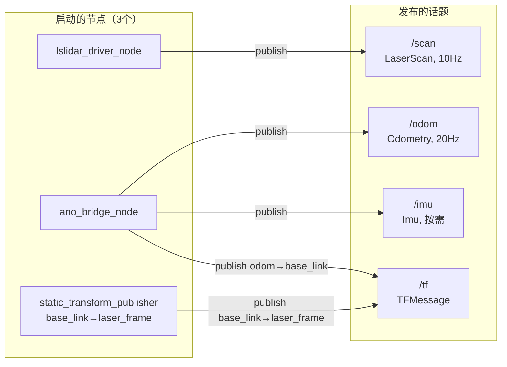

| 节点 | 发布 | 订阅 |
|------|------|------|
| ano_bridge_node | `/odom` (20Hz), `/imu`, TF(odom→base_link) | — (读串口) |
| lslidar_driver_node | `/scan` (10Hz) | `/lslidar_order` |
| static_tf_laser | TF(base_link→laser_frame) | — |

**TF树**：`odom → base_link → laser_frame`（没有map帧，不能做建图或导航，还需额外启动SLAM或Nav2）

**无线模式**：加 `scan_source:=wireless`，lslidar_driver_node 替换为 n10p_wifi_bridge_node。

---

### C.3 模式③：手持SLAM建图 — `slam_launch.py`

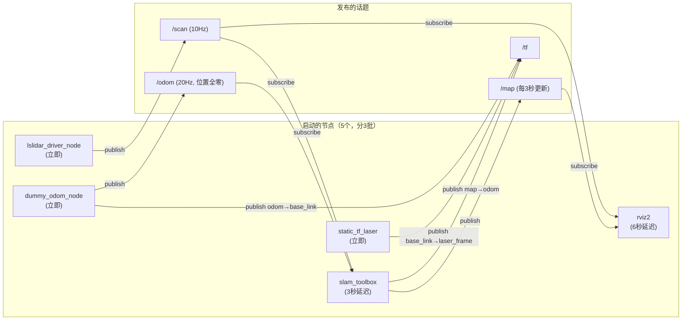

| 启动批次 | 节点 | 为什么有延迟 |
|---------|------|-------------|
| 第1批(立即) | dummy_odom + driver + static_tf | 无依赖，立即可用 |
| 第2批(3秒) | slam-toolbox | 等驱动初始化和TF就绪 |
| 第3批(6秒) | rviz2 | 等其他所有节点就绪再开显示 |

**TF树**：`map → odom → base_link → laser_frame`（完整！SLAM发布map→odom）

**⚠️ 不能跟模式②同时跑**：两个模式都启动了雷达驱动→抢串口。

---

### C.4 模式③B：配合飞控SLAM — `bringup_launch.py` + `slam_only_launch.py`

```
终端1: ros2 launch n10p_bringup n10p_bringup_launch.py
        └→ ano_bridge_node + lslidar_driver_node + static_tf_laser
           发布: /scan + /odom + /imu + TF(odom→base_link, base_link→laser_frame)

终端2: ros2 launch n10p_slam slam_only_launch.py
        └→ slam_toolbox (1秒延迟) + rviz2 (4秒延迟)
           发布: /map + TF(map→odom)
```

**与模式③的区别**：
- 不启动驱动（用终端1的）
- 不启动dummy_odom（用终端1的ano_bridge，真实里程计）
- 延迟更短（无需等驱动初始化）

---

### C.5 模式④：Nav2导航 — `nav_launch.py`

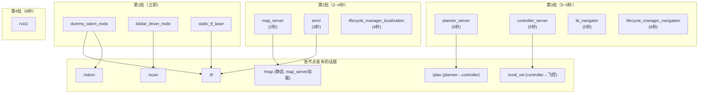

| 批次 | 延迟 | 原因 |
|------|------|------|
| 第1批 | 0秒 | 驱动和里程计无依赖 |
| 第2批 | 2~4秒 | 等DDS发现就绪；AMCL等map_server发布/map |
| 第3批 | 5~6秒 | 等AMCL的map→odom TF就绪 |
| 第4批 | 8秒 | 等其他所有节点就绪 |

**Nav2核心节点的输入/输出**：

| 节点 | 输入 | 输出 | 频率 |
|------|------|------|------|
| map_server | .pgm+.yaml文件 | `/map` (静态) | 启动时一次 |
| amcl | `/scan` + `/map` + TF(odom→base_link) | TF(map→odom) | 粒子持续更新 |
| planner_server | `/map` + TF + 目标位姿(action) | `/plan` (Path) | 收到目标后 |
| controller_server | `/plan` + `/scan` + TF | `/cmd_vel` (Twist) | 10Hz |
| bt_navigator | action请求 | 编排planner+controller | 按需 |

---

### C.6 桌面测试模式 — `keyboard_odom_node` + `desktop_test_launch.py`

```
终端1: ros2 run n10p_bringup keyboard_odom_node
        └→ 发布: /odom + TF(odom→base_link), 20Hz
           键盘WASD控制, 全向运动模型

终端2: ros2 launch n10p_nav desktop_test_launch.py
        └→ lslidar_driver_node + map_server + amcl 
           + planner_server + controller_server + bt_navigator 
           + lifecycle_managers + rviz2
```

**与模式④的区别**：里程计来源不同——真机用飞控，桌面用键盘模拟。其他所有逻辑完全一致。

---

### C.7 模式⑤：Gazebo仿真 — `sim_launch.py`

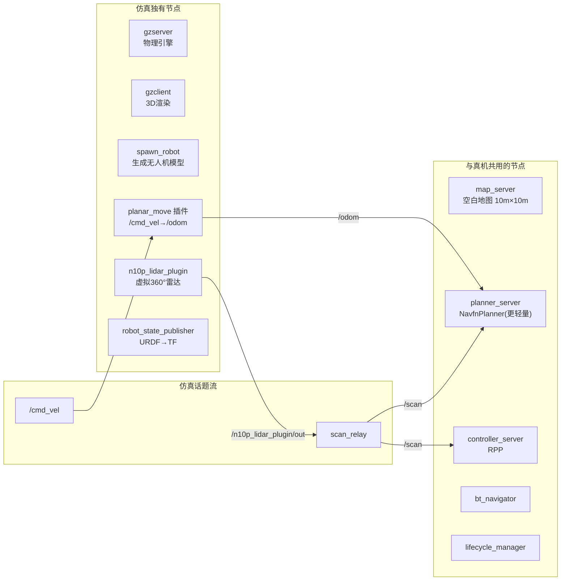

**仿真与真机的关键区别**：

| | 真机 | 仿真 |
|---|------|------|
| 里程计 | 飞控(会漂移) | planar_move插件(Ground Truth) |
| 定位 | AMCL粒子滤波 | 不需要AMCL(里程计就是真值) |
| 地图 | 真实建图结果 | 空白全空闲地图 |
| 雷达 | N10P真实串口 | Gazebo ray插件模拟 |
| 时间 | 系统时钟(wall time) | Gazebo模拟时钟(sim time) |
| 全局规划 | SmacPlanner2D | NavfnPlanner(更轻量) |
| TF树 | map→odom→base_link→laser_frame | map→odom→base_footprint→base_link→laser_frame |

---

> 以上三组图覆盖了本项目的全部节点关系、TF坐标变换和启动模式。当你在RViz或终端看到某个话题/TF异常时，回到这里对照——很快就能定位是哪个节点没启动或哪个TF断了。

---

# 第二阶段：中层架构 — 六包详解

> 目标：逐个拆解每个包的内部结构、关键文件、关键参数。能独立修改配置和代码。

---

# 2.1 n10p_bringup 包 — 飞控桥接 + 里程计 + WiFi桥接

> **这是整个项目中我们自己写的最核心的包。** 它是硬件（飞控、雷达）和ROS2世界之间的"翻译官"。

## 2.1.1 包在项目中的位置

回顾数据流图，`n10p_bringup` 位于**驱动层**：

```
硬件 → n10p_bringup → 话题(/odom, /scan等) → SLAM/Nav2消费
```

它包揽了三件事：
1. **飞控串口→ROS2**：把匿名协议V7的串口字节变成`/odom` + `/imu` + TF
2. **里程计兜底**：飞控不在线时，提供dummy里程计或键盘里程计
3. **无线雷达接入**：ESP32 WiFi TCP数据变成`/scan`

## 2.1.2 文件结构总览

```
n10p_bringup/
├── package.xml                    ← 包元信息（依赖声明）
├── setup.py                       ← 安装规则（注册了5个可执行节点）
├── params/
│   └── ano_bridge.yaml            ← 飞控串口参数
├── launch/
│   └── n10p_bringup_launch.py     ← 传感器全开启动文件
└── n10p_bringup/                  ← 源代码目录
    ├── ano_protocol.py            ← ①协议层：帧定义、校验、编解码
    ├── ano_transport.py           ← ②传输层：串口管理、后台线程、回调分发
    ├── ano_bridge_node.py         ← ③应用层：飞控数据→ROS2消息 (核心！)
    ├── dummy_odom_node.py         ← 占位里程计节点
    ├── keyboard_odom_node.py      ← 键盘里程计节点
    ├── n10p_wifi_bridge.py        ← WiFi桥接节点
    ├── rpi_pos_frame.py           ← 0xF5位置下行帧构造模块
    └── ano_data_logger.py         ← 数据记录器
```

**三层架构设计**（这是本项目最精妙的设计之一）：

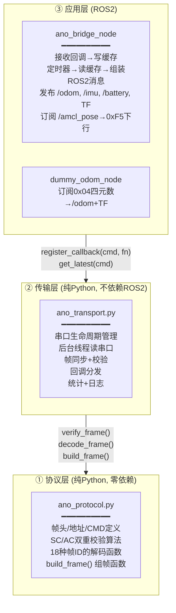

**为什么分三层？**
- 协议层和传输层**不依赖ROS2**——可以直接在任何Python程序里用（比如在飞控测试脚本里用）。
- 应用层只关心"收到数据后怎么发ROS2消息"，不关心串口字节怎么解析。
- 每一层可以独立测试、独立修改。比如换一种飞控协议，只改协议层即可。

## 2.1.3 协议层：ano_protocol.py（约1100行）

这一层做的事：**定义"数据长什么样"以及"怎么验证数据没坏"**。

**帧格式（核心）**：

```
字节:   [0]     [1]     [2]    [3]    [4..3+n]    [4+n]   [5+n]
      ┌──────┬──────┬──────┬──────┬────────────┬──────┬──────┐
      │ 0xAA │ ADDR │ CMD  │ LEN  │ DATA[LEN]  │  SC  │  AC  │
      └──────┴──────┴──────┴──────┴────────────┴──────┴──────┘
      帧头    目标    帧ID   数据长  实际数据     累加和  累积和
```

**双重校验（SC + AC）是怎么算的**：

```python
# 校验覆盖范围：从0xAA到DATA结束，共 LEN+4 字节（不含SC和AC本身）
sc = 0
ac = 0
for byte in frame[0 : len+4]:   # 逐字节
    sc = (sc + byte) & 0xFF      # SC = 所有字节的累加和
    ac = (ac + sc) & 0xFF        # AC = 每一步SC的累积和
# 最后比对 frame[-2] == sc 且 frame[-1] == ac
```

**为什么需要双重校验？** 如果只有一个SC，传输中两个比特翻转可能恰好互相抵消（比如一个多1，另一个少1）。但AC累积了SC的变化历史，几乎不可能同时蒙混过关。

**ano_bridge_node 解析的9种帧**：

| 帧ID | 名称 | 频率 | 内容 | 用途 |
|------|------|------|------|------|
| `0x01` | IMU_Raw | ~100Hz | 加速度计+陀螺仪原始值 | → `/imu` 角速度+线加速度 |
| `0x02` | Baro_Mag | ~20Hz | 气压高度+磁力计 | 高度参考 |
| `0x03` | Euler | ~0.67Hz | 欧拉角(极低频！勿用) | 仅参考 |
| `0x04` | Quaternion | **~67Hz** | 四元数姿态 | → `/odom`姿态 + `/imu`姿态 |
| `0x05` | Altitude | ~50Hz | 融合高度cm | → `/odom` Z位置 |
| `0x06` | FC_Status | ~20Hz | 飞行模式+解锁状态 | 状态监控 |
| `0x07` | Velocity | ~50Hz | 速度cm/s | → `/odom` 线速度 |
| `0x08` | XY_Pos | ~20Hz | 位置cm | → `/odom` X/Y位置(需外部定位) |
| `0x0D` | Battery | ~1Hz | 电压+电流 | → `/battery` |

## 2.1.4 传输层：ano_transport.py（约435行）

这一层做的事：**可靠地从串口字节流中提取帧**。

**核心逻辑——帧同步状态机**：

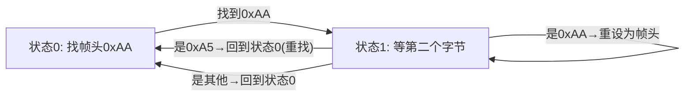

实际上 `ano_transport` 用的是更高效的算法——在buffer里直接搜索`0xAA`，而不是逐字节状态机。但wifi_bridge（后面会讲）用的是状态机方式。

**传输层设计的几个关键决策**：

1. **后台线程读串口**：不阻塞ROS2主线程。回调也在后台线程中执行（所以回调里不能做重活）。
2. **校验失败只跳1字节**：因为DATA区中可能恰好出现`0xAA`字节。跳整个帧会丢失有效数据。
3. **线程安全**：`_lock`保护缓存和统计，`_send_lock`保护串口写入。
4. **`send_raw()`方法**：允许发送非ANO格式的原始字节（用于0xF5位置下行帧）。

## 2.1.5 应用层：ano_bridge_node.py（约564行）

这是整个包的核心。它的工作流程：

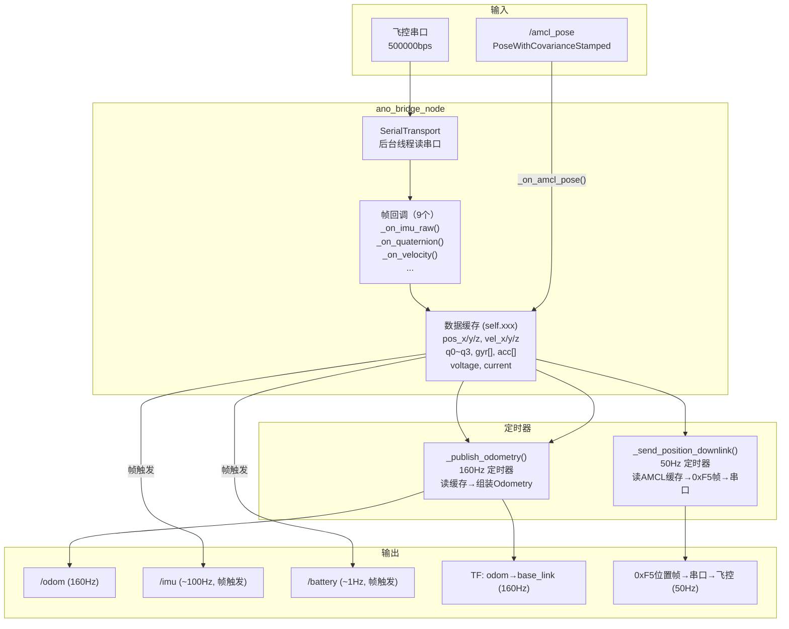

**关键设计：串口读取和消息发布是两个独立流程**：

- **流程A（后台线程）**：串口来数据→帧同步→校验→解码→更新缓存变量（`self.pos_x`, `self.q0~q3` 等）。频率由飞控决定（100~500Hz不等）。
- **流程B（ROS2定时器）**：每 `1/160` 秒触发一次，从缓存变量读最新值→组装Odometry消息→发布。频率固定160Hz。

为什么要分开？因为飞控数据来的频率不稳定（不同帧ID有不同频率），但ROS2下游期望固定的发布频率。

**`_publish_odometry()` 的关键细节（第296-348行）**：

```python
# 位置：设为0！（第307-309行）
msg.pose.pose.position.x = 0.0
msg.pose.pose.position.y = 0.0
msg.pose.pose.position.z = 0.0

# 姿态：来自飞控0x04四元数帧（第312-315行）
msg.pose.pose.orientation.w = self.q0
# ...

# 位置协方差：拉满到1.0（第330-336行）
# 意思是"飞控的位置数据不可信，SLAM你自己看着办"
cov_pose = [1.0, 0.0, 0.0, ...]  # 1.0 m² 的方差
```

**为什么位置设为0？** 飞控的0x08位置帧依赖外部定位传感器（GPS/UWB）才有效。室内没有GPS，所以飞控的位置不可靠。干脆设为0，让SLAM的扫描匹配自己去算真实位置——这跟dummy_odom的思路一模一样。

**位置下行功能（第449-545行）**——这是Phase 7新增的关键功能：

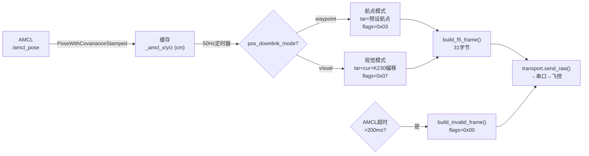

## 2.1.6 rpi_pos_frame.py：0xF5位置下行帧（约311行）

这是树莓派给STM32飞控发送的**31字节自定义帧**。

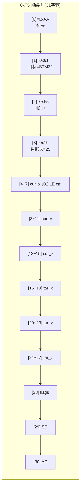

**flags字节的3个位**：

| 位 | 值 | 含义 | 什么时候置1 |
|----|----|------|-----------|
| bit0 | `0x01` | SLAM_VALID | AMCL 200ms内有新数据 |
| bit1 | `0x02` | TARGET_VALID | 有目标（航点或视觉目标） |
| bit2 | `0x04` | VISUAL_MODE | 目标来自K230视觉（而非固定航点） |

**两种工作模式的区别**：

| | 航点模式 (waypoint) | 视觉伺服模式 (visual) |
|----|-------------------|---------------------|
| flags | `0x03` | `0x07` |
| tar来源 | 预设固定坐标 `(wp_x, wp_y, wp_z)` | `cur + (dx, dy, dz)` K230偏移 |
| 视觉丢失时 | N/A | `tar = cur` 悬停 |
| 飞控行为 | 飞向固定航点 | 跟踪移动目标 |

**帧构造的核心函数**：

```python
build_f5_frame(cur_x, cur_y, cur_z, tar_x, tar_y, tar_z, flags) → 31 bytes
build_invalid_frame()                                              → AMCL超时用, flags=0x00
build_hover_frame(cur_x, cur_y, cur_z)                            → 悬停, tar=cur
build_waypoint_frame(cur, wp)                                     → 航点模式, flags=0x03
build_visual_frame(cur, dx, dy, dz, valid)                        → 视觉模式, flags=0x07
```

## 2.1.7 里程计三兄弟 — 三种里程计节点的对比

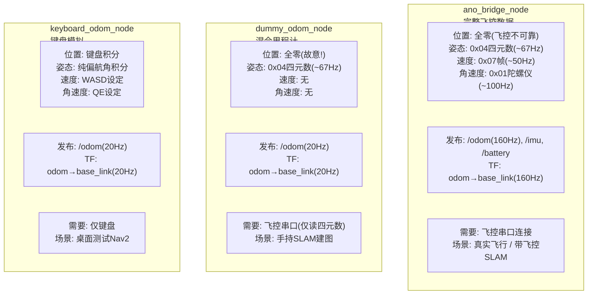

**dummy_odom 为什么位置全零但SLAM能用？** 这是最反直觉也最精妙的设计：

1. 你拿着雷达在房间里走，dummy_odom始终报告"(0,0,0)，我没动"
2. slam-toolbox每10ms收到一帧新的激光扫描
3. 它对比前后两帧扫描——"咦？墙近了，说明我向前走了"
4. SLAM自己算出真实位移，然后发布`map→odom` TF来修正dummy_odom的"零位移"
5. 最终地图仍然是正确的！

**dummy_odom唯一必须提供的：姿态。** 如果姿态也是全零（意味着雷达水平），而你拿着雷达倾斜了30°，激光平面就歪了→SLAM扫描匹配会崩溃。

**keyboard_odom 的全向运动模型（第127-135行）**：

```python
# 体坐标系速度 → 世界坐标系积分（全向模型）
self.x += (self.vx * cos(self.yaw) - self.vy * sin(self.yaw)) * dt
self.y += (self.vx * sin(self.yaw) + self.vy * cos(self.yaw)) * dt
self.yaw += self.vth * dt
```

这个公式允许机器人朝任意方向平移，不受偏航角约束。你按A键就是纯左移（不改变朝向），按D就是纯右移。无人机就是全向的（可以横着飞），这与差分驱动（只能前进+转向）完全不同。

## 2.1.8 WiFi桥接节点：n10p_wifi_bridge.py（约291行）

这个节点做一件看起来很"蠢"的事：**把lslidar_driver已经做过一遍的帧解析，用Python重新做一遍**。

**为什么要重复造轮子？** （ADR-004）原本想用socat把TCP映射成虚拟串口，让lslidar_driver无改动接入。但lslidar_driver启动时会调用`tcsetattr()`改变终端属性——这对真实串口没问题，但对PTY虚拟串口会破坏其行规约，导致`poll()`永久阻塞。所以只能自己写一个独立节点。

**wifi_bridge的数据处理流程**：

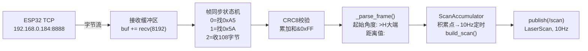

**几个关键设计细节**：

1. **5秒启动延迟（第126行）**：wifi_bridge连接ESP32后立即收到数据，但此时AMCL可能还没初始化（map→odom TF不存在）。如果立刻发`/scan`，costmap的message_filter会因TF变换失败而堆积→队列爆满。所以先沉默5秒，丢弃期间积累的旧数据。

2. **`count_num = 529`（第128行）**：N10P的典型半圈点数。`scan_num = 2 × 529 = 1058`，与有线驱动保持一致。下游SLAM/AMCL感知不到数据来自有线还是无线。

3. **WARNING：距离用小端`<H`，角度用大端`>H`**（第198-199行）。这是N10P帧格式的一个坑——同一帧内混用了两种字节序！

## 2.1.9 Launch文件：n10p_bringup_launch.py（约91行）

这个launch文件启动3个节点：飞控桥接 + 雷达驱动 + 静态TF。

**有线/无线切换的核心逻辑**：

```python
# 声明参数，默认为wired
scan_source = LaunchConfiguration('scan_source', default='wired')
# 把字符串比较包装成PythonExpression
is_wireless = PythonExpression(["'", scan_source, "' == 'wireless'"])

# 有线模式：启动lslidar_driver_node（C++驱动）
driver_node = Node(..., condition=UnlessCondition(is_wireless))

# 无线模式：启动n10p_wifi_bridge_node（Python节点）
wifi_bridge_node = Node(..., condition=IfCondition(is_wireless))
```

**为什么要用`PythonExpression`而不是直接取布尔值？** 因为`'wired'`和`'wireless'`作为字符串，`IfCondition`不会自动转为True/False。必须用Python表达式做字符串比较。

## 2.1.10 n10p_bringup 包小结

**记住这几点**：

| 要点 | 说明 |
|------|------|
| 三层架构 | 协议层(纯数据)→传输层(串口管理)→应用层(ROS2发布)，各层独立可测 |
| 两股独立流程 | 串口读取(后台线程,不固定频率) + ROS2发布(定时器,固定160Hz) |
| 位置为什么是0 | 飞控室内无GPS，位置不可靠。设为0让SLAM自估，协方差拉满表达"不信飞控" |
| 里程计三选一 | ano_bridge(飞控)/dummy(手持)/keyboard(桌面)，**绝不能同时跑两个** |
| 0xF5下行 | 双模式(航点/视觉)，50Hz，200ms超时自动发无效帧 |
| 有线/无线切换 | launch中用PythonExpression做字符串比较，`scan_source:=wired|wireless` |

**如果你要改"里程计来源"，你需要动的地方**：
- 改launch文件：决定启动哪个里程计节点
- 改参数：`ano_bridge.yaml`（飞控串口、波特率、scale因子）
- 如果换一种飞控协议：改`ano_protocol.py`（帧定义和解析函数）

---

> **第二阶段2.1理解确认**：你能画出ano_bridge_node的双线程工作模型吗（后台线程收帧→写缓存，ROS2定时器读缓存→发布）？你能说清dummy_odom为什么位置全零但SLAM仍然有用吗？你能说出0xF5帧的31字节每个字段的含义吗？
>
> 如果完全理解了，说"理解了，进下一节"。如果还有模糊的，指出具体哪里不清楚。

---

# 2.2 lslidar_driver 包 — N10P雷达驱动从串口到/scan

> 这个包是整个项目最底层的模块。它是镭神官方提供的C++驱动，被我们修复了5个Bug。

## 2.2.1 驱动在项目中的位置

```
N10P雷达 ──串口(460800bps)──→ lslidar_driver_node ──→ /scan (LaserScan, 10Hz)
                                     ↑
                             这是整个项目唯一的雷达数据来源
                             （无线模式下被 n10p_wifi_bridge 替代）
```

**驱动做什么**：接收串口字节流 → 从连续字节中找出帧头 → 解析每帧的角度和距离 → 拼合成完整一圈360° → 组装成ROS2标准LaserScan消息 → 发布。

**驱动不做什么**：不做SLAM，不做导航，不关心下游怎么用数据。它只管一件事——"把雷达的字节变成/scan"。

## 2.2.2 文件结构

```
lslidar_driver/
├── CMakeLists.txt                  ← 编译规则
├── package.xml                     ← 依赖: rclcpp, lslidar_msgs, PCL, pcap, Boost
│
├── include/lslidar_driver/         ← 头文件
│   ├── lslidar_driver.h            ←   核心类 LslidarDriver（继承 rclcpp::Node）
│   ├── input.h                     ←   UDP/PCAP网络输入
│   └── lsiosr.h                    ←   串口I/O抽象（POSIX termios封装）
│
├── src/                            ← 源码
│   ├── lslidar_driver_node.cc      ←   main()入口：创建节点 → 轮询循环
│   ├── lslidar_driver.cc           ←   核心驱动逻辑（~1384行，全部精华）
│   ├── input.cc                    ←   网络输入实现
│   └── lsiosr.cpp                  ←   串口实现（open/read/write/close）
│
├── params/
│   └── lsx10.yaml                  ←   N10P出厂配置
│
├── launch/
│   ├── lslidar_launch.py           ←   单雷达启动
│   └── lslidar_double_launch.py    ←   双雷达启动
│
└── rviz/
    └── lslidar.rviz                ←   预配置的RViz2文件
```

## 2.2.3 驱动支持的所有型号

一个驱动兼容8种镭神雷达，通过 `lidar_name` 参数切换：

| 型号 | 每帧字节 | 每帧点数 | 波特率 | 总点数 | 本项目 |
|------|---------|---------|--------|--------|:---:|
| M10 | 92 | 42 | 460800 | 1008 | |
| M10_P | 160 | 70 | 500000 | 2000 | |
| M10_PLUS | 104 | 41 | 921600 | 5000 | |
| M10_GPS | 102 | 42 | 460800 | 1008 | |
| N10 | 58 | 16 | 230400 | 2000 | |
| **N10_P** | **108** | **16** | **460800** | **2000** | ✅ |
| M10_DOUBLE | 300 | 70 | 921600 | 3000 | |
| L10 | 58 | 16 | 230400 | 2000 | |

**`points_size_ = 2000` 是什么意思？** N10_P的2000是"半圈"的点数上限（`count_num`）。`scan_num = 2 × count_num` 是全圈点数。驱动预分配了 `scan_points_.resize(6000)` ——3000×2=6000个元素，留有安全余量。

## 2.2.4 N10_P 帧格式——逐字节拆解

N10_P 每帧 **108 字节**，结构如下：

```
偏移    字节数    内容              解析方式
────    ──────    ────────────────  ────────────────────────────
0       2         帧头               固定值 0xA5 0x5A
2       2         数据长度           小端序 uint16（实际固定108）
4       1         (未使用/保留)
5       2         起始角度            大端序 uint16，单位 0.01°
7       n×6       距离数据区起点      每点6字节(距离2B+置信度2B+保留2B)
                  共16个点            距离单位mm，小端序 uint16
                  16×6=96字节         值 0xFFFF = 无效点
103     2         (保留)
105     2         结束角度            大端序 uint16，单位 0.01°
107     1         CRC8校验            前107字节累加和 & 0xFF
```

**每个激光点的6字节结构**：

```
偏移    字节数    内容
────    ──────    ────────────────
0       2         距离值 (mm)，小端序 uint16
2       2         置信度/强度
4       2         (保留)
```

**关键陷阱——同一帧内混用两种字节序**：

```cpp
// 角度: 大端序 (Big Endian)
start_angle = packet_bytes[5] * 256 + packet_bytes[6];  // >H

// 距离: 小端序 (Little Endian)
distance = packet_bytes[7] + packet_bytes[8] * 256;     // <H
```

这是踩过的最坑的Bug之一。如果用同一种字节序解析所有字段，要么角度全乱，要么距离全飞到几万米。

## 2.2.5 完整函数调用链——从main()到/scan

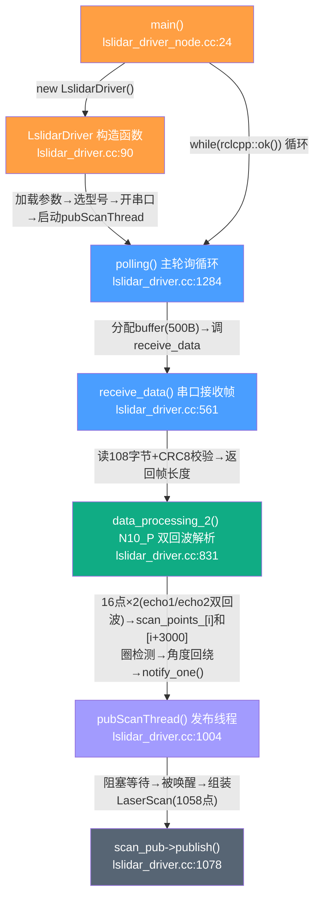

**两个线程的分工**：

| 线程 | 函数 | 职责 | 频率 |
|------|------|------|------|
| **主线程** | `main() → polling() → receive_data() → data_processing_2()` | 不停收帧、解析、存点 | ~332fps（帧率） |
| **发布线程** | `pubScanThread()` | 等待一圈完整→组装LaserScan→发布 | ~10Hz（圈率） |

两个线程通过 `scan_points_[]` 数组（共享内存）+ `pubscan_cond_` 条件变量通信。主线程填数据，填满一圈后发信号唤醒发布线程。

## 2.2.6 逐函数拆解

### receive_data()——从串口收一帧（第561行）

```
流程：读第1字节→检查0xA5→读第2字节→检查0x5A→读第3-4字节(长度)
     →读剩余字节至len长度→CRC8校验→返回帧长度
```

这个函数是**阻塞**的——它不读到完整帧不返回。因为雷达每秒发 ~332 帧，帧间隔约 3ms，阻塞等待不会丢帧。

**N10_P 的 CRC8 校验**（第642行）：
```cpp
uint8_t N10_CalCRC8(unsigned char *p, int len) {
    int sum = 0;
    for (int i = 0; i < len; i++)
        sum += uint8_t(p[i]);   // 逐字节累加
    return sum & 0xFF;           // 取低8位
}
```
前107字节的累加和必须等于第108字节。不等→帧损坏→丢弃。

### data_processing_2()——N10_P双回波解析（第831行）

这是 N10_P 最核心的解析函数。每帧（108字节=16个点）执行一次：

```
步骤1: 读起始角度 (字节5-6, 大端序) → degree = (s*256+z)/100.0°
步骤2: 读结束角度 (字节105-106, 大端序) → end_degree
步骤3: 算角度步长 → degree_interval = end_degree - start_angle
       (如果开始角度>结束角度, 说明跨过0°, end_degree+360)
步骤4: 循环16个点:
        ├─ 读距离值 (小端序, mm→m: /1000.0)
        ├─ 读强度值
        ├─ 存 echo1: scan_points_[idx].range, .degree, .intensity
        └─ 存 echo2: scan_points_[idx+3000].range, .degree=同角度(0°偏移), .intensity
步骤5: 圈检测: 如果当前角度<上次角度(角度回绕) → 一圈完整
        └─ 存储count_num, 通知pubScanThread()
```

**⚠️ 重大认知修正 (2026-07-20)**：以下"双棱镜设计"是**错误认知**，已被修正。

N10_P 实际是**双回波(Dual Echo)**：传统旋转电机单头扫描，每个记录6字节包含两个距离值，是**同一激光脉冲在相同角度先后收到的两次反射**（如先打到窗户玻璃→再打到玻璃后面的墙），**角度相同、距离不同**。不是两个棱镜180°对装。

原代码错误地将 echo2 的角度设为 `point_deg + 180.0`，导致扫描点云180°镜像对称，SLAM建图产生幽灵L形障碍物。现已修复为 echo1 和 echo2 同角度，近距离优先。

```
scan_points_[0]      ← echo1 在0°的测量 (第一反射, 通常更近)
scan_points_[0+3000] ← echo2 在0°的测量 (第二反射, 同角度更远)
scan_points_[1]      ← echo1 在0.34°的测量
scan_points_[1+3000] ← echo2 在0.34°的测量
...
```

**圈检测算法**（第938行）：
```cpp
if ((scan_points_[idx].degree < last_degree 
     && scan_points_[idx].degree < 5 
     && last_degree > 355) 
    || idx >= points_size_)
```
条件：当前帧角度降回接近0°（<5°），而上一次接近360°（>355°）→ 这一圈扫完了。或者点数超过上限（2000）。

### polling()——主循环（第1284行）

```cpp
bool LslidarDriver::polling() {
    unsigned char *packet_bytes = new unsigned char[500];  // 分配缓冲区
    int len;
    
    if (interface_selection == "serial") {
        len = receive_data(packet_bytes);     // 从串口收一帧
        if (len > 0) {
            if (lidar_name == "N10_P")
                data_processing_2(packet_bytes, len);  // N10_P专用解析
            else
                data_processing(packet_bytes, len);    // 其他型号通用解析
        }
    }
    delete[] packet_bytes;    // 解析完释放内存
    return true;
}
```

每次被 `main()` 调用时：收一帧 → 解析 → 存点。如果一圈完整，解析函数内部会发信号唤醒发布线程。

### pubScanThread()——组装+发布（第1004行）

这是一个**独立的Boost线程**，在构造函数中启动：

```
while (rclcpp::ok()) {
    pubscan_cond_.wait(lock);           // 阻塞等待，直到被data_processing_2唤醒
    ↓
    getScan(points, start_time, scan_time);  // 从scan_points_取出所有有效点
    ↓
    组装 LaserScan 消息:
      frame_id = "laser_frame"
      angle_min = 0, angle_max = 2π
      angle_increment = 2π / 1058 (固定！不是count_num)
      range_min = 0.02, range_max = 12.0
      ranges[1058] = inf (预填充)
      intensities[1058] = 0.0
    ↓
    遍历 echo1 points[i] (双回波第一反射):
      idx = round(degree * 1058 / 360.0)
      ranges[idx] = points[i].range
      intensities[idx] = points[i].intensity
    遍历 echo2 points[i+3000] (双回波第二反射, 同角度):
      同上
    ↓
    scan_pub->publish(scan);            // 发布到 /scan 话题
}
```

**scan_num 固定为 1058（重要修复）**：原始代码用 `2*count_num`，而 `count_num` 每帧浮动（1040~1080）。导致同一物理方向在不同帧映射到不同 ranges 槽位→SLAM帧间匹配时把格式漂移误判为机器人旋转→地图跟着转。修复为固定1058后，每帧角度映射完全一致。

## 2.2.7 我们修过的5个Bug

| # | Bug | 位置 | 现象 | 修复 |
|----|----|------|------|------|
| ① | **angle_increment 错误** | L990 | SLAM丢弃所有扫描"1058 expected 529" | `2*PI/count_num` → `2*PI/scan_num`（分母翻倍） |
| ② | **double free** | L718,862 | 启动崩溃 exit code -6 | 删除子函数内的delete，内存归polling统一管理 |
| ③ | **delete vs delete[]** | L794,951,1379 | 内存破坏、随机崩溃 | `delete ptr` → `delete[] ptr`（数组必须用delete[]） |
| ④ | ~~后半圈角度未设置~~ **认知错误已修正(2026-07-20)** | L929-934 | N10P是双回波非双棱镜，echo2角度不应+180° | 修复：echo1/echo2同角度，独立验证，近距离优先 |
| ⑤ | **scan_num 浮动** | L1037 | 每帧 ranges 数组大小不同→建图变形 | 固定 `scan_num = 1058`，`angle_increment` 固定 |

**⚠️ Bug④的历史分析已被推翻(2026-07-20)**。当时的"后半圈角度缺失"分析基于错误的前提(N10P双棱镜)。实际上N10P是双回波，echo2和echo1应在同一角度。原代码的+180°偏移才是造成180°镜像幽灵障碍物的真正根因。

## 2.2.8 关键参数 lsx10.yaml

```yaml
/lslidar_driver_node:
  ros__parameters:
    frame_id: laser_frame       # 雷达坐标系名（RViz Fixed Frame 就设这个）
    lidar_name: N10_P           # 型号（触发 N10_P 专用参数）
    angle_disable_min: 0.0      # 屏蔽角度起点(0=不过滤)
    angle_disable_max: 0.0      # 屏蔽角度终点
    min_range: 0.02             # 最近有效距离(m)
    max_range: 12.0             # 最远有效距离(m)
    use_gps_ts: false           # 不用GPS时间戳
    interface_selection: serial # 串口模式
    serial_port_: /dev/serial/by-id/usb-1a86_USB_Single_Serial_58EB011256-if00
    compensation: false         # 角度补偿(N10P不需要)
    pubScan: true               # 发布/scan
    pubPointCloud2: false       # 不发布点云(省带宽)
```

**每个参数改错了会怎样**：

| 参数 | 改错后果 |
|------|---------|
| `lidar_name` | 改成M10→驱动按92字节/帧解析→帧结构全乱 |
| `serial_port_` | 串口不存在→驱动报错退出 |
| `min_range` | 设太大→近处障碍物被当成无效点滤掉（你的挡板`inf`问题之一） |
| `pubScan: false` | 不发布/scan→下游SLAM/Nav2全瘫痪 |
| `angle_disable_min/max` | 屏蔽角度范围→雷达后方被机身遮挡的方向可以屏蔽 |

## 2.2.9 串口层——LSIOSR（约400行）

这是镭神自己写的POSIX termios封装（单例模式），不复杂：

```
LSIOSR::instance()
  ├── init(port, baud)    → open() + tcgetattr + 配置8N1 + tcsetattr
  ├── read(buf, len)      → select()超时等待 + read()
  ├── write(buf, len)     → write()
  └── close()             → close(fd)
```

配置的串口参数：8数据位、无校验、1停止位（8N1），支持230400/460800/500000/921600四种波特率。

## 2.2.10 驱动验证三步法

| 步骤 | 命令 | 预期 |
|------|------|------|
| ① 话题存在 | `ros2 topic list \| grep scan` | `/scan` |
| ② 有数据 | `ros2 topic echo /scan --once --field ranges \| head -20` | 不全为inf |
| ③ 频率正确 | `ros2 topic hz /scan` | ~10Hz |

**常见故障排查**：

```
/scan 不存在
  → 驱动crash了？检查终端日志是否有 segfault
  → 串口被占用？lsof /dev/ttyACM0

ranges 全是 inf
  → 雷达转了吗？（听声音/看指示灯）
  → 串口路径对了吗？
  → 波特率对了吗？（N10P是460800）

频率不是10Hz
  → CPU被挤占（top看驱动CPU占用）
  → 串口丢数
```

## 2.2.11 lslidar_driver 包小结

| 要点 | 说明 |
|------|------|
| 它是官方驱动 | 从GitHub克隆，支持8种镭神雷达，通过lidar_name切换 |
| 双线程模型 | 主线程收帧解析（~332fps）+ 发布线程组装LaserScan（~10Hz），条件变量通信 |
| N10_P双回波 | ~~双棱镜~~→双回波: 同一激光脉冲两次反射,角度相同,距离不同 | (2026-07-20修正)
| 帧格式陷阱 | 角度用大端序`>H`，距离用小端序`<H`，同一帧内混用！ |
| 5个Bug修复 | angle_increment、double free、delete→delete[]、~~后半圈角度缺失~~→双回波认知修正、scan_num浮动 | (2026-07-20修正)
| 固定scan_num=1058 | 保证每帧角度映射一致，SLAM帧间匹配不偏移 |

---

> **第二阶段2.2理解确认**：你能画出从 `polling() → receive_data() → data_processing_2() → pubScanThread() → publish()` 的完整调用链吗？你能说清 N10_P 帧的108字节每个字段含义吗？~~你能解释"双棱镜双回波"为什么会导致 `inf` 和有效值交替出现吗？~~ → N10P是双回波非双棱镜，inf交替是因echo1无效时echo2也被丢弃(已修复)
>
> 如果完全理解了，说"理解了，进下一节"。如果还有模糊的，指出具体哪里不清楚。

---

# 2.3 & 2.4 n10p_slam + n10p_nav — SLAM建图与Nav2导航

> 这两个包放在一起讲，因为它们都是"纯配置包"——没有自己的可执行代码，只提供 YAML 参数和 launch 启动文件。真正干活的是外部的 `slam-toolbox` 和 `Nav2` 全家桶。

## 2.3.1 n10p_slam 包：告诉 slam-toolbox 怎么建图

### 包结构

```
n10p_slam/
├── package.xml                          ← 无特殊依赖（纯launch+配置）
├── setup.py
├── config/
│   ├── mapper_params_online_async.yaml  ← SLAM 全部参数（56行）
│   └── n10p_slam.rviz                   ← RViz2 预配置文件
└── launch/
    ├── slam_launch.py                   ← 手持建图（自带驱动+dummy里程计）
    └── slam_only_launch.py              ← 配合bringup（不启动传感器）
```

### 核心参数逐行拆解

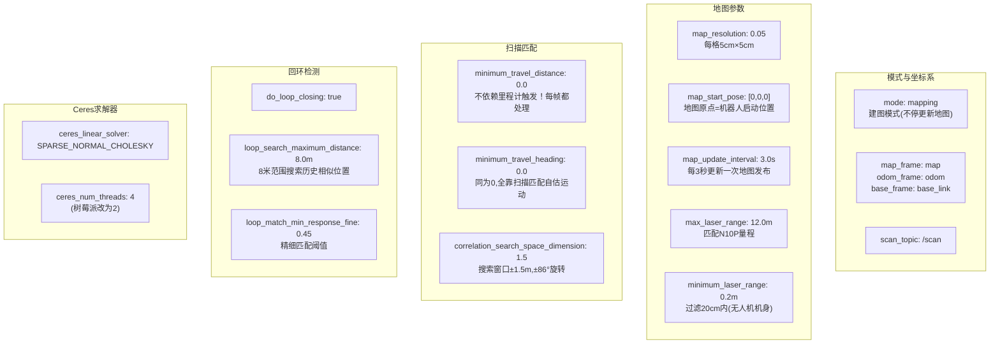

**最关键的三个参数**：

| 参数 | 值 | 为什么这么设 |
|------|----|------------|
| `minimum_travel_distance` | **0.0** | 手持建图用dummy_odom（位置始终为0），如果设0.5m，SLAM会认为"机器人从未移动过"→永远不处理扫描→永远不建图 |
| `correlation_search_space_dimension` | **1.5** | 手持旋转建图时，两帧间的旋转可能超过30°。0.5的窗口（±28°）不够→地图严重变形。1.5 = ±86°→大幅旋转也能匹配 |
| `map_resolution` | **0.05** | 每格5cm。树莓派改为0.1（每格10cm），数据量减少75% |

### slam_launch.py —— 手持建图模式

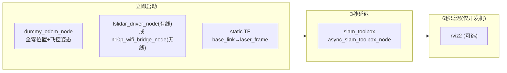

**启动延迟的原因**：
- SLAM等3秒：等驱动初始化串口、TF就绪、/scan开始稳定发布
- RViz等6秒：等SLAM发布/map和map→odom TF

### slam_only_launch.py —— 配合飞控

比 `slam_launch.py` 简单得多——不启动驱动、不启动里程计。**只启动slam-toolbox（1秒延迟）和可选RViz（4秒延迟）**。

前提是另一终端已运行 `n10p_bringup_launch.py`（已提供/scan + /odom + TF）。

### SLAM到底怎么建图——三步走

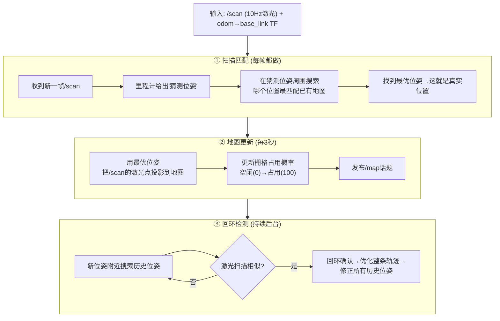

**扫描匹配的原理（一句话）**：把当前的激光扫描放到已有地图的不同位置上试，哪个位置匹配度最高，机器人就在哪个位置。

**回环检测的原理（一句话）**：当你走回之前来过的地方，激光看到的环境跟记忆中的一样→SLAM发现自己"漂了一圈"→自动把轨迹拉回闭合。

### 保存地图

```bash
ros2 service call /slam_toolbox/save_map slam_toolbox/srv/SaveMap \
  "{name: {data: '/home/ylz/n10p_leishen/maps/n10p_map'}}"
```

生成两个文件：
- `n10p_map.yaml` — 元数据（分辨率、原点坐标、占用阈值）
- `n10p_map.pgm` — 灰度图像（白=空闲, 黑=占用, 灰=未知）

---

## 2.4.1 n10p_nav 包：告诉 Nav2 怎么导航

### 包结构

```
n10p_nav/
├── package.xml                      ← 依赖: nav2全家桶 + n10p_bringup
├── config/
│   ├── nav2_params_n10p.yaml        ← Nav2全部参数（228行）
│   └── n10p_nav.rviz                ← RViz2预配置文件
└── launch/
    ├── nav_launch.py                ← 自给自足模式（自带driver+dummy_odom）
    ├── nav_only_launch.py           ← 配合飞控模式（不启动driver/odom）
    └── desktop_test_launch.py       ← 桌面测试（需手动启动keyboard_odom）
```

### Nav2导航栈的五大组件

```mermaid
flowchart TB
    USER["你在RViz点2D Goal Pose"] --> BT

    subgraph NAV["Nav2 导航栈"]
        BT["bt_navigator<br/>行为树编排器<br/>━━━━━━━<br/>'先规划→再跟踪→到达→结束'<br/>用行为树编排这流程"]
        PLANNER["planner_server<br/>全局规划器<br/>━━━━━━━<br/>输入: /map + 目标位姿<br/>输出: /plan (Path)<br/>算法: SmacPlanner2D (Hybrid-A*)"]
        CONTROLLER["controller_server<br/>局部控制器<br/>━━━━━━━<br/>输入: /plan + /scan + TF<br/>输出: /cmd_vel (Twist)<br/>算法: RegulatedPurePursuit"]
        AMCL["amcl<br/>定位器<br/>━━━━━━━<br/>输入: /scan + /map + odom TF<br/>输出: map→odom TF<br/>算法: 粒子滤波(500粒子)"]
        MAP_SRV["map_server<br/>地图加载器<br/>━━━━━━━<br/>输入: .pgm+.yaml文件<br/>输出: /map (静态OccupancyGrid)"]
    end

    BT -->|"ComputePathToPose"| PLANNER
    PLANNER -->|"/plan"| BT
    BT -->|"FollowPath"| CONTROLLER
    CONTROLLER -->|"/cmd_vel"| CMD["飞控执行"]

    MAP_SRV -->|"/map"| AMCL
    MAP_SRV -->|"/map"| PLANNER
    AMCL -->|"map→odom TF"| PLANNER
    AMCL -->|"map→odom TF"| CONTROLLER
    SCAN["/scan"] --> AMCL
    SCAN --> CONTROLLER
    ODOM["/odom + odom→base_link TF"] --> AMCL
```

### AMCL定位——为什么导航前必须先设初始位姿

AMCL = Adaptive Monte Carlo Localization（自适应蒙特卡洛定位）。

**原理（四步）**：

1. **撒粒子**：在地图上随机散布500个粒子，每个粒子代表"机器人可能在这里"
2. **预测**：里程计说"我朝X方向走了0.5m"→每个粒子也朝自己的朝向走0.5m（但方向各异所以散开）
3. **打分**：对每个粒子问"如果机器人在这个位置，看到的激光扫描应该是什么样的？"对比真实的`/scan`→越像的粒子得分越高
4. **重采样**：低分粒子淘汰，高分粒子复制→粒子群收敛向真实位置

**为什么需要"2D Pose Estimate"？** 刚启动时AMCL的500个粒子均匀散布在整个地图上，方差极大。在地面站RViz用"2D Pose Estimate"点一下，相当于告诉AMCL"你大概在这附近"，粒子瞬间集中到这个区域附近→收敛速度从"几小时"变成"几秒"。

**关键参数**：

| 参数 | 值 | 为什么 |
|------|----|--------|
| `robot_model_type` | `OmniMotionModel` | 无人机全向运动 |
| `laser_model_type` | `likelihood_field` | 似然场模型，对离散障碍物更鲁棒 |
| `max_particles` | `500` | 500个粒子（树莓派砍半） |
| `max_beams` | `30` | 每帧只用30条激光束打分（全1058条太重） |
| `update_min_d` | `0.1m` | 平移10cm才触发粒子更新（省CPU） |
| `update_min_a` | `0.1rad` | 旋转6°才触发（省CPU） |

### SmacPlanner2D——全局路径规划

在整张地图上规划一条从当前位置到目标位置的最优路径。

**Hybrid-A\* 算法（通俗理解）**：Imagine你是一个盲人，在迷宫里从起点走到终点。Dijkstra（穷举法）会摸遍迷宫每一寸；A\*更有方向感——"往终点方向走！"；Hybrid-A\* 不仅考虑当前位置，还考虑朝向——"我要到达这个位置时，车头朝哪？"因为有朝向约束，规划的路径是**真正可驾驶的**。

**关键参数**：

| 参数 | 值 | 为什么 |
|------|----|--------|
| `motion_model_for_search` | `MOORE` | 8方向搜索（上下左右+四个对角），全向无人机无约束 |
| `angle_quantization_bins` | `72` | 360°/72=5°分辨率 |
| `minimum_turning_radius` | `0.0` | 全向运动无转弯半径 |
| `tolerance` | `0.25m` | 规划目标点25cm内就算到达 |

### RegulatedPurePursuit——局部路径跟踪

拿到全局路径后，沿着路径走，同时避开临时出现的障碍物。

**Pure Pursuit 原理（通俗理解）**：在路径上选一个"前视点"（lookahead点），然后计算"要到达前视点，机器人该以什么线速度和角速度运动"。纯追踪总是追逐路径上一个跑在自己前方的点，所以路径是光滑的——它不会傻傻地"先转到位再直走"。

**关键参数**：

| 参数 | 值 | 为什么 |
|------|----|--------|
| `desired_linear_vel` | `0.3 m/s` | 目标线速度 |
| `lookahead_dist` | `0.5m` | 前视距离（太近=太急，太远=太钝） |
| `xy_goal_tolerance` | `0.2m` | 目标XY方向20cm内算到达 |
| `controller_frequency` | `10Hz` | 树莓派减半 |

### Global Costmap vs Local Costmap——两张地图的分工

```mermaid
flowchart LR
    subgraph GLOBAL["全局Costmap<br/>固定在map坐标系<br/>不滚窗(rolling_window=false)"]
        G1["static_layer<br/>加载SLAM保存的静态地图<br/>障碍物标记在坐标系固定位置"]
        G2["inflation_layer<br/>在障碍物周围膨胀25cm安全边距"]
        G1 --> G2
    end

    subgraph LOCAL["局部Costmap<br/>固定在odom坐标系<br/>滚窗4m×4m(rolling_window=true)"]
        L1["obstacle_layer<br/>实时订阅/scan<br/>标记动态障碍物"]
        L2["inflation_layer<br/>同样膨胀25cm"]
        L1 --> L2
    end
```

**为什么全局costmap不能用rolling_window？**（ADR-007）

配置 `rolling_window: true + obstacle_layer` 会导致全局costmap的内存管理出错→planner_server SIGSEGV崩溃（exit code -11）。这是Nav2的一个已知bug。解决方案：全局costmap只用 `static_layer + inflation_layer`，不加obstacle_layer。

**效果对比**：

| | 全局Costmap | 局部Costmap |
|---|-----------|-----------|
| 参考系 | `map`（世界固定） | `odom`（机器人相对） |
| 覆盖范围 | 整张地图 | 机器人周围4m×4m |
| 滚窗？ | ❌ 固定 | ✅ 跟随机器人 |
| 障碍物来源 | 静态地图文件 | 实时/scan |
| 作用 | 全局路径规划（知道"整条路"） | 局部避障（知道"眼前的路"） |

### 行为树——编排导航流程

```
收到导航目标
    ↓
ComputePathToPose ─→ /plan (规划全局路径)
    ↓
FollowPath ─→ /cmd_vel (沿着路径走)
    ↓ (同时每1秒)
Replanning ─→ 重新规划（避免堵塞/动态障碍）
    ↓
GoalReached? ─→ 到达→结束 / 未到→继续FollowPath
```

本项目用的行为树是系统自带的 `navigate_w_replanning_time.xml`——最简单的"规划→跟踪→重规划"循环。

### nav_launch.py —— 11个节点的启动编排

```mermaid
flowchart TB
    subgraph T0["0秒 传感器层"]
        S1["dummy_odom_node"]
        S2["lslidar_driver_node"]
        S3["static_tf_map_odom (bootstrap!)"]
        S4["static_tf_laser"]
    end

    subgraph T2["2~4秒 定位层"]
        L1["map_server (2s)"]
        L2["amcl (3s)"]
        L3["lifecycle_manager_localization (4s)"]
    end

    subgraph T5["5~6秒 导航层"]
        N1["planner_server (5s)"]
        N2["controller_server (5s)"]
        N3["bt_navigator (5s)"]
        N4["lifecycle_manager_navigation (6s)"]
    end

    subgraph T8["8秒 可视化"]
        R["rviz2"]
    end

    T0 --> T2 --> T5 --> T8
```

**为什么需要这个启动顺序？** Nav2的节点是**生命周期管理（Lifecycle）**的——它们不是你启动了就能用，而是要经过一套状态机：`unconfigured → configured → activated`。只有activated状态的节点才真正工作。

`lifecycle_manager` 自动按序激活它们：
1. 先激活map_server和amcl（定位层）
2. 等定位层就绪（map→odom TF存在）
3. 再激活planner_server、controller_server、bt_navigator（导航层）

如果导航层先激活，它会发现/map不存在、map→odom TF不存在→报错退出。

**Bootstrap TF**（第62-67行）：`static_transform_publisher 0 0 0 0 0 0 map odom`。这是解决"先有鸡还是先有蛋"问题的关键——AMCL激活前map帧不存在→RViz无法渲染→用户看不到地图→无法设初始位姿→AMCL永远不激活→死锁。发布一个全零的`map→odom`引导TF，让map帧先"活"着，AMCL初始化后再用自己的TF覆盖。

### 三套导航启动文件——各自的使用场景

```mermaid
flowchart TB
    subgraph NAV_FULL["nav_launch.py — 自给自足模式"]
        NF1["自带: lslidar_driver + dummy_odom"]
        NF2["不需要: 飞控、外部里程计"]
        NF3["场景: 仅有雷达，无飞控，想测试导航全流程"]
    end

    subgraph NAV_ONLY["nav_only_launch.py — 配合飞控模式"]
        NO1["不带: driver、里程计"]
        NO2["需要另一终端: bringup_launch.py (提供/scan+/odom+TF)"]
        NO3["场景: 飞控在线，用真实里程计(ano_bridge)做导航"]
    end

    subgraph DESKTOP["desktop_test_launch.py — 桌面测试模式"]
        D1["不带: 里程计"]
        D2["需要另一终端: keyboard_odom_node (手动启动)"]
        D3["场景: 无飞控，用键盘模拟移动，测试Nav2逻辑"]
    end
```

**三种模式的核心区别**：

| | nav_launch.py | nav_only_launch.py | desktop_test_launch.py |
|---|:---:|:---:|:---:|
| 启动雷达驱动？ | ✅ 有/无线 | ❌ | ✅ 有/无线 |
| 启动里程计？ | ✅ dummy_odom | ❌ | ❌ (手动开keyboard) |
| 启动map→odom引导TF？ | ✅ | ✅ | ✅ |
| 启动Nav2栈？ | ✅ 全部 | ✅ 全部 | ✅ 全部 |
| 里程计来源 | dummy(全零+飞控姿态) | **ano_bridge(飞控真实数据)** | keyboard(键盘积分) |
| 需要飞控？ | 否 | **是** | 否 |
| 需要先建图？ | 是 | 是 | 是 |

**有飞控时的正确导航流程**：

```bash
# 终端1：传感器层（飞控 + 雷达 + TF）
ros2 launch n10p_bringup n10p_bringup_launch.py

# 终端2：纯导航栈（AMCL + planner + controller + BT）
ros2 launch n10p_nav nav_only_launch.py map:=/home/ylz/n10p_leishen/maps/n10p_map.yaml
```

终端1的 `ano_bridge_node` 提供了**真正的里程计**：位置(全零+飞控四元数姿态)、速度(飞控0x07帧)、角速度(飞控0x01陀螺仪)。终端2的 `nav_only_launch.py` **不启动任何里程计**——AMCL 直接消费终端1发布的 `/odom` 和 `odom→base_link` TF。

**与手持建图配合飞控的对称设计**：

```
SLAM:  slam_launch.py (自给自足)  ↔  bringup + slam_only_launch.py (配合飞控)
Nav:   nav_launch.py  (自给自足)  ↔  bringup + nav_only_launch.py  (配合飞控)
```

两边完全对称。`_only` 变体都是同样的逻辑：不启动驱动、不启动里程计，只启动算法层。

### 桌面测试模式——desktop_test_launch.py

与 `nav_launch.py` 的唯一区别：**不启动里程计**。里程计由用户在另一终端手动启动 `keyboard_odom_node`。

这就是之前说的"二选一"——不能让 launch 启动里程计，同时用户又手动开一个，否则两个节点都发 `odom→base_link` TF→AMCL收到矛盾的TF→定位飞到44米外（Bug 12）。

---

## 2.4.2 两张参数配置的关键区别一览

| 参数 | SLAM（建图） | Nav2（导航） |
|------|-----------|-----------|
| 地图来源 | slam-toolbox动态生成 | map_server加载静态文件 |
| 地图更新 | 每3秒 | 不更新 |
| map→odom TF | slam-toolbox发布 | AMCL发布 |
| 里程计 | dummy(全零)或飞控 | 飞控或键盘 |
| 模式 | 探索未知 | 已知地图找路 |
| 输出 | /map (保存为文件) | /cmd_vel (发给飞控) |

**从建图到导航的交接流程**：

```
建图完成 → SaveMap → n10p_map.pgm + n10p_map.yaml
                          ↓
导航启动 → map_server加载.yaml → /map (静态)
                          ↓
        AMCL订阅/map + /scan → 粒子滤波定位 → map→odom TF
                          ↓
        用户点2D Goal Pose → planner规划路径 → controller跟踪 → /cmd_vel
```

---

> **第二阶段2.3-2.4理解确认**：你能说出SLAM建图的三步流程（扫描匹配→地图更新→回环检测）吗？你能说清AMCL粒子滤波的四步（撒粒子→预测→打分→重采样）吗？你能画出Nav2五大组件的数据流图吗？你能解释为什么全局costmap不能用`rolling_window: true`吗？
>
> 如果完全理解了，我们就结束第二阶段，进入第三阶段——关键协议与数据格式。

---

# 第三阶段：关键协议与ROS2消息格式

> 目标：掌握项目中出现的所有协议帧格式和ROS2标准消息类型。能独立解析原始数据、调试消息内容。

---

## 3.1 三套协议速查卡

项目中有三套自定义通信协议。把它们放在一起对比，一目了然。

```mermaid
flowchart LR
    subgraph P1["N10P 帧 (雷达→树莓派)"]
        direction TB
        P1A["方向: 单向(雷达→上位机)"]
        P1B["帧头: A5 5A"]
        P1C["每帧: 108字节, 16个点"]
        P1D["校验: CRC8累加和"]
        P1E["波特率: 460800"]
    end

    subgraph P2["匿名协议V7 (飞控↔树莓派)"]
        direction TB
        P2A["方向: 双向"]
        P2B["帧头: AA"]
        P2C["每帧: 可变, LEN+6字节"]
        P2D["校验: SC+AC双重累加"]
        P2E["波特率: 500000"]
    end

    subgraph P3["0xF5位置帧 (树莓派→飞控)"]
        direction TB
        P3A["方向: 单向(树莓派→飞控)"]
        P3B["帧头: AA 61 F5 19"]
        P3C["每帧: 固定31字节"]
        P3D["校验: SC+AC双重累加"]
        P3E["波特率: 500000"]
    end
```

### 3.1.1 N10P 雷达帧（108字节）

```
偏移  字节  内容            字节序   类型    说明
──────────────────────────────────────────────────
0     2     帧头            —       固定    0xA5 0x5A
2     2     数据长度        LE       uint16  固定108
4     1     保留            —        —       —
5     2     起始角度        BE       uint16  单位0.01°, 如8222=82.22°
7     96    16个点×6字节    —        —       每点: 距离(LE uint16 mm)
                                              +置信度(LE uint16)
                                              +保留2B
103   2     保留            —        —       —
105   2     结束角度        BE       uint16  单位0.01°
107   1     CRC8            —        uint8   前107字节累加和&0xFF
──────────────────────────────────────────────────
总长: 108字节 | 帧率: ~332fps | 圈率: ~10Hz | 每圈: ~125帧拼接
```

### 3.1.2 匿名协议V7帧（飞控通信）

```
偏移  字节  内容            说明
──────────────────────────────────────────────────
0     1     帧头            固定0xAA
1     1     目标地址        0xFF=广播, 0xAF=上位机, 0x60=IMU, 0x61=STM32
2     1     帧ID            决定DATA区如何解析(0x01~0x0E等)
3     1     数据长度(LEN)   DATA区的字节数
4     LEN   数据(DATA)      实际内容, 多字节值均为小端序
4+LEN 1     SC(和校验)      sum([0]..[3+LEN]) & 0xFF
5+LEN 1     AC(附加校验)    cumulative_sum(各步SC) & 0xFF
──────────────────────────────────────────────────
总长: LEN+6字节 | 帧率: 各帧独立频率(1~500Hz不等)
```

**本项目用到的9种帧ID**：

| ID | 名称 | LEN | 频率 | DATA关键字段 | 发布到 |
|----|------|-----|------|-------------|--------|
| 0x01 | IMU_Raw | 13 | ~100Hz | acc_x/y/z(s16×3), gyr_x/y/z(s16×3) | `/imu` |
| 0x02 | Baro_Mag | 14 | ~20Hz | baro_alt_cm(s32) | 缓存 |
| 0x03 | Euler | 7 | ~0.67Hz | roll/pitch/yaw(s16×3, ×0.01°) | 缓存(勿用) |
| 0x04 | Quaternion | 9 | **~67Hz** | q_w/x/y/z(s16×4, ×0.0001) | `/odom`姿态 |
| 0x05 | Altitude | 9 | ~50Hz | alt_fused_cm(s32) | `/odom` Z |
| 0x06 | FC_Status | 5+ | ~20Hz | mode, unlocked | 日志 |
| 0x07 | Velocity | 6 | ~50Hz | vel_x/y/z_cms(s16×3) | `/odom`速度 |
| 0x08 | XY_Pos | 8 | ~20Hz | pos_x/y_cm(s32×2) | `/odom`位置 |
| 0x0D | Battery | 4 | ~1Hz | voltage×0.01V, current×0.01A | `/battery` |

### 3.1.3 0xF5 位置下行帧（31字节，树莓派→STM32飞控）

```
偏移  字节  内容            说明
──────────────────────────────────────────────────
0     1     帧头            固定0xAA
1     1     目标地址        固定0x61 (STM32)
2     1     帧ID            固定0xF5
3     1     数据长度        固定0x19 (25字节)
4     4     cur_x           s32 LE, 飞机当前X坐标, cm
8     4     cur_y           s32 LE, cm
12    4     cur_z           s32 LE, cm
16    4     tar_x           s32 LE, 目标X坐标, cm
20    4     tar_y           s32 LE, cm
24    4     tar_z           s32 LE, cm
28    1     flags           bit0=SLAM_VALID, bit1=TARGET_VALID, bit2=VISUAL_MODE
29    1     SC              和校验(覆盖[0]~[28])
30    1     AC              附加校验
──────────────────────────────────────────────────
总长: 31字节 | 频率: 50Hz | 无效值: 0x80000000
```

**flags 的三种组合**：

| flags值 | 二进制 | 含义 |
|---------|--------|------|
| 0x00 | 0000_0000 | 全部无效，飞控暂停PID悬停 |
| 0x03 | 0000_0011 | 航点模式：SLAM正常 + 目标有效 |
| 0x07 | 0000_0111 | 视觉伺服模式：SLAM正常 + 目标有效 + K230来源 |

---

## 3.2 ROS2标准消息类型——逐个拆解

项目中所有话题使用的都是ROS2标准消息类型。理解每个字段的含义是调试的基础。

### 3.2.1 sensor_msgs/LaserScan — `/scan`

```
sensor_msgs/LaserScan
├── header
│   ├── stamp          # 时间戳(秒+纳秒)，由驱动pubScanThread设置
│   └── frame_id       # 坐标系名，本项目 = "laser_frame"
├── angle_min          # 扫描起始角(弧度)，本项目 = 0.0
├── angle_max          # 扫描结束角(弧度)，本项目 = 2π ≈ 6.283
├── angle_increment    # 相邻采样点角度间隔，本项目 = 2π/1058 ≈ 0.00594 rad
├── time_increment     # 相邻采样点时间间隔(秒)，本项目未使用(=0)
├── scan_time          # 扫描一圈的时间(秒)，本项目未使用(=0)
├── range_min          # 最小有效距离(m)，本项目 = 0.02
├── range_max          # 最大有效距离(m)，本项目 = 12.0
├── ranges[]           # 距离数组，长度=1058。inf=无效
└── intensities[]      # 强度数组，长度=1058。0=无反射
```

**调试命令**：

```bash
ros2 topic echo /scan --once                    # 完整消息(会很长)
ros2 topic echo /scan --once --field ranges     # 只看距离数组
ros2 topic hz /scan                              # 发布频率
ros2 topic echo /scan --once | grep frame_id    # 确认frame_id
```

### 3.2.2 nav_msgs/Odometry — `/odom`

```
nav_msgs/Odometry
├── header
│   ├── stamp          # 时间戳
│   └── frame_id       # 父坐标系，本项目 = "odom"
├── child_frame_id     # 子坐标系，本项目 = "base_link"
├── pose
│   ├── pose
│   │   ├── position   # (x, y, z) 位置(m)，本项目x/y=0, z=飞控高度
│   │   └── orientation # 姿态四元数(w, x, y, z)，来自飞控0x04帧
│   └── covariance     # 6×6位置协方差矩阵，本项目对角线=1.0(不信任飞控)
└── twist
    ├── twist
    │   ├── linear     # 线速度(m/s)，来自飞控0x07帧
    │   └── angular    # 角速度(rad/s)，来自飞控0x01陀螺仪
    └── covariance     # 6×6速度协方差矩阵
```

**关键理解**：`/odom` 消息本身不直接给出"机器人在世界坐标系的位置"。它表达的是 `odom` 坐标系与 `base_link` 坐标系之间的**相对变换**。要得到 `map` 中的位置，还需要乘上 `map→odom` TF。

**调试命令**：

```bash
ros2 topic echo /odom --once --field pose.pose           # 只看位姿
ros2 topic echo /odom --once --field twist.twist         # 只看速度
ros2 topic hz /odom                                       # 发布频率(应为20-160Hz)
```

### 3.2.3 sensor_msgs/Imu — `/imu`

```
sensor_msgs/Imu
├── header
│   ├── stamp          # 时间戳(注意: 当前是收到时刻, 非采样时刻)
│   └── frame_id       # 本项目 = "base_link"
├── orientation        # 姿态四元数(w,x,y,z)，来自飞控0x04帧
├── orientation_covariance     # 姿态协方差(9个float64)
├── angular_velocity           # 角速度(rad/s)，来自飞控0x01陀螺仪
│   ├── x, y, z
├── angular_velocity_covariance # 角速度协方差
├── linear_acceleration         # 线加速度(m/s²)，来自飞控0x01加速度计
│   ├── x, y, z               #   静止时Z轴应=+9.8(重力)
└── linear_acceleration_covariance # 加速度协方差
```

**调试命令**：

```bash
ros2 topic echo /imu --once --field orientation                  # 姿态
ros2 topic echo /imu --once --field angular_velocity            # 角速度
ros2 topic echo /imu --once --field linear_acceleration         # 加速度
```

### 3.2.4 nav_msgs/OccupancyGrid — `/map`

```
nav_msgs/OccupancyGrid
├── header
│   ├── stamp          # 时间戳
│   └── frame_id       # 本项目 = "map"
├── info
│   ├── resolution     # 每格边长(m)，建图=0.05, 树莓派=0.1
│   ├── width          # 地图宽度(格子数)
│   ├── height         # 地图高度(格子数)
│   └── origin         # 地图左下角在map坐标系中的位姿
└── data[]             # 一维数组，长度=width×height
                       #   值含义: -1=未知, 0=空闲, 100=占用
                       #   中间值: 1~99=占用概率(越大越可能被占用)
```

**关键理解**：`data[]` 是一维的，要按行主序自己换算二维坐标：`data[y * width + x]`。

**调试命令**：

```bash
ros2 topic echo /map --once --field info             # 地图元数据
ros2 topic echo /map --once --field data | head -50  # 前50格数据
```

### 3.2.5 geometry_msgs/Twist — `/cmd_vel`

```
geometry_msgs/Twist
├── linear
│   ├── x    # 前进方向线速度(m/s)，本项目目标=0.3
│   ├── y    # 横向线速度(m/s)，全向无人机可横飞
│   └── z    # 垂直线速度(m/s)
└── angular
    ├── x    # 绕X轴角速度(rad/s)，地面机器人=0
    ├── y    # 绕Y轴角速度(rad/s)，地面机器人=0
    └── z    # 绕Z轴(偏航)角速度(rad/s)，本项目最大=1.0
```

**调试命令**：

```bash
ros2 topic echo /cmd_vel --once   # 当前速度指令
ros2 topic hz /cmd_vel             # controller_server发布频率
```

### 3.2.6 nav_msgs/Path — `/plan`

```
nav_msgs/Path
├── header
│   ├── stamp          # 规划时刻
│   └── frame_id       # 本项目 = "map"
└── poses[]            # 路径点数组(PoseStamped序列)
    └── [i]
        ├── header
        │   └── frame_id   # 每个点所在的坐标系
        └── pose
            ├── position   # (x, y, z) 该路径点在地图中的坐标
            └── orientation # 期望到达该点时的朝向(四元数)
```

**调试命令**：

```bash
ros2 topic echo /plan --once --field poses | wc -l  # 路径点个数
```

### 3.2.7 geometry_msgs/PoseWithCovarianceStamped — `/amcl_pose`

```
geometry_msgs/PoseWithCovarianceStamped
├── header
│   ├── stamp          # 定位时刻
│   └── frame_id       # 本项目 = "map"
└── pose
    ├── pose
    │   ├── position   # (x, y, z) AMCL估计的位置(m)
    │   └── orientation # AMCL估计的姿态(四元数)
    └── covariance     # 6×6协方差矩阵(表达定位的不确定性)
```

**与 `/odom` 的本质区别**：
- `/odom`：里程计推断的位姿（在odom坐标系中），会漂移
- `/amcl_pose`：AMCL用激光匹配修正后的位姿（在map坐标系中），不漂移

**调试命令**：

```bash
ros2 topic echo /amcl_pose --once --field pose.pose.position  # AMCL位置
```

### 3.2.8 sensor_msgs/BatteryState — `/battery`

```
sensor_msgs/BatteryState
├── header
├── voltage         # 电压(V)，来自飞控0x0D帧
├── current         # 电流(A)
├── percentage      # 电量百分比(0~1)，本项目由电压估算
├── power_supply_status    # DISCHARGING(放电)
├── power_supply_health    # UNKNOWN
└── power_supply_technology # LIPO(锂电池)
```

### 3.2.9 geometry_msgs/TransformStamped — `/tf` 中的每条变换

```
geometry_msgs/TransformStamped
├── header
│   ├── stamp          # 该TF有效的时刻
│   └── frame_id       # 父坐标系名
├── child_frame_id     # 子坐标系名
└── transform
    ├── translation    # (x, y, z) 平移，单位m
    └── rotation       # (x, y, z, w) 旋转，四元数
```

**调试命令**：

```bash
ros2 run tf2_ros tf2_echo odom base_link          # 实时监控某段TF
ros2 run tf2_tools view_frames                    # 生成TF树PDF
ros2 topic echo /tf --once | grep frame_id        # 看当前发布的所有TF
```

---

## 3.3 话题速查总表

| 话题 | 消息类型 | 发布者 | 频率 | QoS |
|------|---------|--------|------|-----|
| `/scan` | `LaserScan` | lslidar_driver_node / wifi_bridge | 10Hz | Best Effort |
| `/odom` | `Odometry` | ano_bridge / dummy / keyboard | 20~160Hz | Best Effort |
| `/imu` | `Imu` | ano_bridge_node (帧触发) | ~100Hz | Best Effort |
| `/map` | `OccupancyGrid` | slam-toolbox(动态) / map_server(静态) | 3s周期 / 启动一次 | Transient Local |
| `/plan` | `Path` | planner_server | 按需(收到目标后) | Reliable |
| `/cmd_vel` | `Twist` | controller_server | 10Hz | Reliable |
| `/amcl_pose` | `PoseWithCovarianceStamped` | amcl | 按需(粒子更新后) | Reliable |
| `/battery` | `BatteryState` | ano_bridge_node | ~1Hz | **Reliable** |
| `/tf` | `TFMessage` | 多个节点 | 变化时 | Transient Local |
| `/particle_cloud` | `PoseArray` | amcl | 按需 | Reliable |

**QoS 选择规律回顾**：

```
高频(≥10Hz) + 传感器数据 → Best Effort   (丢了不可惜, 新数据马上来)
低频(~1Hz)                → Reliable     (丢了要等很久)
地图类                    → Transient Local (新订阅者需要最近一次的值)
命令类(路径/速度)          → Reliable     (必须送达)
```

---

## 3.4 调试速查：遇到问题时该看什么

```
问题现象                          检查命令                                  看什么
─────────────────────────────────────────────────────────────────────────────────
雷达无数据                       ros2 topic hz /scan                      频率应为~10Hz
                                 ros2 topic echo /scan --once --field ranges  是否全inf?

里程计无数据                     ros2 topic hz /odom                      频率应为>0
                                 ros2 run tf2_ros tf2_echo odom base_link  TF是否存在

IMU无数据                        ros2 topic hz /imu                       频率应>50Hz
                                 ros2 topic echo /imu --once --field linear_acceleration  acc_z是否≈9.8?

地图无数据/不更新                ros2 topic echo /map --once --field info  分辨率等信息是否正确

AMCL不收敛                       ros2 topic echo /amcl_pose --once        位置是否在合理范围
                                 ros2 run tf2_ros tf2_echo map odom        TF值是否在跳变

导航不规划路径                   ros2 lifecycle get /planner_server        必须是active[3]
                                 ros2 topic echo /plan --once              路径是否为空

TF断链                           ros2 run tf2_tools view_frames            生成PDF看整棵树
```

---

> **第三阶段理解确认**：你能说出N10P帧、匿名V7帧、0xF5帧各自的帧头、校验方式和典型帧长吗？你能说出LaserScan消息中 `ranges[]` 和 `angle_increment` 的关系吗？你能说出Odometry消息中 `frame_id` 和 `child_frame_id` 分别是什么吗？你能说出地图消息中 `data[]` 的 `-1/0/100` 各代表什么吗？
>
> 如果完全理解了，我们进入第四阶段——代码级深入。

---

# 第四阶段：代码级深入 — 看懂源码、能改代码

> 目标：掌握本项目所有 Python 节点的通用代码模式，理解帧同步算法，知道怎么加新功能。
> 本阶段不讲重复的内容（第二阶段已逐包讲过逻辑），只讲第二阶段没覆盖的"代码怎么写"。

---

## 4.1 ROS2 Python 节点的通用模板

本项目所有 Python 节点都遵循同一个结构模板。看懂了这个模板，所有节点的代码都能读通。

```mermaid
flowchart TB
    subgraph TEMPLATE["ROS2 Python 节点五段式"]
        S1["① 参数声明 declare_parameter"]
        S2["② 数据缓存 self.xxx = 0.0"]
        S3["③ 发布者/订阅者 create_publisher / create_subscription"]
        S4["④ 定时器 create_timer (固定频率干活)"]
        S5["⑤ spin 循环 rclpy.spin(node) ← 事件驱动"]
    end

    S1 --> S2 --> S3 --> S4 --> S5
```

**为什么是这五步？** ROS2 节点是事件驱动的——你不主动调用函数，而是"注册回调"，等事件发生（定时器到点/消息到达/参数改变）时 ROS2 自动调用你的回调。

**对照 `dummy_odom_node.py`（最简单，156行）**：

```python
class DummyOdomNode(Node):
    def __init__(self):
        super().__init__('dummy_odom_node')

        # ── ① 参数声明 ──
        self.declare_parameter('serial_port', '/dev/ttyAMA0')
        self.declare_parameter('baud_rate', 500000)
        port = self.get_parameter('serial_port').value

        # ── ② 数据缓存 ──
        self.q0, self.q1, self.q2, self.q3 = 1.0, 0.0, 0.0, 0.0  # 四元数

        # ── ③ 发布者 ──
        self.odom_pub = self.create_publisher(Odometry, '/odom', 10)
        self.tf_broadcaster = TransformBroadcaster(self)

        # ── ④ 数据来源 (传输层+回调) ──
        self._transport = SerialTransport(port, baud)
        self._transport.register_callback(0x04, self._on_quaternion)  # 注册帧回调
        self._transport.start()

        # ── ⑤ 定时器 ──
        self._pub_timer = self.create_timer(0.05, self._publish)  # 每50ms调_publish()

    def _on_quaternion(self, d):  # ← 帧回调（后台线程中执行）
        self.q0, self.q1, self.q2, self.q3 = d['w'], d['x'], d['y'], d['z']

    def _publish(self):           # ← 定时器回调（主线程中执行）
        # 从缓存读数据 → 组装消息 → 发布
        ...

def main():
    rclpy.init()
    node = DummyOdomNode()
    rclpy.spin(node)  # ← ⑤ spin: 阻塞等待事件（定时器+订阅），事件来了调回调
```

**关键理解——两股数据流的回调机制**：

| 数据流 | 谁触发 | 在哪里执行 | 频率 |
|--------|--------|----------|------|
| 串口帧回调 `_on_quaternion()` | 传输层后台线程 | **后台线程**（不能做重活！） | 飞控决定的频率(~67Hz) |
| 定时器回调 `_publish()` | ROS2 事件循环 | **主线程**（可以做重活） | 你决定的频率(20Hz) |

后台线程只做"写缓存"（`self.q0 = d['w']`），主线程做"读缓存 + 组装消息 + 发布"。这是本项目最核心的线程安全模式。

---

## 4.2 帧同步算法——最精巧的代码

`ano_transport.py` 的 `_parse_buffer()` 是整个项目最需要仔细看的算法。

### 问题描述

串口字节流是这样的：

```
... 0xAA 0xFF 0x04 0x09 ...数据... SC AC 0xAA 0xFF 0x01 ...数据... SC AC ...
      ↑── 帧头 ──→                        ↑── 下一帧头 ──→
```

但有一个陷阱：**DATA 区里的数据字节也可能恰好等于 0xAA**。如果你天真地"找下一个 0xAA 就是帧头"，就会把数据当帧头——这被称为"帧内伪帧头"。

### 算法逐行拆解

```python
def _parse_buffer(self):
    buf = self._buf
    while len(buf) >= 6:          # 至少 6 字节才能构成最小帧
        # ── 步骤1：找帧头 ──
        idx = buf.find(FRAME_HEAD) # FRAME_HEAD = 0xAA
        if idx == -1:
            buf.clear()            # 缓冲区全是垃圾，清空
            return
        if idx > 0:
            del buf[:idx]          # 跳过帧头前的垃圾字节
            buf = self._buf        # buf 已变，重新获取引用！

        # ── 步骤2：帧长检查 ──
        if len(buf) < 4:
            break                  # 连 LEN 字段都不够，等更多数据

        payload_len = buf[3]                 # 第4字节 = DATA长度
        frame_total = 4 + payload_len + 2    # HEAD(1)+DEST(1)+CMD(1)+LEN(1) + DATA + SC+AC

        if len(buf) < frame_total:
            break                  # 帧不完整，等更多数据

        # ── 步骤3：校验 ──
        frame = bytes(buf[:frame_total])

        if verify_frame(frame):    # SC+AC 双重校验通过
            # 解码 → 缓存 → 回调 → 移除已处理帧
            del buf[:frame_total]
        else:
            # ⚡ 关键！只跳 1 字节！
            # 原因：可能是帧内伪帧头（DATA区恰好有0xAA）
            # 如果跳整个frame_total，可能跳过真正的下一帧
            del buf[:1]
```

**为什么校验失败只跳1字节，而不是跳整个帧？**

```
假设串口数据是这样的：
  [0xAA 0xFF 0x04 0x09 ...数据(里面有0xAA)... 0xAA 0xFF 0x01 ...]
                          ↑ 这个0xAA是数据！      ↑ 这个才是真帧头！
                      不是帧头！

如果校验失败跳整帧：
  从假帧头0xAA开始，读frame_total=15字节 → 校验失败
  → 跳过15字节 → 把真帧头也跳过去了 → 丢了一整帧有效数据

如果校验失败只跳1字节：
  从假帧头0xAA开始 → 校验失败
  → 只跳1字节 → 下一次循环又回到 "找帧头"
  → 最终能找到真帧头 0xAA
```

**这是通信协议最经典的设计决策**——牺牲一点 CPU（多扫描几次），换取零丢帧的可靠性。

---

## 4.3 编译系统——`ros2 run` 是怎么找到你的代码的

```mermaid
flowchart LR
    subgraph SOURCE["你写的代码"]
        A["n10p_bringup/keyboard_odom_node.py<br/>def main(): ..."]
    end

    subgraph BUILD["setup.py"]
        B["entry_points={
            'console_scripts': [
                'keyboard_odom_node = n10p_bringup.keyboard_odom_node:main',
            ]
        }"]
    end

    subgraph INSTALL["编译后"]
        C["install/n10p_bringup/lib/n10p_bringup/<br/>keyboard_odom_node ← 可执行脚本"]
    end

    subgraph RUNTIME["运行时"]
        D["ros2 run n10p_bringup keyboard_odom_node"]
        E["→ 找到 install/.../keyboard_odom_node → 执行 main()"]
    end

    A --> B --> C --> D --> E
```

**`entry_points` 的语法**：

```python
'可执行文件名 = Python模块路径:函数名'

'ano_bridge_node = n10p_bringup.ano_bridge_node:main'
# ↑ros2 run用的名字  ↑包.文件名           ↑入口函数
```

编译后 `colcon build` 会为每个 entry_point 生成一个包装脚本放到 `install/` 下。`ros2 run` 就是找到这个脚本并执行它。

**如果你要新增一个节点**，三步：

1. 写一个 `.py` 文件，里面有一个 `main()` 函数
2. 在 `setup.py` 的 `entry_points` 里加一行
3. `colcon build` 编译 → `ros2 run` 就能找到

---

## 4.4 五个节点的代码复杂度对比

| 节点 | 行数 | 核心难点 | 用什么回调 |
|------|:---:|---------|----------|
| `dummy_odom_node.py` | 156 | 最简，入门首选 | 串口帧回调 + 定时器回调 |
| `keyboard_odom_node.py` | 175 | 全向运动模型公式、非阻塞键盘读取 | 键盘线程 + 定时器回调 |
| `n10p_wifi_bridge.py` | 291 | 状态机帧同步(0→1→2)、ScanAccumulator | TCP 接收线程 + 定时器回调 |
| `ano_bridge_node.py` | 564 | 双线程模型、9种帧ID分发、位置下行 | 串口帧回调(9个) + 定时器回调(2个) + 话题订阅回调 |
| `ano_transport.py` | 435 | 帧同步算法、线程安全、校验失败回退 | 内部回调分发 |

**推荐的阅读顺序**（由浅入深）：dummy_odom → keyboard_odom → wifi_bridge → ano_bridge → ano_transport

---

## 4.5 修改代码的常见场景与操作指南

### 场景 A：改一个参数

```
需要改什么: 只改 YAML 文件
需要编译吗: 不需要（-symlink-install 时）
需要重启吗: 需要重启节点
```

### 场景 B：改一个 Python 节点的逻辑

```
需要改什么: .py 文件
需要编译吗: 不需要（-symlink-install 时 Python 文件是软链接）
需要重启吗: 需要重启节点
```

### 场景 C：改 C++ 驱动代码

```
需要改什么: lslidar_driver.cc 等
需要编译吗: 需要！colcon build --packages-select lslidar_driver --parallel-workers 2
需要重启吗: 需要
```

### 场景 D：新增一个 Python 节点

```
1. 写 .py 文件（按 4.1 节的模板）
2. 在 setup.py 的 entry_points 里加一行
3. colcon build --packages-select <包名>
4. ros2 run <包名> <节点名>
```

### 场景 E：新增一个 launch 文件

```
1. 写 .launch.py（参考已有的，复制改）
2. setup.py 的 data_files 里确认 launch/*.py 已被包含
3. colcon build --packages-select <包名>
4. ros2 launch <包名> <文件名>
```

---

> **第四阶段是开放式的**——代码细节无尽，不可能逐一讲解。到这里你已经有了：
> - 第一阶段：项目全景图（知道每层干什么）
> - 第二阶段：每个包的内部结构（知道每个文件干什么）
> - 第三阶段：所有协议和消息格式（知道数据长什么样）
> - 第四阶段：代码通用模式和修改指南（知道怎么改）
>
> **现在你可以独立阅读项目中的任何代码，理解它做什么，并修改它。** 如果在阅读某段具体代码时有疑问，随时问。

---

# 第五阶段：卡尔曼滤波与互补滤波原理

> 目标：**彻底理解卡尔曼滤波在做什么、为什么有效、我们项目中实际怎么用的、EKF/UKF 的区别。**
> 不讲公式推导，不讲代码实现（那是第六阶段）。只讲"它在干什么"和"为什么这样干"。

---

## 5.1 用一个比喻彻底搞懂卡尔曼滤波

### 5.1.1 一个故事：盲人过马路

你闭着眼睛站在马路中间。你不知道自己具体在哪。你有两个信息来源：

**信息源 1 —— 你自己的"感觉"（IMU）**

你记得刚才往前迈了三步。每步大约 0.5 米。你推算自己往前走了大约 1.5 米。

但这个感觉**不精确**——你可能步子迈大了、迈小了、方向偏了。你只能说"我大概在起点前方 1.5 米，误差大概 ±0.3 米"。

而且这个误差**会累积**。你继续往前走，每迈一步，误差在上一步的基础上继续放大。走了 100 步后，你根本不知道自己偏到哪去了。

**信息源 2 —— 偶尔睁眼看一眼（激光雷达）**

每隔几秒，你可以睁开眼睛看一眼。看到前面有一根电线杆——你知道电线杆在马路边缘，位置是确定的。

但这个信息**有噪声**——睁眼的那一瞬间，你可能看歪了、光线不好、有人挡住了电线杆。而且睁眼的频率不高（10Hz，即 0.1 秒一次），不能连续依赖它。

**问题**：你如何综合"感觉"和"偶尔睁眼"这两个信息，得出最准确的当前位置？

**答案就是卡尔曼滤波。**

### 5.1.2 卡尔曼滤波的核心思想：加权平均

卡尔曼滤波做的事情可以用一句话概括：

> **有两个来源告诉我同一个东西是多少，我知道每个来源有多不可靠，那我就用不可靠程度的倒数做权重，加权平均。**

```mermaid
flowchart LR
    A["来源A: 我的感觉 (IMU积分)<br/>说我在 1.5m 处<br/>方差=0.09 (标准差±0.3m)"] --> C["融合: 加权平均<br/>更信方差小的那个"]
    B["来源B: 睁眼看 (飞控四元数)<br/>说我在 1.2m 处<br/>方差=0.04 (标准差±0.2m)"] --> C
    C --> D["结果: (1.5/0.09 + 1.2/0.04) / (1/0.09+1/0.04)<br/>= 1.29m<br/>融合后方差=0.028 (比两个来源都小!)"]
```

**关键洞察**：融合后的结果比任何一个单独的来源都更可靠。加权平均后的方差 0.028 小于 A 的 0.09 和 B 的 0.04。

### 5.1.3 卡尔曼滤波的两步循环

```mermaid
flowchart TB
    subgraph PREDICT["第1步: 预测 Predict (靠模型推)"]
        P1["上一时刻的最优估计"]
        P2["+ 控制输入 (我迈了一步)"]
        P3["= 当前时刻的先验估计 (prior)"]
        P1 --> P2 --> P3
    end

    subgraph UPDATE["第2步: 更新 Update (靠测量纠)"]
        U1["收到新的测量值 (睁眼看)"]
        U2["比较: 测量值 vs 预测值 → 残差 (innovation)"]
        U3["按'谁更可信'分配权重 → 卡尔曼增益 K"]
        U4["后验估计 (posterior) = 预测 + K × 残差"]
        U1 --> U2 --> U3 --> U4
    end

    PREDICT --> UPDATE
    UPDATE -->|"下一轮"| PREDICT
```

**每一步都在做两件事**：

1. **预测**："如果上一拍我在这，这一拍我按模型应该走了多远 → 猜一个新位置"（这个猜的方差变大了，因为模型不完美）
2. **更新**："传感器告诉我在另一个位置，我比较一下差多少 → 按可信度加权修正"（修正后方差变小了，因为有真实数据校准）

**方差的含义**：
- 预测之后 → 方差变大（"我猜的，我不太确定"）
- 更新之后 → 方差变小（"有传感器告诉我了，我现在更确定了"）
- 循环往复 → 方差在变大（预测）和变小（更新）之间波动，但总体可控

### 5.1.4 卡尔曼滤波为什么叫"滤波"

"滤波"（Filter）这个词来自信号处理——把噪声滤掉，留下真实信号。

```
原始数据: ▁▂▁▃▂▄▃▅▄▆▅▇▆█▇   ← 充满噪声, 剧烈抖动
滤波后:   ───────╱──────╱───   ← 平滑, 保持了趋势
```

想象你有一根温度计，每秒报一次温度：36.2, 36.8, 35.1, 38.3, 37.0... 这些数字跳来跳去，因为温度计本身有噪声。但你知道**真实的温度不可能突变**——它只能连续慢慢地变。卡尔曼滤波利用这个"连续缓慢变化"的约束，把跳变滤掉，还原出最可能的真实温度。

---

## 5.2 结合我们项目的实际例子

### 5.2.1 我们有两套传感器在测同一个东西：姿态

```mermaid
flowchart TB
    subgraph S1["传感器1: IMU 陀螺仪 (高频, 会漂)"]
        G1["角速度 500Hz<br/>gyr_z = 2.0 rad/s (正在旋转)"]
        G2["积分: 角度 = 上一次角度 + gyr_z × dt"]
        G3["优点: 500Hz, 每2ms更新一次, 极其灵敏"]
        G4["缺点: 每个采样点有微小误差(零偏), 500次/秒累积→几秒后漂到不知道哪去了"]
    end

    subgraph S2["传感器2: 飞控四元数 (低频, 不漂)"]
        Q1["姿态四元数 67Hz<br/>q = (0.999, 0.001, 0.002, 0.044)"]
        Q2["优点: 飞控内部做了融合, 绝对准确, 不漂移"]
        Q3["缺点: 67Hz有延迟, 快速旋转时有噪声, 精度~±2°"]
    end

    S1 --> FUSION["互补滤波器<br/>高频用陀螺积分<br/>低频用四元数修正"]
    S2 --> FUSION
    FUSION --> OUTPUT["平滑姿态<br/>100Hz 输出<br/>既灵敏又不漂"]
```

### 5.2.2 为什么这个融合让你的建图变好了——具体数值

假设你在**手持飞机快速旋转 90°**。来看看原始方案和滤波方案的对比：

```
时间线: 0ms ──────────── 500ms ──────────── 1000ms
        开始旋转          旋转中              转完

原始方案 (只用飞控四元数, 67Hz):
  t=0ms:   飞控说 yaw = 0.0°     ← 正确
  t=15ms:  (没有新数据! 还是用旧的) yaw = 0.0°   ← 延迟!
  t=30ms:  飞控说 yaw = 12.5°    ← 跳了12.5°!
  t=45ms:  (没有新数据) yaw = 12.5°
  t=60ms:  飞控说 yaw = 28.0°    ← 又跳了15.5°!
  ...
  问题: 67Hz意味着每15ms才更新一次。在0.5秒内转90°, 角速度=180°/s,
        每15ms转2.7°。但飞控四元数有±2°的噪声。
        → SLAM收到的姿态是一系列"跳跃+停顿"的阶梯状数据
        → 扫描匹配: 两帧激光之间姿态跳了15°, 但实际可能只转了8°
        → 匹配器在±86°窗口内搜索 → 可能匹配到错误的位置 → 地图变形!

滤波方案 (IMU陀螺 500Hz + 飞控四元数 67Hz 融合):
  t=0ms:   陀螺说 "没转",     滤波输出 yaw = 0.0°
  t=2ms:   陀螺说 "转了0.36°", 滤波输出 yaw = 0.36°   ← 顺滑!
  t=4ms:   陀螺说 "转了0.35°", 滤波输出 yaw = 0.71°
  t=6ms:   陀螺说 "转了0.37°", 滤波输出 yaw = 1.08°
  ...每2ms平滑更新, 像电影一样流畅...
  t=15ms:  飞控说 "你现在的绝对角度应该是 2.8°"
           滤波说 "我积分得到的是3.1°, 差0.3°, 按alpha=0.02微调"
           滤波输出 yaw = 2.82° ← 既平滑又准确!
  ...
  500ms后: 滤波输出 yaw = 90.0°, 全程平滑无跳变
  → SLAM收到的姿态是连续光滑的 → 扫描匹配精确 → 地图不变形!
```

**这就是你看到的效果差异的数学本质**：原始方案给 SLAM 的是"跳跃的阶梯"，滤波方案给 SLAM 的是"平滑的斜坡"。

### 5.2.3 用我们实际测试的数据验证

你之前测试自适应 alpha 时输出的数据：

```
静止时: gyr_mag = 0.004 rad/s, alpha = 0.0500
        ↓ 几乎不动, 多信飞控四元数 (5%修正), 消除IMU噪声

快速转: gyr_mag = 2.43 rad/s, alpha = 0.0050
        ↓ 在转! 少信飞控(0.5%修正), 几乎全靠陀螺积分, 保证响应速度
```

alpha = 0.05 意味着：滤波输出 = 95% × 陀螺积分 + 5% × 飞控四元数。飞控的修正只占 5%，但足以防止漂移。快速旋转时 alpha 降到 0.005——只占 0.5%，几乎不修正，因为飞控四元数在快速旋转时噪声大，而陀螺积分此刻非常准。

---

## 5.3 我们实际上用的是什么：互补滤波 vs 卡尔曼滤波

### 5.3.1 互补滤波是什么

**我们项目实际用的算法叫"互补滤波"（Complementary Filter），而不是完整的卡尔曼滤波。**

两者的关系不是"替代"，而是"互补滤波是卡尔曼滤波的一个特例"。

```mermaid
flowchart TB
    subgraph KF["完整卡尔曼滤波"]
        K1["需要: 状态转移矩阵 F (系统模型)"]
        K2["需要: 观测矩阵 H (传感器模型)"]
        K3["需要: 过程噪声 Q + 测量噪声 R"]
        K4["每步: 计算卡尔曼增益 K"]
        K5["K = P*H^T / (H*P*H^T + R)"]
        K6["计算量大, 需要维护协方差矩阵 P"]
    end

    subgraph CF["互补滤波 (我们用的)"]
        C1["只需要: 一个系数 alpha"]
        C2["output = (1-alpha) × 高频预测 + alpha × 低频测量"]
        C3["alpha 相当于固定的卡尔曼增益"]
        C4["计算量极小, 只需几次乘除和加减"]
    end
```

**为什么我们用互补滤波而不是完整的卡尔曼滤波？**

1. **树莓派算力有限**：完整 KF 每步要维护 4×4 或 15×15 的协方差矩阵，做矩阵乘法和求逆。互补滤波每步只需几次四元数乘法——比 KF 快 100 倍以上。

2. **我们的场景足够简单**：只有两路传感器（陀螺仪 + 飞控四元数），没有复杂的系统模型。互补滤波的"高频+低频互补"思想恰好匹配这个场景。

3. **调试更直观**：alpha 只有一个数字，调大调小效果直观可见。KF 的 Q 和 R 矩阵有几十个参数，牵一发动全身。

4. **我们试过标准的 robot_localization KF，ARM64 上直接 NaN**——这进一步证明了"够用就好"的原则。

### 5.3.2 互补滤波的数学直觉

```mermaid
flowchart LR
    HIGH["高频信号 (陀螺积分)<br/>优点: 响应快, 灵敏<br/>缺点: 会漂移<br/>━━━━━━<br/>像个带了噪声的速度表<br/>短时间很准, 长时间漂"] --> COMBINE["互补融合<br/>高通滤波 + 低通滤波<br/>= 全通 (不失真)"]
    LOW["低频信号 (飞控四元数)<br/>优点: 绝对准确, 不漂<br/>缺点: 有噪声, 有延迟<br/>━━━━━━<br/>像个不准但不会偏的指南针<br/>长时间很准, 短时间噪声大"] --> COMBINE
```

**"互补"的含义**：高频部分用陀螺（它响应快），低频部分用飞控（它不漂）。两个信号在频域上互补——陀螺覆盖高频段，飞控覆盖低频段——合在一起覆盖了全频段，既快又准。

---

## 5.4 EKF（扩展卡尔曼滤波）vs 标准卡尔曼滤波 vs UKF

### 5.4.1 标准卡尔曼滤波的局限

标准卡尔曼滤波假设**系统是线性的**：

```
下一时刻状态 = A × 当前状态 + B × 控制输入
传感器读数 = H × 当前状态
```

这两个都必须是**线性方程**——只能有"乘以常数再加起来"，不能有 sin、cos、平方这些。

**但无人机的运动不是线性的。** 姿态用四元数表示，四元数的更新涉及旋转矩阵和三角函数——这是典型的非线性系统。标准 KF 不能直接处理。

### 5.4.2 EKF 怎么解决的

EKF（Extended Kalman Filter）的核心思路：

> **把非线性的系统，在每个时刻用泰勒展开取一阶近似，当成局部线性的来处理。**

```
标准 KF:  y = H × x              ← 线性的, 直接算
EKF:      y = h(x)               ← 非线性的!
          ≈ h(x̂) + J × (x - x̂)   ← 在当前估计点 x̂ 附近, 用雅可比矩阵 J 线性近似
```

**打个比方**：地球是圆的（非线性），但你脚下这块地看起来是平的（局部线性近似）。EKF 就是在你当前估计的位置附近，把弯曲的地球面近似成平面，在这个平面上做标准 KF。每次你走到新位置，重新取一次近似。

**EKF 的代价**：
1. 需要计算雅可比矩阵（对状态向量的偏导数）——多了一些矩阵运算
2. 线性近似在强非线性时可能偏离真实（比如姿态接近 ±90° 时的 gimbal lock 区域）
3. 但计算量还是可控的，远小于 UKF

### 5.4.3 为什么不用 UKF

UKF（Unscented Kalman Filter，无迹卡尔曼滤波）是 EKF 的改进版：

| | EKF | UKF |
|----|-----|-----|
| 处理非线性的方式 | 泰勒展开一阶近似 | 选几个 sigma 采样点，直接穿过非线性函数 |
| 精度 | 一阶近似，强非线性时误差大 | 至少二阶精度，非线性越强优势越明显 |
| 计算量 | 中等（算雅可比） | 较大（算多个采样点） |
| 适用场景 | 中等非线性 | 强非线性（如 3D 旋转） |

**为什么我们用互补滤波而不是 UKF？**

```
UKF 在树莓派上根本跑不动。每个状态向量需要 2n+1 = 31 个 sigma 点（15维状态），
每个点都要做一次状态传播（四元数乘法+积分），100Hz 下 31×100 = 每秒 3100 次状态传播。
再加上协方差更新等，CPU 占用率可能超过 50%。

互补滤波每步只做: 四元数乘法(几次乘加) + 归一化(1次开方) + 线性插值
100Hz 下 CPU 占用 < 1%。
```

**而更关键的是**：即使 UKF 精度在理论上略好于互补滤波，对于我们的实际场景（10Hz 激光 + 67Hz 飞控 + 100Hz IMU），互补滤波的精度已经**远超激光 SLAM 的分辨能力**。SLAM 的姿态更新频率是 10Hz（靠扫描匹配），你给它 100Hz 的平滑姿态已经绰绰有余——再用 UKF 提高姿态精度到小数点后 4 位，SLAM 根本感知不到差别。

---

## 5.5 从理论到实践：我们的参数怎么调的

### 5.5.1 alpha 怎么选的

```mermaid
flowchart TB
    subgraph TUNING["alpha 调参指南"]
        A1["alpha=0.0: 全信陀螺积分 → 姿态快速漂移 → 几秒后偏到不知哪去"]
        A2["alpha=0.5: 一半信陀螺一半信飞控 → 响应慢半拍, 像踩在棉花上"]
        A3["alpha=1.0: 全信飞控 → 姿态有跳变(67Hz阶梯) → 地图变形"]
        A4["alpha=0.02: 每帧2%来自飞控修正 → 响应快且稳定 ✅"]
    end
    
    WHY["为什么0.02是对的?<br/>100Hz输出 → 每秒100次更新<br/>alpha=0.02 → 每秒有2次'完全修正'的机会<br/>飞控每秒67帧 → 大约每1.5次滤波就收到一次飞控数据<br/>→ 修正既不过度也不滞后"]
```

### 5.5.2 自适应 alpha 的原理

`alpha = lerp(alpha_max, alpha_min, clamp(gyr_magnitude / threshold, 0, 1))`

```python
# 静止时:  gyr_mag=0.004 → ratio=0.008 → alpha=0.05 (多信飞控)
# 旋转时:  gyr_mag=2.43  → ratio=4.86  → alpha=0.005 (多信陀螺)
```

**直觉**：旋转越快，飞控的数据越不可靠（噪声大+延迟大），所以 alpha 自动降低，更信陀螺。静止时飞控的数据非常稳定，alpha 增大，用飞控来消除陀螺的零偏累积。

### 5.5.3 如果 alpha 调错了会发生什么

| alpha 太大 | 现象 | 原因 |
|-----------|------|------|
| > 0.2 | 姿态像"踩棉花"，旋转响应迟钝 | 过度依赖飞控，飞控 67Hz 的延迟被放大 |
| < 0.001 | 姿态持续漂移，几秒后 yaw 偏了几度 | 飞控修正力量不够，陀螺零偏没人管 |
| 最佳 0.005~0.05 | 旋转跟手、静止不漂 | 平衡了响应速度和长期稳定性 |

**你在 `/ekf_status` 里看到的 alpha 在 0.005~0.05 之间动态切换**——这就是自适应在起作用，不需要手动干预。

---

## 5.6 总结：三个层次的理解

```mermaid
mindmap
  root((卡尔曼滤波<br/>三层次理解))
    第一层: 概念
      加权平均
      谁方差小信谁
      两个传感器比一个好
    
    第二层: 机制
      预测-更新循环
      预测增加不确定性
      测量减少不确定性
      卡尔曼增益 = 最优权重
    
    第三层: 实践
      我们用互补滤波
      高频陀螺 + 低频四元数
      alpha 控制融合比例
      自适应: 旋转快→alpha小
      静止时→alpha大
```

**第一层**（你应该已经掌握）：卡尔曼滤波 = 给两个有噪声的传感器做加权平均，谁更可靠就给谁更大权重。

**第二层**（理解了我们为什么需要它）：预测-更新的循环中，预测靠模型（IMU 积分）让方差变大，更新靠测量（飞控四元数）让方差变小。卡尔曼增益自动算出最优权重。

**第三层**（知道怎么用和怎么调）：我们实际用的是互补滤波——卡尔曼滤波的一个轻量特例。只有一个参数 alpha（0.02），一个参数就能描述"我多信 IMU vs 多信飞控"。自适应 alpha 让系统在旋转和静止之间自动切换。

---

> **第五阶段理解确认**：你能用自己的话解释"卡尔曼滤波本质上是什么"吗？你能说清为什么加了滤波之后你的旋转建图就不变形了吗？你能说出互补滤波和标准卡尔曼滤波的区别吗？你知道 alpha=0.02 和 alpha=1.0 分别会导致什么后果吗？
>
> 如果理解了，我们进入第六阶段——代码实现详解。

---

# 第六阶段：EKF 互补滤波 — 代码实现详解

> 目标：彻底理解 `imu_filter_node.py` 每一行在干什么。从数据流入到流出，从参数含义到调参方法。

---

## 6.1 完整数据流：从飞控 IMU 芯片到 SLAM 消费

```mermaid
flowchart TB
    subgraph HARDWARE["🖥️ 硬件层"]
        IMU_CHIP["飞控 IMU 芯片<br/>加速度计 + 陀螺仪"]
        FC_FUSION["飞控内部姿态解算<br/>(算法未知, 输出四元数)"]
    end

    subgraph SERIAL["📡 串口传输"]
        UART["UART5 总线<br/>500000 bps"]
        FRAMES["匿名协议 V7 帧<br/>0x01 = IMU原始 (100Hz)<br/>0x04 = 四元数 (67Hz)<br/>0x07 = 速度 (50Hz)"]
    end

    subgraph ANO["ano_bridge_node (Python)"]
        TRANSPORT["ano_transport.py<br/>串口读字节→帧同步→校验"]
        DECODE["ano_protocol.py<br/>解码: s16→物理量"]
        PUB_IMU["发布 /imu<br/>orientation(四元数)<br/>angular_velocity(角速度)<br/>linear_acceleration(加速度)"]
        PUB_ODOM["发布 /odom<br/>twist.linear(飞控速度)<br/>pose.orientation(四元数)"]
    end

    subgraph FILTER["imu_filter_node (Python, ~240行) ← 我们的代码"]
        SUB_IMU["订阅 /imu, Best Effort"]
        SUB_ODOM["订阅 /odom, Best Effort"]
        ORI_FILTER["姿态互补滤波<br/>_on_imu(): 陀螺积分 + 四元数修正"]
        VEL_FILTER["速度互补滤波<br/>_on_imu(): 加速度积分 + FC修正"]
        ADAPTIVE["自适应 alpha<br/>旋转快→小alpha→信陀螺<br/>静止→大alpha→信飞控"]
        TIMEOUT["IMU超时回退<br/>3秒无IMU→透传模式"]
        PUB_FILTERED["发布 /odometry/filtered<br/>+ odom→base_link TF<br/>+ /ekf_status"]
    end

    subgraph CONSUMER["🎯 下游消费者"]
        SLAM["slam-toolbox / AMCL<br/>通过 tf2 查询 odom→base_link<br/>获得平滑姿态<br/>(不订阅 /odometry/filtered!)"]
    end

    IMU_CHIP --> FC_FUSION --> UART --> FRAMES --> TRANSPORT --> DECODE
    DECODE --> PUB_IMU --> SUB_IMU
    DECODE --> PUB_ODOM --> SUB_ODOM
    SUB_IMU --> ORI_FILTER
    SUB_IMU --> VEL_FILTER
    SUB_ODOM --> VEL_FILTER
    ORI_FILTER --> ADAPTIVE --> PUB_FILTERED
    VEL_FILTER --> PUB_FILTERED
    PUB_FILTERED --> SLAM
```

**关键事实**：slam-toolbox 和 AMCL **不订阅** `/odometry/filtered` 话题。它们通过 `tf2` 库查询 `odom→base_link` 这个 TF 变换来获取姿态。我们的滤波器同时发布 `/odometry/filtered` 话题（供调试监控）和 `odom→base_link` TF（供 SLAM 消费）。

---

## 6.2 n10p_fusion 包：文件编排与构建

```
n10p_fusion/                          ← 独立功能包, 零侵入现有代码
├── package.xml                       ← 依赖: n10p_bringup
├── setup.py                          ← entry_points 注册 + data_files 安装
├── resource/n10p_fusion              ← ament 索引标记文件
│
├── config/
│   └── ekf.yaml                      ← 滤波参数 (alpha, rate 等)
│
├── launch/
│   └── ekf_odom_launch.py            ← 独立启动文件 (仅滤波, 不启动传感器)
│
└── n10p_fusion/                      ← Python 源码包
    ├── __init__.py
    └── imu_filter_node.py            ← 核心算法 (240行)
```

**为什么不放在 n10p_bringup 里面？**

因为解耦。`n10p_fusion` 可以独立编译、独立删除、独立更新。如果滤波方案出问题，删除这个包，改一行 launch 参数（`use_ekf:=false`），系统回到原始状态。

**setup.py 的作用**：

```python
# 1. 注册可执行节点: ros2 run n10p_fusion imu_filter_node
entry_points={'console_scripts': [
    'imu_filter_node = n10p_fusion.imu_filter_node:main',
]}

# 2. 安装配置和 launch 文件到 install/ 目录
data_files=[
    ('share/.../launch', glob('launch/*.py')),
    ('share/.../config', glob('config/*.yaml')),
]
```

---

## 6.3 节点启动与协作

### 6.3.1 谁启动谁

```mermaid
flowchart LR
    subgraph LAUNCH["ros2 launch n10p_bringup n10p_bringup_launch.py"]
        C1["cleanup_pre_launch<br/>(0.0s) 杀串口占用者"]
        C2["ano_bridge_node<br/>(2.0s) 飞控→/odom+/imu"]
        C3["lslidar_driver_node<br/>(2.0s) 雷达→/scan"]
        C4["static_tf_laser<br/>(2.0s) base_link→laser_frame"]
        C5["imu_filter_node<br/>(2.0s) 滤波→TF+/odometry/filtered"]
    end

    C1 --> C2 & C3 & C4 & C5
```

所有节点在 cleanup 完成 2 秒后同时启动。它们之间**没有启动依赖关系**——imu_filter_node 启动后会立即开始订阅 `/imu` 和 `/odom`，不管话题上有没有数据。数据来了自动开始处理。

### 6.3.2 节点间的数据流动

```
ano_bridge_node                    imu_filter_node              slam-toolbox
     │                                   │                          │
     ├─ /imu (Best Effort, ~100Hz) ──→ _on_imu()                   │
     ├─ /odom (Best Effort, ~160Hz)──→ _on_odom()                  │
     │                                   │                          │
     │                              _publish() (100Hz 定时器)       │
     │                                   │                          │
     │                         /odometry/filtered (监控用)          │
     │                         odom→base_link TF ───────────→ tf2查询
     │                                   │                          │
     │                              _publish_status() (1Hz)         │
     │                         /ekf_status (调试用)                 │
```

**注意**：imu_filter_node 的 `_on_imu()` 回调在收到 IMU 数据时**被 DDS 线程触发**，不是我们自己控制的。`_publish()` 是 ROS2 定时器回调，在主线程中执行，频率固定 100Hz。

### 6.3.3 为什么不用主线程做计算

```
如果每收到一帧 IMU (100Hz) 就发布一次:
  → 发布频率不稳定 (依赖飞控帧率, 抖动大)
  → 下游 SLAM 期望稳定的 TF 频率

解决方案: 用定时器固定 100Hz 发布
  → 读缓存变量 (最新四元数), 不管缓存被更新了多少次
  → 保证输出频率稳定
```

---

## 6.4 逐函数拆解：数据怎么在代码里流动

### 6.4.1 构造函数 `__init__()`：搭好框架

```python
# 1. 声明参数 (可从 YAML 或命令行覆盖)
self.declare_parameter('alpha_orientation', 0.02)  # 姿态互补系数
self.declare_parameter('alpha_velocity', 0.05)      # 速度互补系数
self.declare_parameter('publish_rate', 100.0)        # 发布频率

# 2. 初始化缓存变量 (滤波器的"记忆")
self.q0..q3 = 1,0,0,0        # 滤波后姿态 (初始: 单位四元数, 水平朝前)
self.q0_raw..q3_raw = 1,0,0,0 # 飞控原始姿态
self.gyr = [0,0,0]            # 最新角速度
self.acc = [0,0,0]            # 最新线加速度
self.vel_fc = [0,0,0]         # 飞控速度
self.vel_filt = [0,0,0]       # 滤波后速度

# 3. 创建发布者 (输出)
self.odom_pub    → /odometry/filtered
self.status_pub  → /ekf_status
self.tf_broadcaster → odom→base_link TF

# 4. 创建订阅者 (输入)
self.imu_sub  → /imu  → _on_imu()  回调
self.odom_sub → /odom → _on_odom() 回调

# 5. 创建定时器 (固定频率干活)
self._pub_timer    → 每 10ms 调 _publish()
self._status_timer → 每 1s 调 _publish_status()
```

### 6.4.2 `_on_imu()`：姿态互补滤波的核心（第93行）

这是整个滤波器最核心的函数。每收到一帧 IMU 数据就执行一次（~100Hz）。

```mermaid
flowchart TB
    INPUT["收到一帧 /imu 消息<br/>orientation: (w,x,y,z) 飞控四元数<br/>angular_velocity: (gx,gy,gz) 陀螺仪<br/>linear_acceleration: (ax,ay,az) 加速度计"] --> STEP1

    subgraph STEP1["步骤1: 缓存原始值"]
        CACHE["self.q0_raw..q3_raw = 飞控四元数<br/>self.gyr = 角速度<br/>self.acc = 线加速度<br/>self.status = 'running'"]
    end

    STEP1 --> STEP2

    subgraph STEP2["步骤2: 计算时间差 dt"]
        DT["now_sec = 当前时间<br/>dt = now_sec - last_imu_ts<br/>(首帧跳过, 因为没有上一帧)"]
    end

    STEP2 --> STEP3

    subgraph STEP3["步骤3: 陀螺仪积分 — 算出'我转了多少'"]
        QUAT["小角度近似: 四元数增量 dq<br/>dq_w=1, dq_x=gx*dt/2<br/>dq_y=gy*dt/2, dq_z=gz*dt/2<br/>归一化 dq"]
        MUL["四元数乘法: q_predict = q_filtered ⊗ dq<br/>(把增量'施加'到当前姿态上)"]
    end

    STEP3 --> STEP4

    subgraph STEP4["步骤4: 互补融合 — 飞控修正"]
        ALPHA["a = _adaptive_alpha()<br/>静止: a=0.05, 旋转: a=0.005"]
        BLEND["q_new = (1-a)×q_predict + a×q_raw<br/>归一化 → self.q0..q3"]
    end

    STEP4 --> STEP5

    subgraph STEP5["步骤5: 速度互补滤波"]
        ACC_INT["dv = acc × dt (IMU加速度积分)"]
        VEL_BLEND["vel_filt = (1-αv)×(vel_filt+dv) + αv×vel_fc"]
    end
```

**代码对应**：

```python
# 步骤2: dt (第109-111行)
now_sec = msg.header.stamp.sec + msg.header.stamp.nanosec * 1e-9
if self.last_imu_ts is not None:
    dt = now_sec - self.last_imu_ts
    if 0.0 < dt < 0.1:  # 合理的 dt 范围 (10ms~100ms)

        # 步骤3: 陀螺仪积分 (第113-123行)
        half_dt = dt * 0.5
        dq = [1.0, gx*half_dt, gy*half_dt, gz*half_dt]  # 小角度近似
        dq /= norm(dq)  # 归一化
        q_predict = q_filtered ⊗ dq  # 四元数乘法

        # 步骤4: 互补融合 (第125-132行)
        a = self._adaptive_alpha()
        q_new = (1-a)*q_predict + a*q_raw
        q_new /= norm(q_new)  # 归一化 → 这就是滤波后的姿态!

        # 步骤5: 速度融合 (第134-143行)
        dv = acc * dt
        vel_filt = (1-alpha_vel)*(vel_filt + dv) + alpha_vel*vel_fc
```

### 6.4.3 四元数增量：为什么是 `dq = [1, gx*dt/2, gy*dt/2, gz*dt/2]`

角速度 `gx` 的含义是"绕 X 轴每秒转 `gx` 弧度"。在极短的 `dt` 内，旋转角 = `gx × dt` 弧度。

四元数表示旋转时，旋转轴 (gx, gy, gz) 和旋转角 θ = |gyr| × dt 的关系是：

```
dq = [cos(θ/2), sin(θ/2)×gx/|gyr|, sin(θ/2)×gy/|gyr|, sin(θ/2)×gz/|gyr|]
```

当 θ 非常小（dt = 0.01s，gyr < 5 rad/s → θ < 0.05 rad ≈ 2.8°）时：
- cos(θ/2) ≈ 1.0
- sin(θ/2) ≈ θ/2 = gx × dt / 2

所以 `dq ≈ [1.0, gx*dt/2, gy*dt/2, gz*dt/2]`。这就是代码中 `half_dt = dt * 0.5` 的来历。

**这是整个滤波器里唯一的"数学"**。剩下的全是加减乘除。

### 6.4.4 `_adaptive_alpha()`：自适应系数（第79行）

```python
def _adaptive_alpha(self):
    gyr_mag = sqrt(gx² + gy² + gz²)  # 角速度的"大小"

    if gyr_mag < 0.1:       # 几乎静止 (< 6°/s)
        return 0.05          # 5% 飞控修正 ← 消除 IMU 噪声
    elif gyr_mag > 2.0:     # 快速旋转 (> 115°/s)
        return 0.005         # 0.5% 飞控修正 ← 几乎全靠陀螺
    else:                    # 中间态: 线性插值
        return 0.05 - 0.045 * (gyr_mag - 0.1) / 1.9
```

```mermaid
flowchart LR
    subgraph RANGE["alpha 随角速度变化"]
        S1["静止 0°/s<br/>alpha = 0.05<br/>━━━━━<br/>飞控修正 5%"] --> S2["缓慢 50°/s<br/>alpha = 0.03<br/>━━━━━<br/>飞控修正 3%"]
        S2 --> S3["中速 100°/s<br/>alpha = 0.02<br/>━━━━━<br/>飞控修正 2%"]
        S3 --> S4["快速 115°/s+<br/>alpha = 0.005<br/>━━━━━<br/>飞控修正 0.5%"]
    end
```

### 6.4.5 `_publish()`：组装输出（第179行）

每 10ms 执行一次（100Hz 定时器）。做的事很简单：**从缓存变量读值，填到消息里，发出去。**

```python
# 1. IMU超时检查: 3秒没收到IMU → 透传飞控原始值
if not imu_alive:
    q_filtered = q_raw     # 不滤波了, 直接用原始值
    vel_filt = vel_fc

# 2. 组装 Odometry 消息
odom.header.frame_id = 'odom'
odom.child_frame_id = 'base_link'
odom.pose.pose.orientation = (q0,q1,q2,q3)  # 滤波后的四元数
odom.twist.twist.linear = (vx,vy,vz)         # 滤波后的速度
odom.twist.twist.angular = (gx,gy,gz)        # 原始角速度(给下游参考)

# 3. 设置协方差矩阵
odom.pose.covariance[0]    = 1.0    # X位置: 不信任 (飞控位置不可靠)
odom.pose.covariance[21]   = 0.001  # roll: 较信任 (±1.8°)
odom.pose.covariance[35]   = 0.01   # yaw: 中等信任 (±5.7°)

# 4. 发布 TF: odom→base_link
tf.transform.rotation = (q0,q1,q2,q3)
self.tf_broadcaster.sendTransform(tf)
```

**协方差为什么这样设？**

| 自由度 | 协方差 | 含义 |
|--------|--------|------|
| x, y, z 位置 | 1.0 (m²) | ±1m 的不确定度 → "飞控位置完全不可信，SLAM/AMCL 你自己看着办" |
| roll, pitch 姿态 | 0.001 (rad²) | ±1.8° → "滤波后的姿态是准的，可以用" |
| yaw 偏航 | 0.01 (rad²) | ±5.7° → "偏航比 roll/pitch 不确定一些，因为飞控偏航会漂" |

---

## 6.5 为什么这样设计比原始方案更好——直观对比

```mermaid
flowchart TB
    subgraph OLD["原始方案: 只用飞控四元数"]
        O1["67Hz 更新<br/>每15ms一帧"]
        O2["两帧之间: 姿态冻结<br/>SLAM看到的是'阶梯'" ]
        O3["旋转时: 跳变10-15°<br/>扫描匹配在±86°窗口搜<br/>可能匹配到错误位姿"]
        O4["结果: 地图变形 ❌"]
        O1 --> O2 --> O3 --> O4
    end

    subgraph NEW["滤波方案: 互补滤波"]
        N1["IMU 陀螺 100Hz 积分<br/>每10ms平滑更新"]
        N2["飞控四元数 67Hz 低频修正<br/>只做2%的微调"]
        N3["旋转时: 每10ms变化1-2°<br/>扫描匹配搜索窗口小<br/>精确匹配正确位姿"]
        N4["结果: 地图清晰 ✅"]
        N1 --> N2 --> N3 --> N4
    end
```

**本质差异**：
- 原始方案：SLAM 每 100ms 收到一帧激光，但姿态是 15ms 前跳变过的——"我不知道这 100ms 内姿态怎么变的"
- 滤波方案：SLAM 每 100ms 收到一帧激光，每 10ms 姿态更新一次——"我很清楚这 100ms 内姿态的每一小步"

---

## 6.6 参数速查：改什么、后果是什么

| 参数 | 位置 | 默认值 | 改大 | 改小 |
|------|------|--------|------|------|
| `alpha_orientation` | ekf.yaml | 0.02 | 更信飞控→响应慢→像踩棉花 | 更信陀螺→更灵敏→但会漂 |
| `alpha_velocity` | ekf.yaml | 0.05 | 更信飞控速度→延迟大 | 更信IMU加速度积分→噪声大 |
| `publish_rate` | ekf.yaml | 100.0 | >100Hz CPU 升, 但 SLAM 10Hz 用不上 | <50Hz 输出太稀疏 |
| `publish_tf` | ekf.yaml | true | — | false: 不发布 TF, SLAM 退化到原始方案 |
| `gyr_offset_x/y/z` | ano_bridge.yaml | 0.0 | 补偿特定轴的零偏 | — |
| `acc_scale` | ano_bridge.yaml | 0.007198 | — | — (已校准, 不动) |

---

## 6.7 调试方法：怎么确认滤波在工作

```bash
# 1. 确认滤波节点在运行
ros2 node list | grep imu_filter

# 2. 看实时状态 (alpha + 角速度)
ros2 topic echo /ekf_status

# 3. 看滤波输出
ros2 topic echo /odometry/filtered --qos-reliability best_effort --once

# 4. 对比原始 TF (ano_bridge) vs 滤波 TF (imu_filter)
#    注意: 两个节点都在发布 odom→base_link TF!
#    当 use_ekf=true 时, SLAM 用的是滤波后的版本
ros2 run tf2_ros tf2_echo odom base_link

# 5. 看看有没有 QoS 不匹配 (无此警告=正常)
ros2 launch n10p_bringup n10p_bringup_launch.py 2>&1 | grep -i "incompatible"
```

---

> **第六阶段理解确认**：你能画出从飞控 IMU 芯片到 SLAM 消费的完整数据流吗？你能说出 `_on_imu()` 里五个步骤各干了什么吗？你知道 `alpha=0.05`（静止）和 `alpha=0.005`（旋转）分别意味着什么吗？你能解释为什么滤波后的姿态是"每10ms平滑更新"而原始方案是"每15ms冻结跳变"吗？
>
> 如果理解了，整个 N10P 项目的学习就完成了。你可以独立阅读、修改、调试滤波代码，并能向别人解释它的工作原理。
